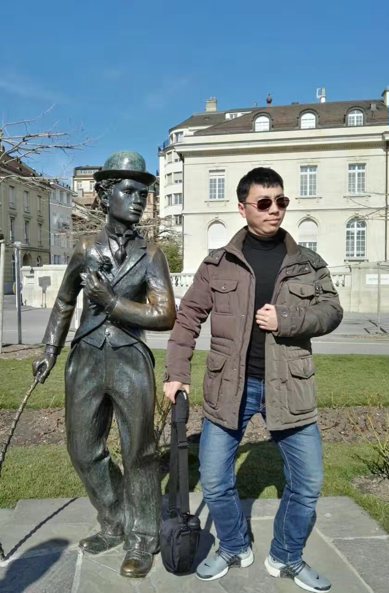

# 【随笔】查理⋅卓别林的诗（十）

查理⋅卓别林有一首诗，据说是他70岁生日时写的，读来很震撼，就好像把所有的人生道理都讲完了一样。以前刚刚离婚觉得特别低落时，曾经打印过这首诗，贴在办公桌前，也曾经翻译过一段或是全部。今天，不禁忍不住又在网上找来了原文[^1]，并且不顾自己英文的拙劣，又翻译了一遍。

### Charlie Chaplin - as I began to love myself 

> ### 查理⋅卓别林 —— 当我开始爱自己

As I began to love myself I found that anguish and emotional suffering are only warning signs that I was living against my own truth. Today, I know, this is **AUTHENTICITY**.

> 当我开始爱自己，我发现愤怒和情感的折磨只不过是些警告的信号，提醒我已经违背了真实的自己。今天，我知道了，这就是**真诚**。

As I began to love myself I understood how much it can offend somebody if I try to force my desires on this person, even though I knew the time was not right and the person was not ready for it, and even though this person was me. Today I call it **RESPECT**.

> 当我开始爱自己，我明白了将自己的欲望强加给一个人是多么的冒犯，即便我知道只是时机不对而且这个人还没有为此做好准备，即便这个人就是我自己。今天我管这叫做**尊重**。

As I began to love myself I stopped craving for a different life, and I could see that everything that surrounded me was inviting me to grow. Today I call it **MATURITY**.

> 当我开始爱自己，我停下来不再去渴求与现在不一样的生活，我开始能够看到：围绕在我身边的一切，都是在邀请我成长。今天我管这叫做**成熟**。

As I began to love myself I understood that at any circumstance, I am in the right place at the right time, and everything happens at the exactly right moment. So I could be calm. Today I call it **SELF-CONFIDENCE**.

> 当我开始爱自己，我明白了在任何情况下，我都是恰逢其时其地，并且一切都发生得恰到好处。因此我得以从容不迫。今天我管这叫**自信**。

As I began to love myself I quit stealing my own time, and I stopped designing huge projects for the future. Today, I only do what brings me joy and happiness, things I love to do and that make my heart cheer, and I do them in my own way and in my own rhythm. Today I call it **SIMPLICITY**.

>  当我开始爱自己，我不想再偷走自己的时间，我停下来不再去为将来构想庞大的计划。今天，我只做那些能带给我快乐与幸福的事情，那些我热爱并且能让我心为之欢呼的事情，并且只用我自己的方式、自己的节奏去做这些事情。今天我管这叫做**简单**。

As I began to love myself I freed myself of anything that is no good for my health – food, people, things, situations, and everything that drew me down and away from myself. At first I called this attitude a healthy egoism. Today I know it is **LOVE OF ONESELF**.

> 当我开始爱自己，我把自己从一切对自己健康不利的东西中解放出来——食物、人、事物、局面， 以及一切会把自己拉下来并且远离我真正自己的东西。起初，我管这种态度叫做好的利己主义。今天我管这叫做**对自己的爱**。

As I began to love myself I quit trying to always be right, and ever since I was wrong less of the time. Today I discovered that is **MODESTY**.

> 当我开始爱自己，我不想再尝试做一个永远正确的人，而从那以后，我犯的错误却越来越少。

As I began to love myself I refused to go on living in the past and worrying about the future. Now, I only live for the moment, where everything is happening. Today I live each day, day by day, and I call it **FULFILLMENT**.

> 当我开始爱自己，我拒绝继续活在过去，拒绝继续焦虑未来。现在，我只活在当下这一刻，这万物生发的刹那。今天，我活在每一天，一天又一天，我管这叫做**真正的活着**。

As I began to love myself I recognized that my mind can disturb me and it can make me sick. But as I connected it to my heart, my mind became a valuable ally. Today I call this connection **WISDOM OF THE HEART**.

> 当我开始爱自己，我认识到我的头脑会干扰我，它可能会让我生病。但是当我把头脑与心灵相连接，它变成了心灵的宝贵盟友。今天，我管这管连接叫做**心灵的智慧**。

We no longer need to fear arguments, confrontations or any kind of problems with ourselves or others. Even stars collide, and out of their crashing new worlds are born. Today I know **THAT IS LIFE**!

> 我们不需要再害怕与自己和他人的争论、对抗或任何问题。即便是星辰也会碰撞，而新世界就在这碰撞后的分崩离析中诞生。今天我知道了，**这就是生命**！

在YouTube上能找到不少朗读这首诗的视频和音频，我喜欢[这个](https://www.youtube.com/watch?v=62oby83NtGw)。最有趣的是，在这个视频下有人回复说，这首诗是卓别林在他70岁的生日会（April 16, 1959）上朗读的，原作诗名为**When I Loved Myself Enough** ，作者是 *Kim & Alison McMillen*。

在找到原文的网站上还有一张有趣的图片[^2]，我也很喜欢，一并贴在这里。

去年初在卓别林晚年居住的小镇与他的雕像合影，那时我比现在胖，气色还不错！

----

[^1]: <https://www.lifeintherightdirection.com/charlie-chaplin-began-to-love-myself/>
[^2]: 图片来源： <http://mindvalleyacademy.com>

