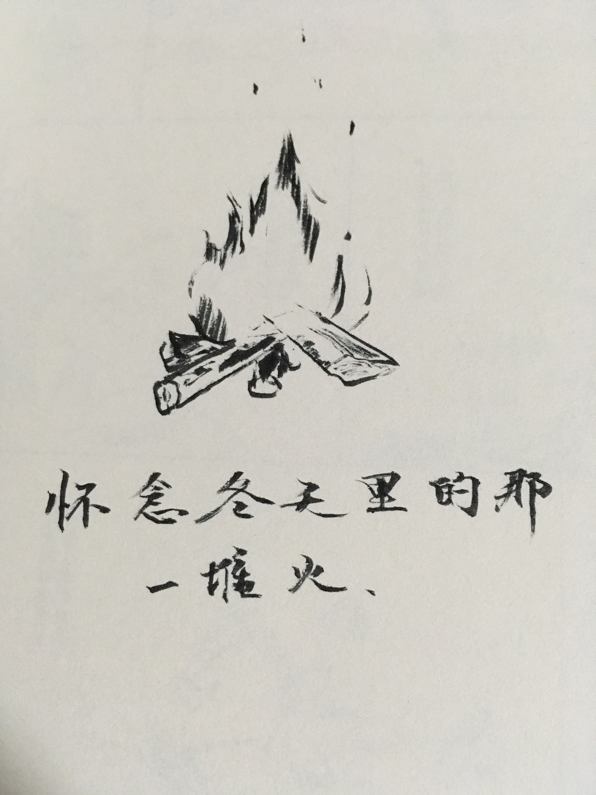

# 【随笔】寒冷的冬天缺少一堆🔥

凌晨醒来，在被窝外面走了一圈，就冷得无法忍受了。鼻涕哗哗，喷嚏不止，那种状态，不止别人不爽，自己看得都心烦。

深圳的冬天，冷起来屋子里也还有摄氏10度以上。然而，常常会觉得从心口里往外冒出一阵阵冷冷的寒意。不禁怀念起前年冬天，猫在湘西山里木屋内的火坑边，什么也不干，看着《哈利波特》，偶尔拨弄一下火坑里的木柴。只有木头燃烧时偶尔发出劈劈啪啪的声音，屋外寒风吹过树稍发出不那么明显的哗哗声，以及门外偶尔传来远处的一两声狗吠划破山寨夜晚的宁静。不论屋子外面多么寒冷，坐在火坑边身体却是暖暖的，心也是暖暖的。甚至，还可以啃一根甘蔗，享受那清凉冰爽的感觉。

更想起小时候，每到冬天，大人们会用纸把窗户缝全都糊起来。每家每户会生一个煤炉，烟囱从炉子上方伸到天花板，再拐弯从窗户上方的一个圆洞里伸到屋外。幼儿园里也是，一群小朋友都坐在屋子里，穿着厚厚的棉袄棉裤，小脸却是红扑扑的。炉火熊熊，从炉子缝隙里透出暖暖的红光。我们围着老师，期待地看她翻弄烤在煤炉上方的红薯🍠，等着她把烤好的红薯分给我们，掰开后热气腾腾、香气四溢，吃下去暖暖贴心的感觉，至今不能忘怀！

难怪，杨绛把生命比作一团火。说：

> 我们彼此依偎着🔥生命之火🔥取暖。

自己感觉这么冷，莫不是心中的🔥生命之火🔥有些萎了。该赶紧整理一下火坑，掏开无法燃烧堵住空隙的灰烬，添一两根干柴，把火好好地烧起来！

🔥🔥🔥🔥🔥🔥🔥🔥🔥🔥🔥🔥🔥🔥🔥🔥

