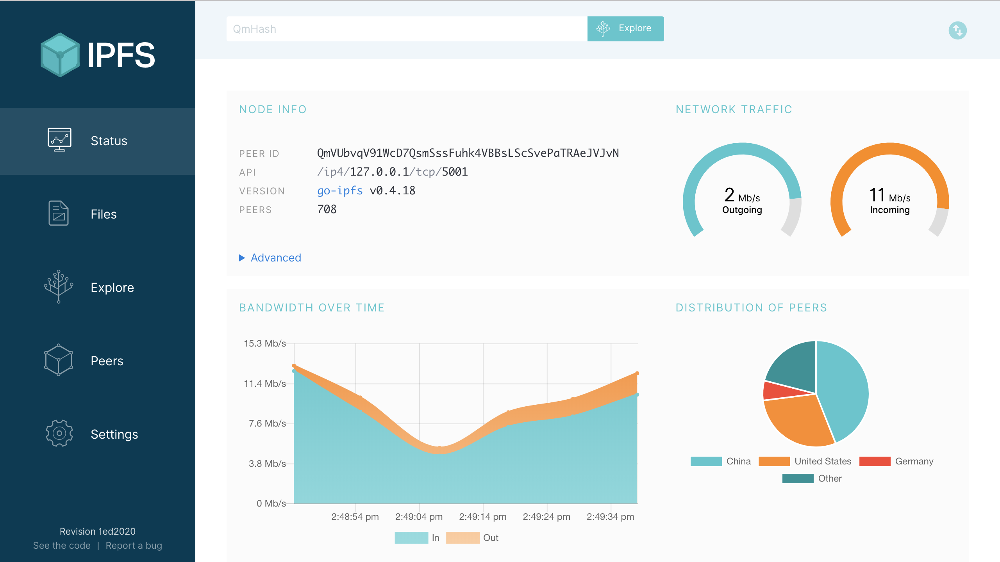

#【区块链】IPFS初探之安装试玩（二十九）

##安装

官方在其[安装手册](https://docs.ipfs.io/introduction/install/)列举的安装方法有这样几种

- 安装已经编译好的软件包
- 用ipfs-update 安装
- 从源代码编译

推荐的方法居然是直接安装已编译好的软件包（为什么不是用ipfs-update呐？），那么就先下载吧。我手头是一台MacBook Pro，点击进入这个网址[Download IPFS for your platform](https://dist.ipfs.io/#go-ipfs) ，他自动识别了我的操作系统，让我下载 **[Version v0.4.18 for OS X 64bit](https://dist.ipfs.io/go-ipfs/v0.4.18/go-ipfs_v0.4.18_darwin-amd64.tar.gz)**。

下载好之后，解开安装包，运行install.sh把ipfs可执行程序移到可执行的$PATH下

```bash
$ tar xvfz go-ipfs.tar.gz
$ cd go-ipfs
$ ./install.sh
```

我执行后，脚本提示说 `Moved ./ipfs to /usr/local/bin`

OK，现在试试看

```bash
$ ipfs help
USAGE:

    ipfs - Global p2p merkle-dag filesystem.

SYNOPSIS
  ipfs [--config=<config> | -c] [--debug=<debug> | -D] [--help=<help>] [-h=<h>] [--local=<local> | -L] [--api=<api>] <command> ...
```

一切正常，这就安装好了！

纳尼，然后呢？？？

## 试玩

###初始化

ipfs的设置和内部数据都存在一个叫 *repository* 的目录下，第一次使用IPFS需要先执行`ipfs init`命令初始化这个 *repository*。

```bash
$ ipfs init
initializing IPFS node at /Users/whoever/.ipfs
generating 2048-bit RSA keypair...done
peer identity: QmVUbvqV91WcD7QsmSssFuhk4VBBsLScSvePaTRAeJVJvN
to get started, enter:

	ipfs cat /ipfs/QmS4ustL54uo8FzR9455qaxZwuMiUhyvMcX9Ba8nUH4uVv/readme
```

> 注意，上面显示在 `peer identity:`之后的那一串Hash码是你的节点ID，肯定会和我这里显示不一样，网络上的其他节点就是通过这个来和你的节点通信连接的。需要时，你可以随时 `ipfs id`命令来查看这个ID

接下来，照着屏幕上的提示继续吧，运行 `ipfs cat /ipfs/QmS4ustL54uo8FzR9455qaxZwuMiUhyvMcX9Ba8nUH4uVv/readme` （留意，这个HASH是我的，你运行时一定和我这个不同），你会看到这样一堆东西

```bash
Hello and Welcome to IPFS!

██╗██████╗ ███████╗███████╗
██║██╔══██╗██╔════╝██╔════╝
██║██████╔╝█████╗  ███████╗
██║██╔═══╝ ██╔══╝  ╚════██║
██║██║     ██║     ███████║
╚═╝╚═╝     ╚═╝     ╚══════╝

If you're seeing this, you have successfully installed
IPFS and are now interfacing with the ipfs merkledag!

 -------------------------------------------------------
| Warning:                                              |
|   This is alpha software. Use at your own discretion! |
|   Much is missing or lacking polish. There are bugs.  |
|   Not yet secure. Read the security notes for more.   |
 -------------------------------------------------------

Check out some of the other files in this directory:

  ./about
  ./help
  ./quick-start     <-- usage examples
  ./readme          <-- this file
  ./security-notes

```

这几个大大的IPFS字母，让我想起了早年纯文本界面的一个叫星球大战的MUD游戏。言归正传，继续照提示操作，看看 `quick-start`里的使用例子吧。

```bash
$ ipfs cat /ipfs/QmS4ustL54uo8FzR9455qaxZwuMiUhyvMcX9Ba8nUH4uVv/quick-start
# 0.1 - Quick Start

This is a set of short examples with minimal explanation. It is meant as
a "quick start".


Add a file to ipfs:

  echo "hello world" >hello
  ipfs add hello


View it:

  ipfs cat <the-hash-you-got-here>


Try a directory:

  mkdir foo
  mkdir foo/bar
  echo "baz" > foo/baz
  echo "baz" > foo/bar/baz
  ipfs add -r foo


View things:

  ipfs ls <the-hash-here>
  ipfs ls <the-hash-here>/bar
  ipfs cat <the-hash-here>/baz
  ipfs cat <the-hash-here>/bar/baz
  ipfs cat <the-hash-here>/bar
  ipfs ls <the-hash-here>/baz


References:

  ipfs refs <the-hash-here>
  ipfs refs -r <the-hash-here>
  ipfs refs --help


Get:

  ipfs get <the-hash-here> -o foo2
  diff foo foo2


Objects:

  ipfs object get <the-hash-here>
  ipfs object get <the-hash-here>/foo2
  ipfs object --help


Pin + GC:

  ipfs pin add <the-hash-here>
  ipfs repo gc
  ipfs ls <the-hash-here>
  ipfs pin rm <the-hash-here>
  ipfs repo gc


Daemon:

  ipfs daemon  (in another terminal)
  ipfs id


Network:

  (must be online)
  ipfs swarm peers
  ipfs id
  ipfs cat <hash-of-remote-object>


Mount:

  (warning: fuse is finicky!)
  ipfs mount
  cd /ipfs/<the-hash-here>
  ls


Tool:

  ipfs version
  ipfs update
  ipfs commands
  ipfs config --help
  open http://localhost:5001/webui


Browse:

  webui:

    http://localhost:5001/webui

  video:

    http://localhost:8080/ipfs/QmVc6zuAneKJzicnJpfrqCH9gSy6bz54JhcypfJYhGUFQu/play#/ipfs/QmTKZgRNwDNZwHtJSjCp6r5FYefzpULfy37JvMt9DwvXse

  images:

    http://localhost:8080/ipfs/QmZpc3HvfjEXvLWGQPWbHk3AjD5j8NEN4gmFN8Jmrd5g83/cs

  markdown renderer app:

    http://localhost:8080/ipfs/QmX7M9CiYXjVeFnkfVGf3y5ixTZ2ACeSGyL1vBJY1HvQPp/mdown
```

很多例子，眼晕吗？这里的例子可以一个个玩过去，以后再慢慢看。我们先来看看最重要的：

###上线

再开一个终端窗口，运行这个命令 `ipfs daemon`

```bash
$ ipfs daemon
Initializing daemon...
go-ipfs version: 0.4.18-
Repo version: 7
System version: amd64/darwin
Golang version: go1.11.1
Successfully raised file descriptor limit to 2048.
Swarm listening on /ip4/10.11.1.135/tcp/4001
Swarm listening on /ip4/127.0.0.1/tcp/4001
Swarm listening on /ip4/172.29.143.147/tcp/4001
Swarm listening on /ip6/::1/tcp/4001
Swarm listening on /p2p-circuit
Swarm announcing /ip4/10.11.1.135/tcp/4001
Swarm announcing /ip4/127.0.0.1/tcp/4001
Swarm announcing /ip4/172.29.143.147/tcp/4001
Swarm announcing /ip6/::1/tcp/4001
API server listening on /ip4/127.0.0.1/tcp/5001
Gateway (readonly) server listening on /ip4/127.0.0.1/tcp/8080
Daemon is ready
```

看到所有这些之后，你的IPFS节点就正式上线了。再看看这个次重要的：

### 欣赏一下IPFS华丽的WEB UI

用浏览器打开 http://127.0.0.1:5001/webui



看到这华丽的Web界面，是不是顿时感觉一切都简单了？眨眼之间，我这里就连上了800多个节点，大部分就是来自国内，看来IPFS确实越来越火啊！

### 附：疑难问题

####检查Go语言版本


IPFS需要go 语言1.7.0以上版本，可以运行 `go version` 来检查，我这里的版本是

``` bash
$go version
go version go1.10.2 darwin/amd64
```

如果Go 语言版本太低，官方建议去[canonical Go packages](https://golang.org/doc/install)升级。

