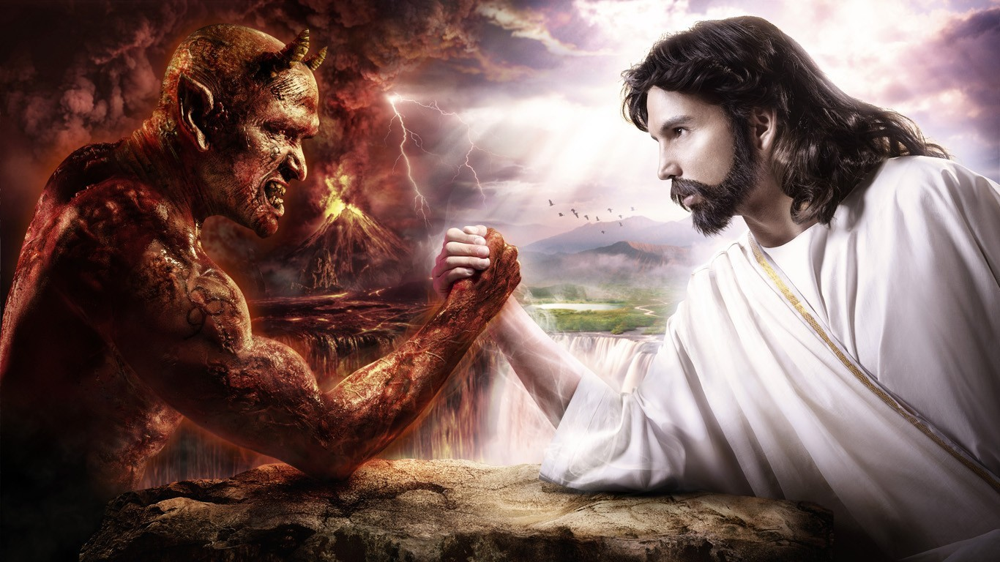

#【生命⋅修行】天使与魔鬼的战争(三十七)

前两天晚上，大宝又一次在我面前哭得很伤心。可能因为哭太久缺氧，最后都呕了。

在安慰了她很久之后终于躺到床上，可她还是会一阵一阵地痛哭。忽然之间，我觉得，一定是有一个魔鬼，在那里影响我的大宝，伤害我的大宝，让她陷入这种痛苦之中。就在这一刹那，我感觉到身体周围弥漫开来一股寒意，后背也一阵阵发凉。我愤怒起来，开始咬牙切齿地念叨：

> 不管你是什么东西，既然敢来伤害我的大宝，我就要用我的愤怒之火、以及来自上天的真火，把你彻底毁灭，烧到神型俱灭，不复存在！

大宝说

> 我要那些烧成的灰，洒在我的伤口上，来治疗我受的伤

我说

> 那就把它烧成银色的灰

大宝说

> 那就烧成金色的，更好看

这样之后，我们俩都感觉好多了。虽然我知道，这"魔鬼"并没消灭干净，他还会不知从哪个地方卷土重来，但我打算"它"来一次，就消灭"它"一次。

后来，继续聊下去，我才意识到，在大宝的眼中那伤害她的魔鬼，就是我自己！这天使与魔鬼的战争，原来正是发生在我自己内心的战争啊！

[^1]: 图片来源 <http://www.tokkoro.com/2964788-devil-jesus-christ-digital-art-fantasy-art-religion-hell-heaven-and-hell.html>