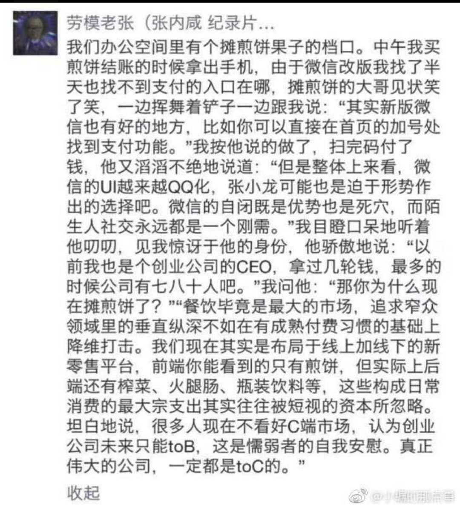

#【创业】Facebook的广告初探（三十八）

> "真正伟大的公司，一定都是toC的"

我想这也是toC创业者的一种安慰吧。

然而，toC却正经可以并且需要实践各种GrowthHacking的方法、方法论以及小技巧。虽然我们现在产品的用户激活与留存方面还有很多工作需要做，拉新的工作因此不敢火力全开，但也不敢完全丢手。

最近尝试了一下Facebook广告的一个新功能：**Lookalike Audiences**

过去都是通过各种参数定制广告的发放对象，比如根据经验，我们产品比较有效的目标客户群是28-55岁的男性，美国人，旅居在外，等等。而使用Lookalike Audiences 呢，则可以导入我们目前已有的用户数据，让Facebook来匹配（AI越来越强大了）和我们目前用户类似的用户群来定向发送广告。当然，我们现在只有一个Email，但这已经可以工作了。而Facebook现在也很注意隐私，他并不需要我们上传内容，而是只上传hash之后的字段值。然后与他自己的用户数据库进行对比。

这一次，广告优化得还不彻底，只是和新用户注册进行了目标优化。最终达到约莫1.5-2.0 美金之间每个新用户注册。但是，比去年同期，0.1美金一个点击的效果比起来要好得多了。去年毕竟只有点击，看不到直接带来的用户与销售。

下一步的目标是，把广告效果和用户消费关联起来。以便针对性地优化整个拉新、激活、留存、推荐的路径。