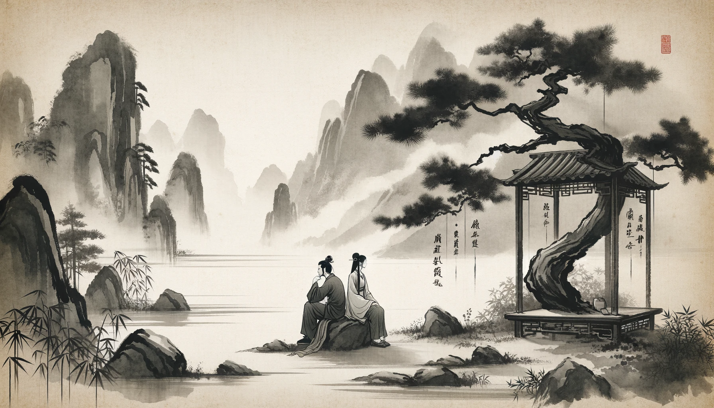

# 【生命⋅修行】不必勉强而为（五十）

这几天，和大宝的关系再次经历了一个重大挑战。因为鬼使神差的一个"小气"行为，暴露了我一个自己都一直羞愧于面对的经历。而这方面，也偏偏正是大宝所看重的一个重要的基本价值观。于是，我们双双经历了那种撕开真相的痛苦，经历痛苦之后，觉得两人更加清醒地认清了对方，更加欣喜地喜欢上了那个更真实的对方。

在和好之后，我们发现一个现象。当我勉强自己去取悦大宝时，通常不用太久，就会起到反作用，变成了惹恼大宝，甚至让她感觉气被堵上，无法疏解。回想到工作中，其实也常常有类似的问题，当感觉到要"勉强"自己一定达到某一个要求时，不仅仅会越来越累，而且最终无法得到需要的结果。

大宝想到了两点，让我在我们的相处之中尝试：

1. 努力找放松的感觉。
2. 努力把注意力完全放在当下。

我觉得完全可以把这两点放在日常生活和工作的每一个瞬间去练习。就好像之前开始的"喝水"训练一样，只要想到，就去做。持续地练习下去！

2019.01.10

----

这么多年来，两人相处中的磨合，确实让人成长不少。回头看，这两点对于亲密关系确实非常有用！至于放在亲密关系之外的日常工作、生活中的实践，倒还没有啥新的心得。

2024.01.10

----