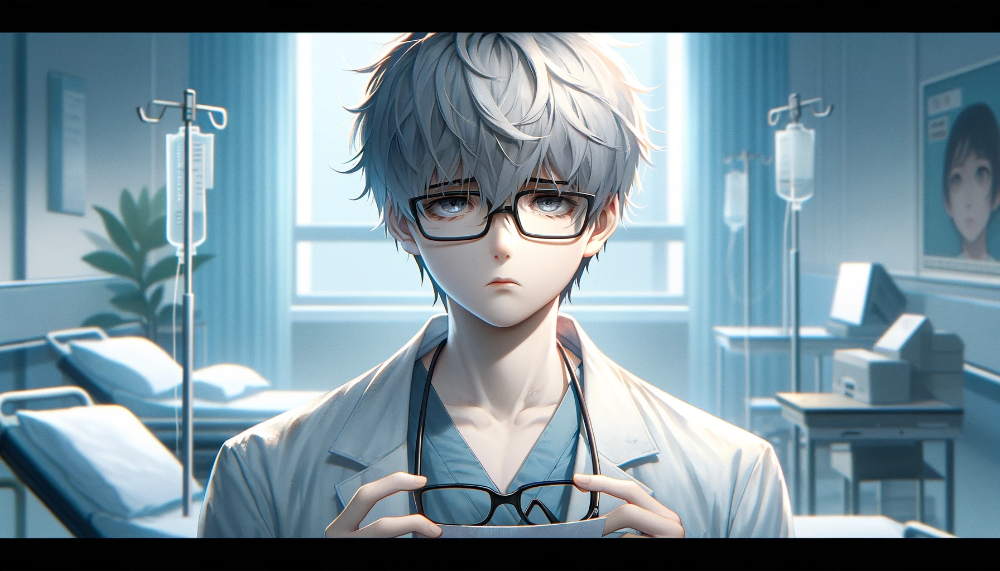
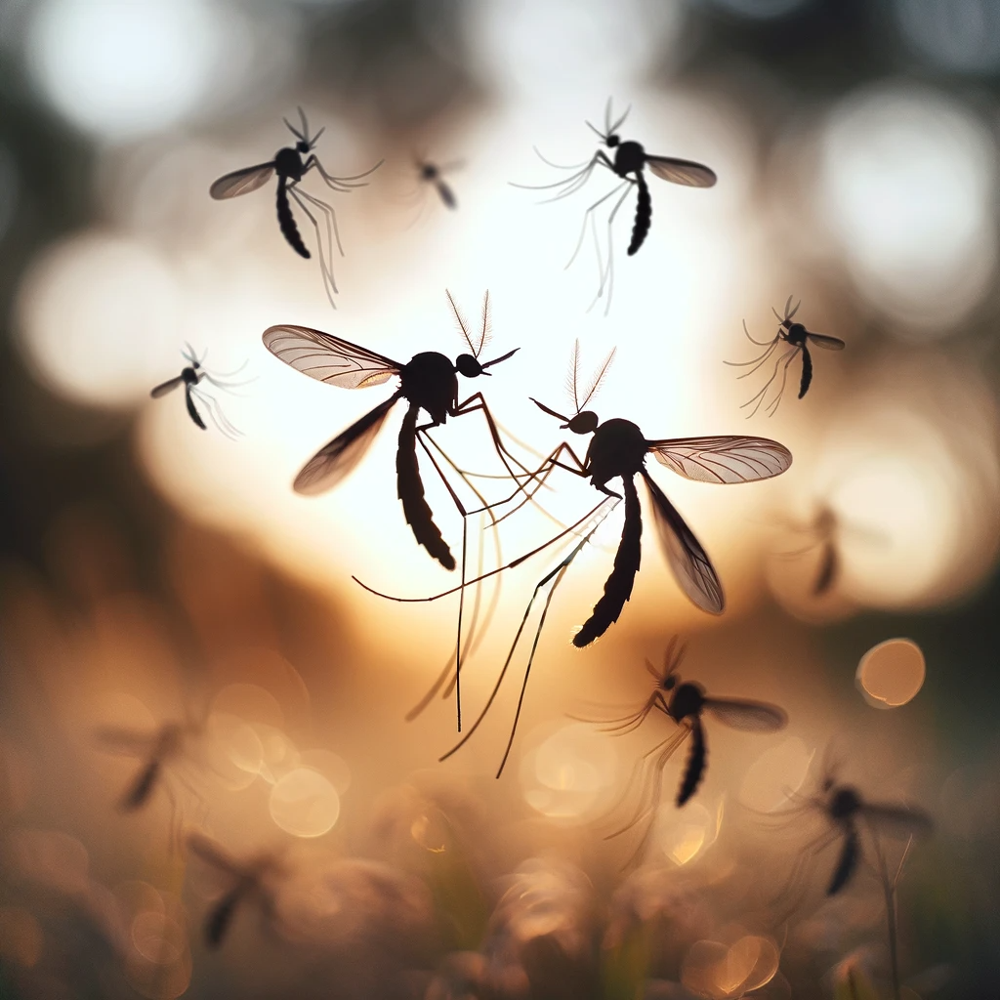

# 【随笔】眼前飞舞的黑影（五十二）

昨天晚上突然发现自己右眼飞舞的黑影更加严重了，直接干扰了接近正中的视野。

心情颇为沮丧，想到这也是因为自己愚蠢，如果就这样引起了视网膜脱落，变成一只眼甚至两只眼瞎掉，不知道会怎样拖累大宝和阿宝的生活。大宝安慰我说：老天爷不会给你安排你无法承受的事情的……你眼睛肯定不会瞎，就算瞎了，也一定有办法过下去！勇敢一点！

是的，没什么大不了的，不管生活打算给我怎样的挑战，尽管勇敢面对就是。我想，最大的可能就是老天爷让我就这样带着眼前飞舞的黑影生活，随时提醒自己灵魂深处的黑暗与光明是同时重要的存在吧。

过会儿到医院检查可能需要散瞳，先完成今天的日更好了。

2019.01.12

----

这几年，偶尔也去医院检查过几次。反正医生说：随着年纪增长，你这玻璃体后脱肯定是不可能变好的啦，能不恶化，保持现状就不错了。

2024.01.12