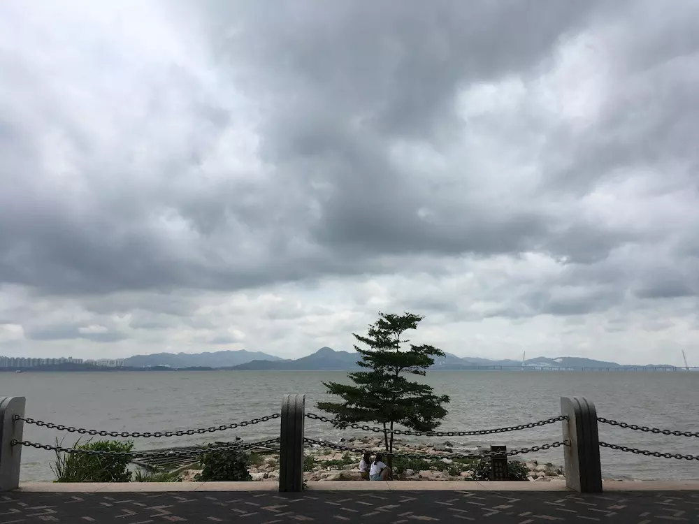

#【随笔】周末的深圳湾公园（一百七十七）

从世界之窗，顺着深南大道走到沙河边，再顺着沙河一直走到了深圳湾公园。这是早上躺在床上就想好的路程。需要的时间并不多，大约一个半小时吧。看了看手机的记录，也不过6、7000步，5、6公里而已。

深圳湾的海水，一片黑黄色，可能是今天阴云密布的缘故吧。身后的滨河大道，一直止不住地咆哮着，车流滚滚。只有静下心来使劲听，才能听到海水拍打岸边岩石的声音。游人不多，两个小孩子拉着扭扭车从我身边呼啸而过，身后不远跟着的是他们的父母、奶奶或外婆。三个操着广式普通话的女人，拿着保温杯聊着天经过我的面前。然后是一对推婴儿车的年轻父母。三五个穿着鲜艳徒步的年轻人。

正对着我，有一棵树，又好像是两棵。两个树干紧紧地靠在一起，接近地面的地方浑然合为一体。我坐在石椅上，一抬头，看见一只白色的海鸟飞过。感觉心脏部位有一点略略收紧的疼痛感。身后树林里，几只倔强的小鸟，叽喳叫着，把它们的歌声送到我耳朵里。

我决定，今天在这里好好待一会儿。

