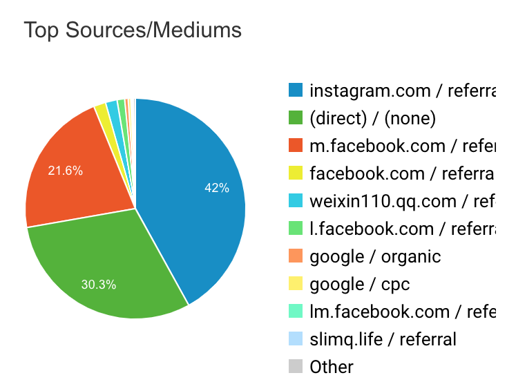

#【创业】Instagram是个好东西（二百七十二）

新做的一个项目，终于[开始在Indiegogo众筹](https://igg.me/at/slimq/x/17419383#/)了。这一次，除了在Fivver 上找人宣传、Facebook广告之外，特意增加了Instagram 的广告投放（其实也是通过FB 的广告平台）。

今天看了一下，项目启动3天，Instagram 上过来的流量已经占到了42%，稳居头名。然后我昨天用官方账号在Instagram发的图片没有做任何推广的情况下，也有383人看过，其中83%并没有Following我们。这真是个好平台，值得深挖潜力！

