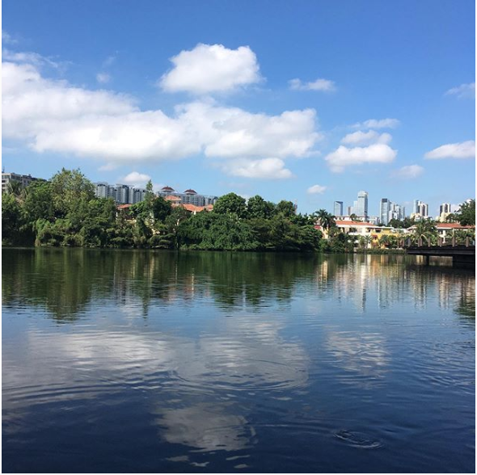

#【随笔】油画一样的云朵（二百七十六）

今天终于天晴了，在湖边练拳，晒着太阳，感觉颇为舒服。因为没带眼镜的缘故，觉得天上的云朵特别好看，就好像油画上画的一样。赶紧去包里拿出手机，拍了几张照片，准备发在Instagram上。

想起第一张发在Instagram上的照片还是2012年在北京出差的时候，那时正在如火如荼地倒腾华为的公有云项目，Instagram还刚刚火起来，在国内也能使用如常。

眨眼之间7年过去了，算起来全身细胞都已经被替换完毕了。却又开始关注Instagram了：）