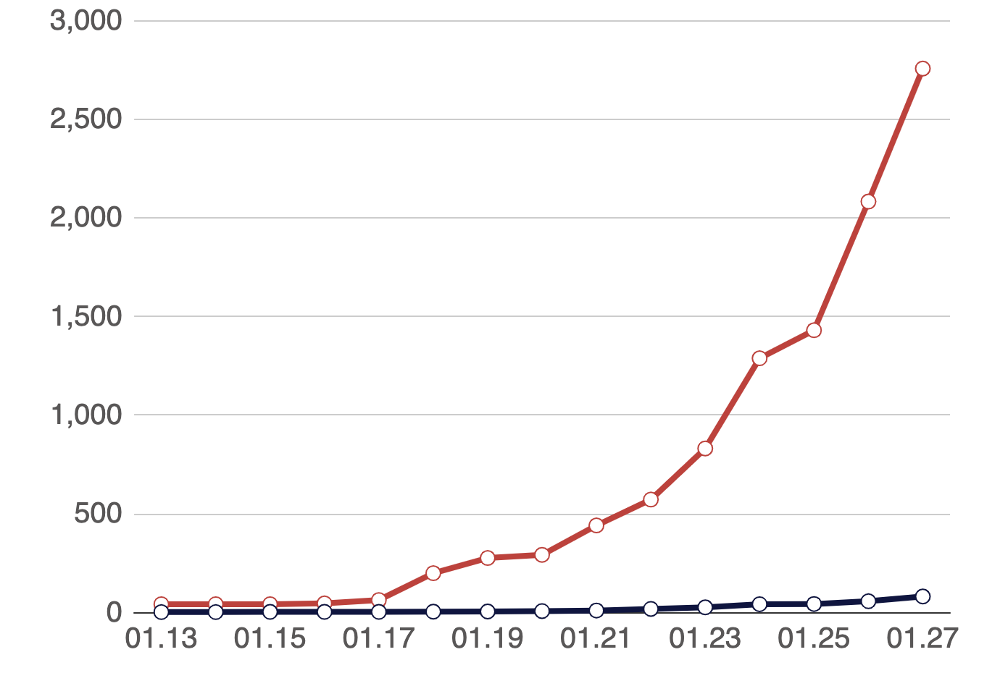

#【随笔】一道算术题（四〇〇）

昨晚躺在床上，忽然想到，如果这次肺炎的患者，每天传染一人的话。10多天的潜伏期，传染人数就是2的10次方，将会达到1000人。再过10天就是100万人，30天就是10亿人。顿时觉得这是很可怕的数字。

赶紧打开手机，查看了一下官方数据，确诊人数大概是每3天翻一倍。到23号武汉封城时，大约是800多人。比我自己瞎琢磨的情况还是要好一点。算起来12天的潜伏期再加上几天发病到确诊需要的缓冲时间，800人确诊时，已经有800x16=12800 或 800x32=25600 人被感染，这些人将要患病但还未确诊。

根据官方公布的数据，这2万人，已经有将近1万离开了武汉，将病毒扩散到了其他区域。如果都还像之前一样，不采取有效的预防和隔离措施，保持着3天一人的传染率。将是非常可怕的数据。

QF师兄现在湖北乡下，武汉封城的前3天湖北其他地方并未重视，大家还是该聚会聚会，该拜年拜年，感染率恐怕仍然保持在1/3。那么现在感染比例算起来已经到了千分之零点五到千分之一了。查了一下今天的官方公布数据，27号早上湖北确诊数1423例，除去武汉698例，其他地方也超过了800。和我计算结果正好匹配。好在师兄所在的村子才几十户人，而且大家现在也不再走动出门。他们村有人被感染的概率应该小于1/10。而他们一家人安全的概率会更高。

20号，我父母离开武汉时，武汉人的感染率算起来应该也在1/1000左右。这也是他们安全幸免的概率吧。希望亲人朋友们都安好。

等各地隔离措施生效，再过十天半月，传染率应该会降下来。一切就会慢慢好起来。

[图片来自腾讯新闻新型肺炎疫情实时通报](https://news.qq.com//zt2020/page/feiyan.htm)

----

20191121开始早起
20191124早起未遂1⃣️💪
20191129早起未遂2⃣️💪💪
20191208早起未遂3⃣️💪💪💪
20191210早起未遂4⃣️💪💪💪💪
20191212早起未遂5⃣️💪💪💪💪💪
20191213早起未遂6⃣️💪💪💪💪💪💪
20191214早起未遂7⃣️💪💪💪💪💪💪💪
20191215早起未遂8⃣️💪💪💪💪💪💪💪💪
20191218早起未遂9⃣️💪💪💪💪💪💪💪💪💪
20191219早起未遂🔟💪💪💪💪💪💪💪💪💪💪
20191221早起未遂1⃣️1⃣️💪
20191223早起未遂1⃣️2⃣️💪💪
20191224早起未遂1⃣️3⃣️💪💪💪
20191225早起未遂1⃣️4⃣️💪💪💪💪
20191226早起未遂1⃣️5⃣️💪💪💪💪💪
20191228早起未遂1⃣️6⃣️💪💪💪💪💪💪
20191229早起未遂1⃣️7⃣️💪💪💪💪💪💪💪
20191230早起未遂1⃣️8⃣️💪💪💪💪💪💪💪💪
20200102早起未遂1⃣️9⃣️💪💪💪💪💪💪💪💪💪
20200103早起未遂2⃣️0⃣️💪💪💪💪💪💪💪💪💪💪
20200108早起未遂2⃣️1⃣️💪
20200110早起未遂2⃣️2⃣️💪💪
20200115早起未遂2⃣️3⃣️💪💪💪
20200116早起未遂2⃣️4⃣️💪💪💪💪
20200118早起未遂2⃣️5⃣️💪💪💪💪💪
20200121早起未遂2⃣️6⃣️💪💪💪💪💪💪
20200122早起未遂2⃣️7⃣️💪💪💪💪💪💪💪
20200123早起未遂2⃣️8⃣️💪💪💪💪💪💪💪💪
20200124早起未遂2⃣️9⃣️💪💪💪💪💪💪💪💪💪
20200125早起未遂3⃣️0⃣️💪💪💪💪💪💪💪💪💪💪
20200126早起未遂3⃣️1⃣️💪
20200127早起未遂3⃣️2⃣️💪💪