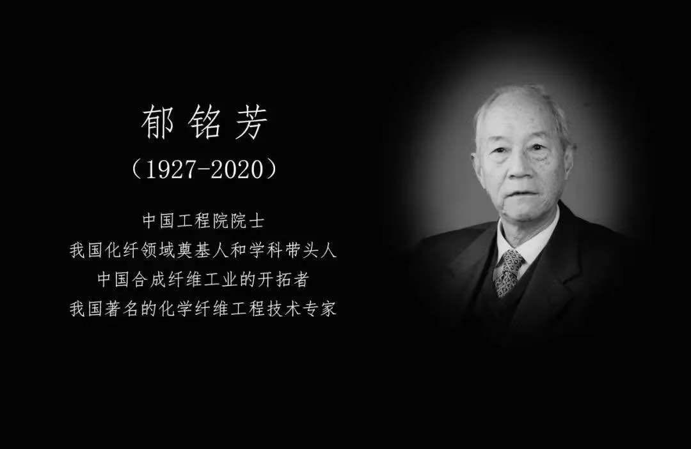

#【随笔】巨星陨落（四八三）

今天早上看到这篇文章[《又一巨星陨落，14亿人痛哭：这才是我们最该追的“星”》](https://mp.weixin.qq.com/s/PkZywMI_dcZ19hN97ZimYg)。原来前几日，悄悄地，又一位给国家科技做出过杰出贡献的院士，郁铭芳院士因病逝世了。

说实话，在看到这篇文章之前，我根本就不知道这位院士。更不知道的是，2020年头四个月，已经有14名院士去世了。

确实有一种众星陨落的感觉，然而。我们却对此几乎一无所知，几乎毫无觉察。真的是「将军孤坟无人问，戏子家事天下知」啊。

更想起，朋友圈有一位神人（神叨叨的人）说起「封灵」，那时说的是以色列首席拉比Eliyahu Baks Hi-Doron在耶路撒冷因新冠肺炎去世。还说什么108天罡地煞之类的话。虽是诳语，却不由得提醒我注意到。从1999年开始，许多领域的一代宗师巨匠，开始扎堆离开人世了。

不禁呜呼！