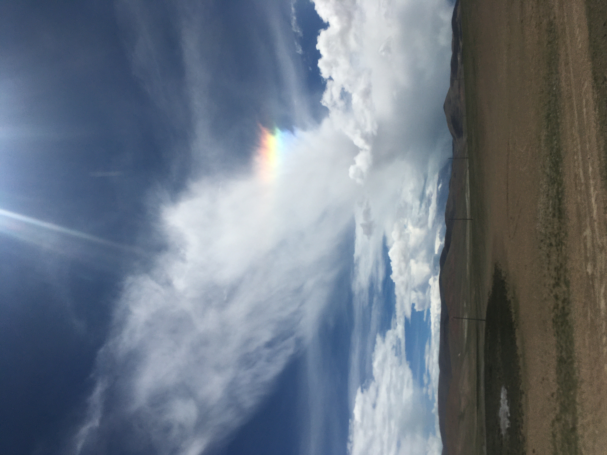
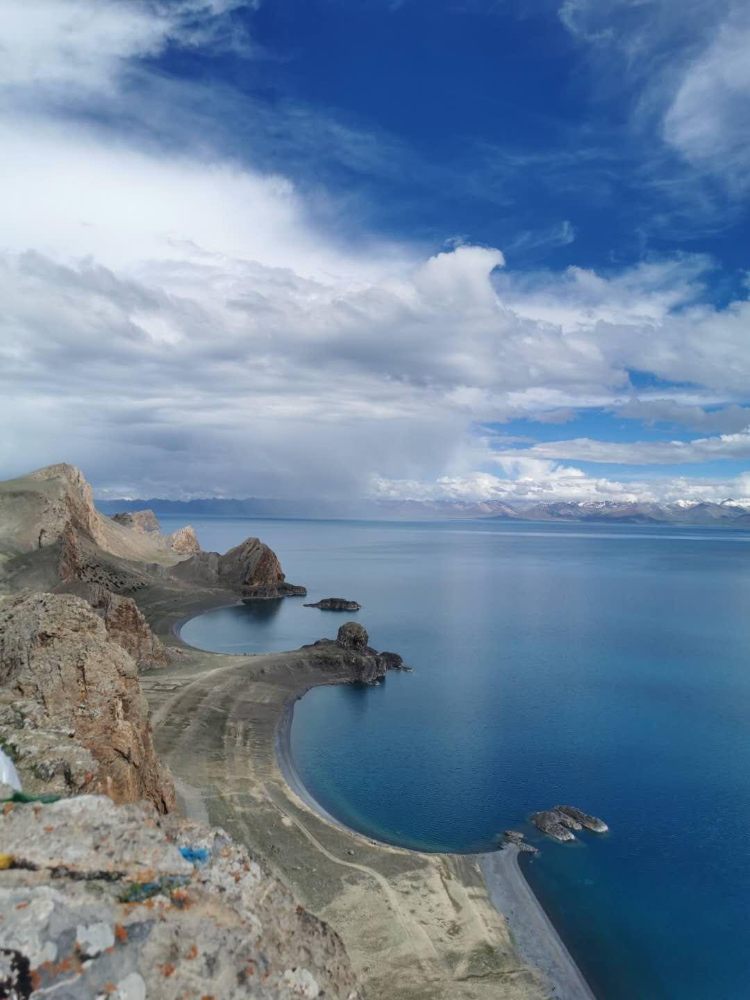

#【生命⋅修行】高原的七彩祥云（五五三）

昨天在去圣象天门的路上，忽然看到这一朵七彩的云。陈师傅说，他在西藏二十多年，这七彩祥云也不过见了两三次，我们的运气可以说是非常好了！

山路崎岖，高反加上晕车，颇有些难受，在海拔4千多米的地方，还要再爬百来米陡峭的山坡，相当辛苦。不禁开始怀疑，这样旅行的意义是什么呢？这算是有意识地受苦吗？

大宝高反更严重，拍了几张照片，她把我扔在山顶就先下去了。后来我才知道，她在下山路上吐了。她说，当时就在想，以后再也不骂我了，万一高反挂了，骂那两句又有什么意义呢？

那么，这就是来高原旅行的意义吗？

特别地辛苦，却也有特别的美景，真真切切地同时感受到生存的不易与生命的精彩。

