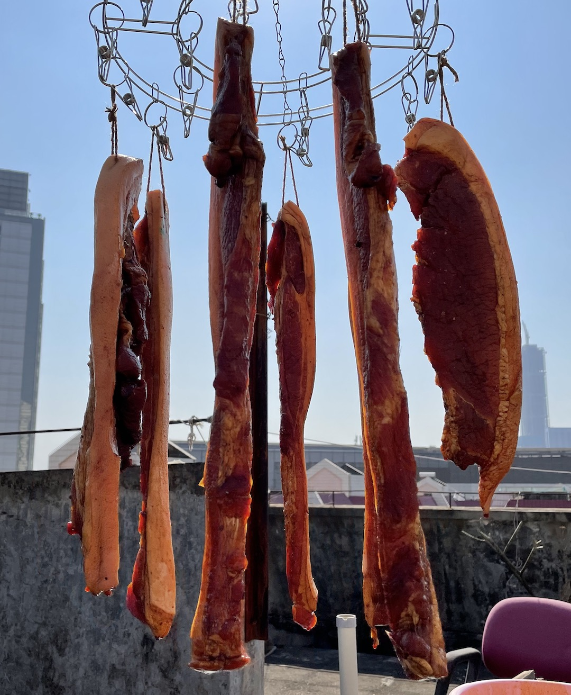

#【随笔】全民腊肉日（七三四）

随着号称史诗级的寒潮正式来到深圳，大宝也激动起来。早上我还坐在马桶上呢，她就开始催：

> 快点！快点！！快点！！！
>
> 我们先出门咯！！！

把阿宝送去幼儿园，我们就骑着小电动车🛵，顶着飕飕的寒风赶去菜市场，在Z师兄推荐的那家肉档买了好几斤腿肉。但是，大宝还是不满意，觉得这肉有些太肥了，不死心地继续逛着，离开前逛到了锦潭的铺面，终于发现这里有更漂亮的五花肉。卖肉的大叔精明得紧，一见我家大宝眼里放着光，赶紧说：

> 这两块也一起买走，给你打九折！

哦，大宝一面狐疑着接过肉塞给我，一面嘀咕：那之前买的腿肉怎么办？剁了包饺子嘛？见我肯定地点了点头，她也就不犹豫了。去买单时才知道，我们是会员，本来就九折！呼呼，已经好久没在他们家买菜了，都忘了自己的会员折扣。我们一面走一面笑：

> 这卖肉的大叔真会忽悠！

> 要不是他家肉好，才不听他忽悠呢：）

一抬头，太阳正好，北风也颇为配合，树叶在早上的阳光中闪闪发亮，迎风起舞。大宝感叹到：

> 真是个晒腊肉的好日子呀！哎，你看，这芒果树竟然已经发新叶子了！

回到家，早饭都没做，大宝就张罗着让我帮她洗盆子，开始动手腌起肉来。不一会，还让我在一边举着手机，一面让Z师兄在视频里远程指导，一面放盐、放糖、放料酒，还要给逝去的猪们做最后一次马杀鸡。记得Z师兄本来说今年不打算做腊肉来着，不曾想这寒潮一来，他还是忍不住啦。接通视频时，他早已把自家的腊肉腌制妥当了……

我刚把盆子里的肉拍照了发到周日吃喝玩乐群里去嘚瑟，不曾想立刻就引得大家纷纷晒出了自家刚做的腊肉，甚至还有人腌了一条鱼。唯一没动手的S姐也忍不住感叹，自己是不是应该也去买肉才对得起这**「年」**了。

<video src="larou.mov"></video>

----

其实，放眼窗外，各家各户的窗户光秃秃的，在这现代大都市里，并没有多少人自己做腊肉、香肠。能像朋友圈里这帮吃货一样会吃爱做的人，毕竟还是少之又少。但这微信群里的热闹，多少让人回想起来一些儿时行走江城，在巷子里穿梭时，那街边屋檐下挂满腊鱼腊肉腊香肠的冬日胜景。

