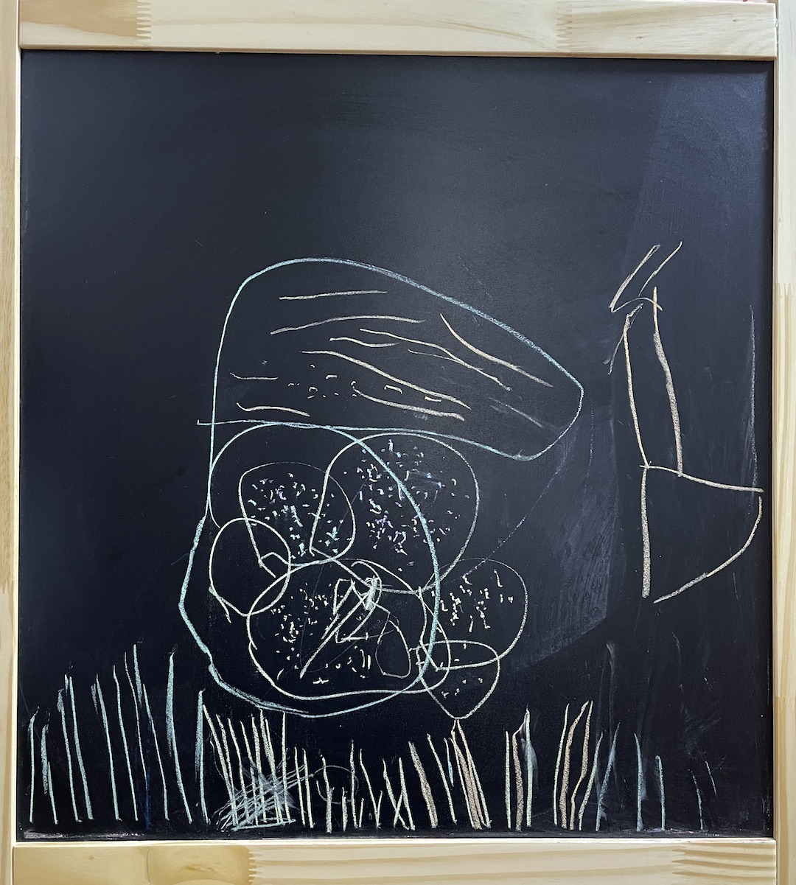

#【随笔】蝌蚪妈妈——阿宝趣事（七四一）

打开门，把阿宝一放进屋，她就像一个上足发条的玩具小人一样，登登登登跑去里屋找妈妈去了。

我转身上楼去取腊肉，等再回来时，她已经在客厅画架前专心开始创作了。于是我跑去厨房帮大宝洗菜，一起准备晚餐。过了一小会儿，我转去客厅里看了一眼她画画的黑板：

> 这是画的什么？给爸爸讲讲呗。

她指着下面的彩色线条说：

> 这是人行道！

又指着上面更密密麻麻的彩色细线条说：

> 这是小蝌蚪！

接着，她指着「小蝌蚪」们上方一个粉色的大圈说：

> 这是蝌蚪妈妈！

这次我学乖了，没有像昨天一样大惊小怪的问：「蝌蚪妈妈不是青蛙吗？」，而是告诉她：

> 蝌蚪妈妈可真大呀，真漂亮！

她满意地继续在蝌蚪妈妈身上添加彩色的线条，说：

> 我还要给她再加点花纹……

----

我跑去厨房，告诉大宝：

> 你发现没？阿宝现在超级喜欢妈妈，**她自己画的每一幅画里，一定都会有妈妈！**

