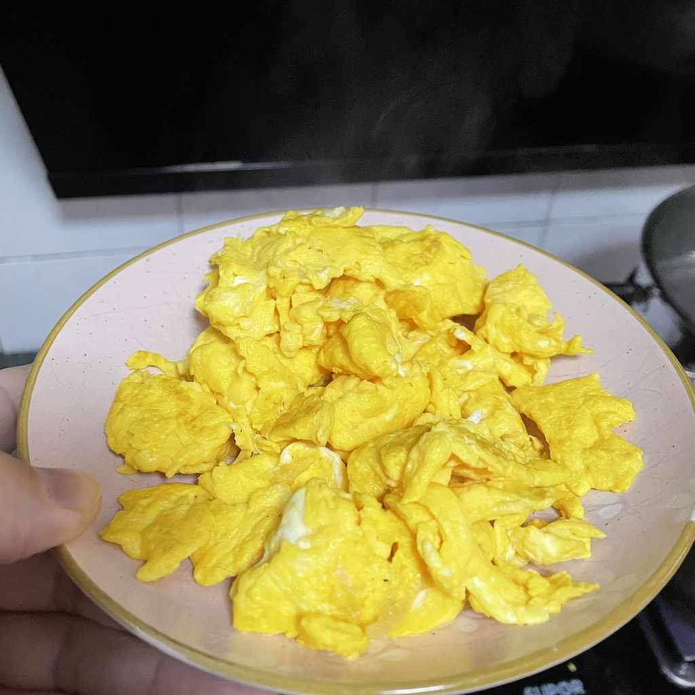

#【教程】怎样炒一盘完美的鸡蛋（七四八）

**【写作课作业D.003】**
早上起床晚了，阿宝嚷嚷着要在家里吃早餐，大宝吩咐我炒个鸡蛋，果然又得到了两只宝的赞赏，已经连续多次成功，看来可以写篇教程嘚瑟一下自己的新技能啦……

### 原材料
1. 黄天鹅鸡蛋三枚
2. 冷榨菜籽油少许
3. 盐适量

### 耗时

约5分钟左右

### 准备工作

1. 把鸡蛋打散备用
2. 平底锅烧热

### 正式开始

首先，把油倒入平底锅，不用太多。因为是冷榨菜籽油，需要稍微多熟一会儿，不然会有生油味儿。当然，也别热太厉害，千万别浓烟滚滚，那就过了。

接下来，关到中小火，将打好的鸡蛋液倒入平底锅。只需要一小会儿，锅底的蛋液凝固了，但上面的还是液体，这时用锅铲、或者筷子那凝固的鸡蛋皮轻轻翻起来，让蛋液继续在热锅上流淌。

反复这样操作，等到大部分鸡蛋都凝固了，呈现出接近完美的金黄色时，放适量盐。

用平底锅翻炒几下，等到你感觉到**完美**的时候，出锅，装盘！

### 关键点

1. 油温、火的大小很重要，太热容易糊，太冷有生油味儿。
2. 翻炒时要轻，不然鸡蛋全碎了不好看，形状不**完美**。
3. 盐要正好，不然或咸或淡，味道不**完美**。
4. 炒到自我感觉**完美**时，迅速出锅、装盘，让一切定格在这**完美时刻**！

----

【PS】正写着呢，大宝看了一眼我的屏幕，说：

> 还好意思写**「完美」**教程呢，早上你盐放少了知道吗？一点都不完美！

😂😂😂😂😂😂