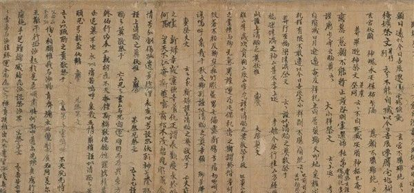
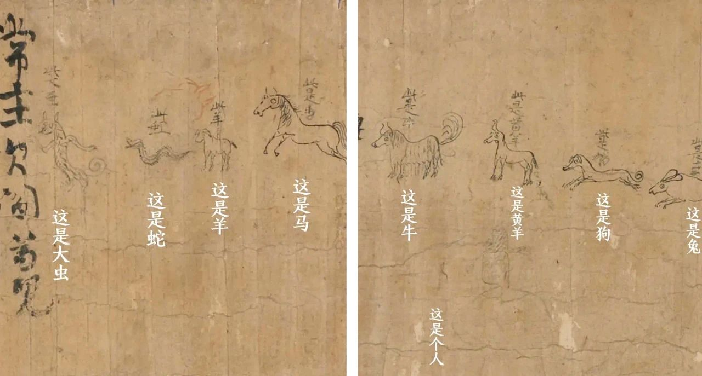

#【随笔】了不起的汉字（八一九）

今天刷到王左中右的一篇旧文：《[从小到大没人告诉我这件事了不起](https://mp.weixin.qq.com/s/-Tw-6AC137JFpbzUeZ2WrQ)》，文章说到敦煌出土过的一个很有研究价值的文物，《吉凶书仪》，正面记录啦当时关于婚丧嫁娶的各种礼仪。长这样：

结果，这张纸估计被一位小盆友（当年的）当作了草稿纸，在背面涂涂画画，像这样：

小盆友在可爱的图画上标注着，「此大虫」，「此蛇」，「此是马」，「此是牛」……云云，下方还有一个淡淡墨迹，戴帽的Q版半身人像。

但凡当过爸妈，教过孩子的人，看着这张纸，闭上眼睛，一千多年前的场景就不禁跃然眼前，那个咿咿呀呀学字、淘气的孩子；那正握着孩子手，耐心教他/她的爸爸或妈妈；旁边或许还有慈眉善目，笑咪咪端着糖水看着，准备一会儿犒劳小宝宝的老爷爷或老奶奶……不经意间，就是一千多年过去了！

忍不住感慨万千，那日常天天用的汉字承载了多少大大小小的故事啊，顺手转发了盆友圈。没多久，L同学在下面回复：

> 说到汉字的伟大我一般跟人分享四个字：
>
> **唇齿喉舌**

我点了个赞，但过了一会儿又觉得应该不是字形的形象这么简单，赶紧微信询问其中奥妙，被告知：

> 你试试读这四个字，看是不是正好发声部位一一对应？

NB呀！不禁对古人更多一层敬仰……

等再一转念，站在声音这个维度，Lip, teeth, throat, tongue好像也差不多哦，看来发明语言的先人们不论东西方，都足够厉害呀！