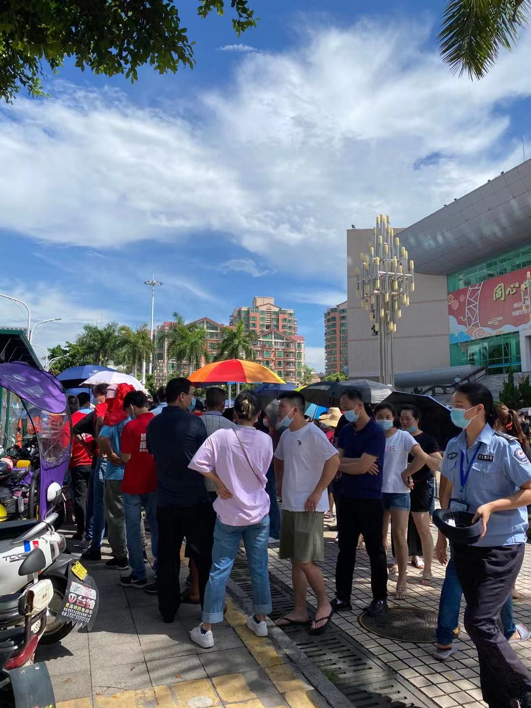
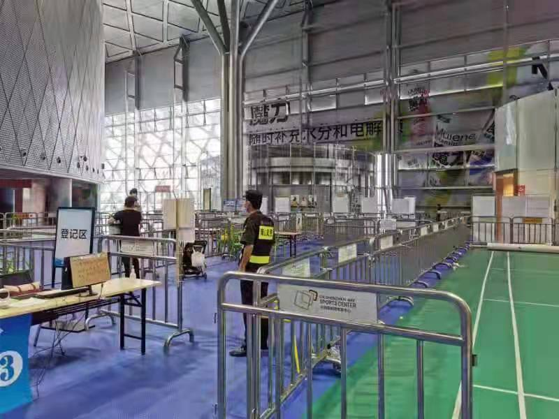

#【随笔】为啥忽然这么多人去打新冠疫苗（八八二）

这两天，忽然在各个微信群里看到人潮汹涌的排队照片，仔细一看，都是去打新冠疫苗的。S姐还特地贴出了一周前疫苗注射点的照片做对比。

这是今天，去晚点就得在外面太阳下烤着等着……

这是上周，真可谓门可罗雀……

之前国家又是通过社区反复宣传、又是通过幼儿园老师统计施压，不停地威逼利诱让大家去打疫苗，愿意去打疫苗的人却不多。哪怕是我心理上已经比较接受：身为中国公民，打新冠疫苗是必须的义务这件事了。还是偷懒，并没有找时间去打疫苗。

刚刚去医院咨询满月的BB打乙肝疫苗的事，又见到打疫苗的区域人声鼎沸。于是我特别纳闷，这到底发生了什么事情，不过才一周时间，就让人们从对疫苗爱理不理，变成了高攀不起呢？

直到我在网上看见了一纸关于《通知》的解读，才知道有说6.10到6.30号不接种第一针疫苗了。原来，忽然这么多人去打疫苗的原因，和之前人们都不愿去打疫苗的原因是一样一样的啊，那就是：

——**人性！**

