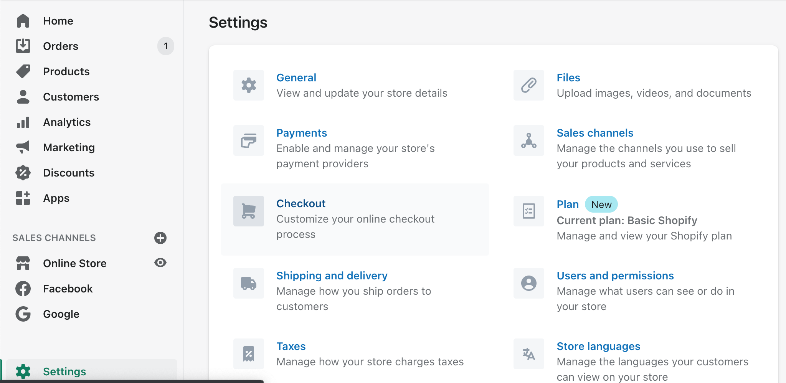
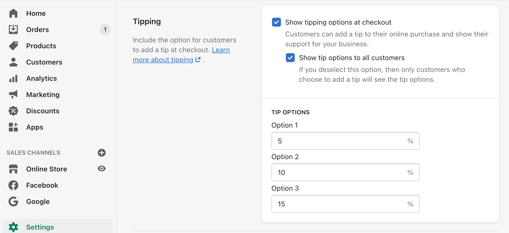

#【创业】第一次收到「小费」（八八四）

早上起床后看到手机里有一条Shopify发来的消息——一张新的订单！

开心！打开电脑，准备处理一下，却发现这条订单不同以往，竟然收到的钱比我的售价还要多，多出一点点。真奇怪？想了一下，莫不是收到小费了吧，可以前从没有过啊。打开订单详情一看，果不其然。打开收小费的功能已经好久了，这可是货真价实的第一次小费呀，虽然只是1.5美金，隔着屏幕都感受到了大西洋彼岸那位客户传递来的满满善意。简直是更开心了！

Shopify 的这个功能还真不赖，强烈建议直接开启。设置也非常简单，在Settings里面，点击Checkout进入买单流程设置——

然后，往下拉，找到Tipping这一节，关键是把Show tipping options at checkout前面的勾勾✅选上，至于要不要Show tip options to all customers就随意了。至于Tip Options，我记得网上的建议是就用缺省值5%，10%，15%即可。

然后，就可以和我一样，坐等着接受某些好心顾客的善意吧：）