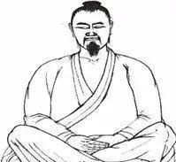
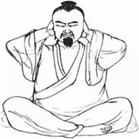
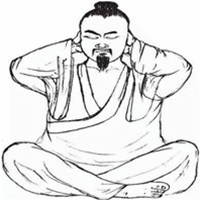
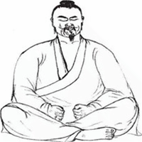
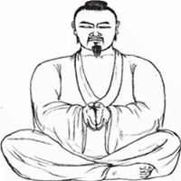
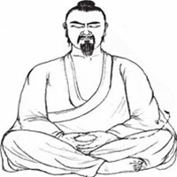
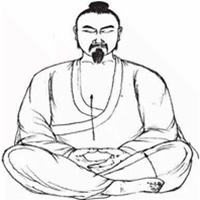
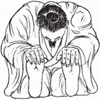

#【随笔】床上八段锦（九四八）

最近几天早上静坐结束，想要稍微活动一下，便想起10多岁时在气功杂志上学过的「床上八段锦」，于是乎搓手捂眼、搓脸、梳头、「鸣天鼓」、捏捏耳垂、搓搓后腰、记得还有所谓「赤龙搅海」——用舌头按摩牙齿，然后鼓漱吞津。

今天忍不住上网找了一下具体的功法，竟然找到两个，一个传自武当，一个传自少林，功法大致一样，细微处略有不同。也不知道当年学的到底是哪一个。总而言之，看动作，都属于久坐之后活动、拉伸的方法，随便照着哪个练都是不会错的。

仔细想想，按金庸老爷子的说法，如果武当张三丰也出自少林，这两个功夫的源头或许都是来自达摩祖师的《洗髓易筋经》吧。

### 床上八段锦，武当秘传八式

[原文来自：崆峒養生匯](https://www.acupoint361.com/2019/09/8.html)

#### 一、冥心叩齒氣歸根

丹床八段錦，身端體松沉。

冥心平穩坐，呼吸細長勻。

慧劍插真土，兩目內凝神。

叩齒三十六，升降氣歸根。

#### 二、鳴響天鼓抱崑崙

片刻澄靜後，雙手抱崑崙。

左右鳴天鼓，二十四安神。

#### 三、撼動天柱四六真

起落又復至，雙手抱腦門。

微擺撼天柱，二十四度真。

#### 四、攪海漱津三口飲

赤龍攬水津，神水滿口勻。

漱津三十六，分作三口飲。

#### 五、搓摩腎堂燒臍輪

搓手摩腎堂，三十六數行。

調息一口氣，真火燒臍輪。

#### 六、單雙轆轤綿練勤

左右轆轤轉，綿綿練之勤。

單雙三十六，動靜不離根。

#### 七、托按頂門腳舒伸

叉手雙虛托，翻掌按頂門。

三翻九按後，兩腳放舒伸。

#### 八、雙手前撥攀足頻

雙手向前撥，低頭攀足頻。

一十一次過，端坐再凝神。

週天搬運訖，百脈自調勻。

子前午後作，造化合乾坤。

邪魔不敢近，夢寐不能昏。

寒暑不能入，災病不沾身。

### 床上八段锦，达摩祖师十二段锦

[原文来自：古武网](http://www.6okok.com/neigong/baduan/2768.html)

#### 闭目冥心坐，握固静思神。

盘腿而坐，紧闭两目，冥亡心中杂念。凡坐要竖起脊梁，腰不可软弱，身不可倚靠。握固者，握手牢固，可以闭关却邪也。静思者，静息思虑而存神也。

#### 扣齿三十六，两手抱昆仑。

上下牙齿，相叩作响，宜三十六声，叩齿以集身内之神，使不散也。昆仑即头，以两手十指相叉，抱住后颈，即用两手掌紧掩耳门，暗记鼻息九次，微敬呼吸，不宜有声。

#### 左右鸣天鼓，二十四度闻。

记算鼻息出入各九次毕，即放叉之手，移两手掌控耳。以第二捐叠在中指上，作力放下第二指，重弹脑后，要如击鼓之声，左右各二十四度。两手同弹，共四十八声。仍放手握固。

#### 微摆撼天柱。

天柱即后颈，低头扭颈向左右侧视，肩亦随之左右招摆，各二十四次。

#### 赤龙搅水津。鼓漱三十六，神水满口匀。一口分三咽，龙行虎自奔。

赤龙即舌，以舌顶上腭，又搅满口内上下两旁，使水津自生，鼓漱于口中三十六次。神水即津液，分作三次，要汩汩有声吞下。心暗想，目暗看，所吞津液，直送至脐下丹田。龙即津，虎即气，津下去，气自随之。

#### 闭气搓手热，背摩后精门。

以鼻吸气闭之，用两掌相搓擦极热，急分两手磨后腰上两边，一面徐徐放气从鼻出。精门即后腰两边软处，以两手磨二十六遍，仍收手握固。

#### 尽此一口气，想火烧脐轮。

闭口鼻之气，以心暗想，运心头之火，下烧丹田，觉似有热，仍放气从鼻出。脐轮即脐丹田。

#### 左右辘轳转。

曲弯两手，先以左手连肩，圆转三十六次，如绞车一股，右手亦如之。此单转辘轳法。

#### 两脚放舒伸，叉手双虚托。

放所盘两脚，平伸向前，两手指相叉，反掌向上，先安所叉之手于头顶，作力上托，要如重石在手托上，腰身俱著力上耸。手托上一次，又放下，安手头顶，又托上。共九次。

#### 低头攀足频。

以两手向所伸两脚底作力扳之，头低如礼拜状，十二次，仍收足盘坐，收手握固。

#### 以候神水至，再漱再吞津。如此三度毕，神水九次吞。咽下汩汩响，百脉自调匀。

再用舌搅口内，以侯神水满口，再鼓漱三十六。连前一度，此再两度，共三度，毕。前一度作三次吞，此两度作六次吞，共九次，吞如前。咽下要汩汩响声，咽津三度，百脉自周遍调匀。

#### 河车搬运毕，想发火烧身。旧名八段锦，子后午前行。勤行无间断，万病化为尘。

心想脐下丹田中，似有热气如火，闭气如忍大便状，将热气运至谷道，即大便处，升上腰间，背脊后颈，脑后头顶止。又闭气，从额上两太阳，耳根前，两面颊，降至喉下，心窝肚脐下丹田止。想是发火烧，通身皆热。

*以上系通身合总，行之要依次序，不可缺，不可乱。此功访自释门，以禅定为主，将欲行持，先须闭目冥心握固神思，屏去纷扰，澄心调息，自神气凝定，然后依次如式行之，必以神贯意注，毋得徒具其形。若心君妄动，神散意驰，便为徒劳其形，而弗获实效。初练动式，必心力兼到；静式，默数三十。数日渐加增至百数为止。日行三次，自二十日成功。气力兼得，则可日行两次；气力能凝且坚，则可日行一次，务至意念不兴乃成。*

