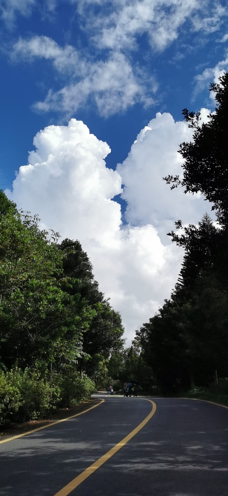

#【随笔】接吻的云（九八三）

在植物园转了好大一圈，眼看着要走出去了。忽然觉得身上颇有些轻松，抖了抖肩膀，这才发现，那沉沉的双肩包此时并没有在自己肩上。我转身惊呼：

> 糟了！

大宝被我吓了一跳，以为我被毒蛇咬了。后来听说只是包没了，气得半天不理我。我赶紧把婴儿车交给文姐，转身往来路跑去。一边琢磨，自己究竟是在哪里休息时，把包放下了忘记拿呢？上坡路跑起来并不轻松，好在没多远，我就看到了刚刚拍过照片的「揽胜亭」。也想起了自己放下包，和阿宝一起坐在亭边台阶上的画面。

进到亭子里，果然，包还在。包里的电话也在这时候响了起来，我掏出来一看，是大宝打过来的。她告诉我说，她想起了包放在亭子里了，刚刚看那里的照片见到我还背着包呢。

背起包，身子虽然沉了，心情却轻松起来。追上大宝时，她和文姐带着大鱼和阿宝正在一边休息。她把手机交给我，让我看刚刚拍的照片。咦，竟然是两朵云在接吻，真是有趣啊！

回想这一天在植物园里悠哉悠哉转下来，一身臭汗，真是舒服愉快啊！我觉得最爽是在「盆景园」的湖边长凳上小憩一会儿，清醒后，看着湖水里倒影的蓝天白云，和轻轻划水的小乌龟时。大宝却觉得站在「仙人掌丛林」里，有特别的气场，最是舒适。

倒是苦了文姐，一直惦记着帮我们照顾大鱼，没能轻松享受着游玩的乐趣，却跟着我们走得快要累趴下。