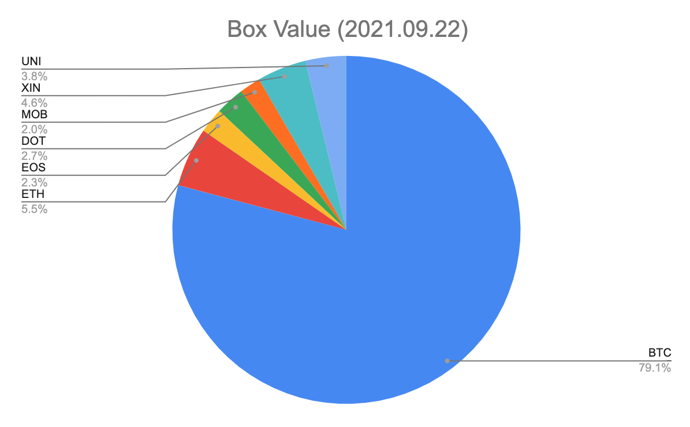

#【区块链】销售“定投人生课堂”的风险问题

下午的时候，和[羽白石](https://zuopin.xin/authors/64aa8c4e22e9a851500716238be88ba630e6d6d9)在微信聊天，聊到视频号，以及销售“定投人生课堂”的事儿，她说：

> 第一阶段想全面销售“定投人生课堂”，有一个问题。
>
> 邀请朋友或陌生人进入定投课堂，肯定涉及到定投Box，我对课程100%安心也绝对认可，对于Box标的我也能做到自己足量定投，但如果邀请朋友，并且帮助他们定投Box，还是有些担心风险。
>
> 我能保证自己承担风险的能力，但是如果Box有隐藏风险的话，还是担心坑了人家。
>
> 我想问的是，就你专业的认知，Box有可能有的一些风险。
>
> 一旦引导进入定投课堂，投资Box的可能性是80%以上的，我最大的担心是，我一旦全面开展业务，可能会销售几百张门票，如果Box崩盘了，那个风险承担起来有些费劲儿。对最坏的结果，做个评估，不怕一万、就怕万一。

还没开始销售，就在操心售后，还是极端情况下的售后怎么办，果然是「专业」、「用心」的销售态度。

关于Box有可能有的一些风险，其实我也不够专业，在微信里我说了两条，这会儿又想到一点，一共三条。且列在这里，供自己，以及其它可能有类似问题的朋友将来参考。

##Box本身的风险

### 1. Box合约本身的风险

Box是李笑来设计的一个“**数字资产投资标的的开源配方。**”，包含了一篮子区块链Token（目前，每一份 BOX 中，包含 0.0001 个 BTC、0.0001 个 ETH、0.03 个 EOS、0.005 DOT、0.01 MOB、0.0008 XIN、0.01 个 UNI 组成。）在[B.watch的帮助网站](https://bwatch.zendesk.com/hc/zh-cn/articles/360032542872-BOX-%E7%AE%80%E4%BB%8B)上，有关于[Box的简介。](https://bwatch.zendesk.com/hc/zh-cn/articles/360032542872-BOX-%E7%AE%80%E4%BB%8B)

本来，智能合约嘛，说白了就是靠一段代码来保障这个「合同」，可任何代码都有风险，任何执行代码的平台也都有风险。这就是我所说的「Box合约本身的风险」。这个风险有多高呢？只有审计过代码才可能进一步量化。至少，跑在ETH平台上的合约，一定比ETH平台本身风险要高。

想到这里，我打开了Box Token的ERC20合约地址： [0x045414e728067ab3da4bceafc0d992d59183463a](https://etherscan.io/address/0x045414e728067ab3da4bceafc0d992d59183463a)，却发现两件事：

1. 源代码并未公开（可能这也不是什么事儿，毕竟字节码也能反编译）
2. 反编译代码后一看，这个Token及其简单，就是一个最简单功能的Token，没干任何额外「智能」的事情。也就是说，Box和其对应的那些数字货币相互间是怎么锁定的，那是由B.watch搞定的事情（怎么搞定的？风险有多高？目前我不知道……）。

### 2. Box相比区块链主流Token（BTC，ETH）的风险

刚刚上CoinMarketCap查了一下Box各成分的价格及排名，做了下面这个表格。

| Name | Volume | Price      | Value      | # Rank |
| ---- | ------ | ---------- | ---------- | ------ |
| BTC  | 1      | $42,525.02 | $42,525.02 | 1      |
| ETH  | 1      | $2,965.56  | $2,965.56  | 2      |
| EOS  | 300    | $4.14      | $1,242.00  | 37     |
| DOT  | 50     | $28.99     | $1,449.50  | 9      |
| MOB  | 100    | $10.51     | $1,051.00  | 2959   |
| XIN  | 8      | $307.72    | $2,461.76  | 4255   |
| UNI  | 100    | $20.42     | $2,042.00  | 13     |

或者，看图更直观一些

注意，这里除了公认排名第一的BTC和排名第二的ETH之外，还有约莫15%是其它项目。也就是说，按今天的价格，**这里引入了15%的其他项目风险**，当然这些项目如果有某一个迅猛发展，也很可能因此带来远超过15%的收益。

### 3. Mixin 钱包的风险

最后，由于Mixin钱包的特殊机制，在「易用性」和「风险」的权衡上，它与传统区块链钱包还是大大不同。它借鉴了我们常用的那种安全登陆手段，手机号+PIN码就是全部了。对于普通用户来说，确实简单了。可是，普通用户，真的能理解——「**这位PIN码若是没了，你的数字资产就全没了**」这句话吗？

另外，普通用户真的理解——「**你的手机和PIN码若是同时被偷了，你的数字资产就可能立刻被偷走**」这句话吗？

而且，这种模式，等同于有一家「银行」（分布式运行的Mixin网络）、或者说「钱庄」，替你保管着各种钱包。呃，这家钱庄的安全措施，真的有那么靠谱，和经过了上十年验证的BTC/ETH那种传统区块链密钥机制，一样一样可靠吗？你可知道，如果这「钱庄」出了严重问题，就算你手机与PIN码都保管得好好的，这「钱庄」里属于你的「数字资产」也可能出问题。

## 如何应对以上风险

### 首先，牢记蛋壳原则

本质上，这其实是一个家庭资产理财分配的原则。在[《定投改变命运》第三部分里](https://ri.firesbox.com/#/cn/?id=_33-%e6%8a%95%e8%b5%84%e4%b8%8d%e6%98%af%e6%99%ae%e9%80%9a%e7%94%9f%e6%84%8f)，李笑来介绍了蛋壳法则，我觉得很有道理，反正是开源的，且摘录在这里：

> > 很多人对生活可能产生意外的可能性低估到干脆忽视的地步。
>
> 可事实上，生活总是充满了意外，于是，你的生活成本总是远高于你最坏的想象。你到底应该用多少钱去投资呢？人们经常会这样问：“我用 10% 的钱去投资是不是很安全？” 在这一点上用比例思考的方式通常不会得到有意义的结论。
>
> 
>
> 你把你的钱想象成一个熟鸡蛋的结构：
>
> > - 蛋黄的部分，就是你的日常必需开销；
> > - 蛋白的部分，就是你为了抵御风险而准备的储蓄；
> > - 蛋壳的部分，才是你可以用来投资的钱，它可以在未来两个大周期之内绝不离开市场……
>
> 很大一部分人的投资失败，并不是因为智商、信心、毅力之类的问题，而是因为早期彻底低估了生活中可能遇到的那些大意外的成本 —— 也就是说，没想到蛋白的部分竟然那么厚。比如，自己的牙突然坏了，某位重要的亲属得了绝症，自己不小心出了个车祸，孩子不小心惹了什么很贵的麻烦…… 例子举也举不完。反正，意外有很多很多面具，每张面具都有一张血盆大口。
>
> 这就解释了为什么用比例思考干脆无效。例如，你总计就有 10 万，你以为这 10 万是基数…… 可就算你小心翼翼只拿出 10% 去做投资，但一个大周期还没过去的时候你遇到了一个 20 万的意外，而这时候连那用来投资的 1 万也处于缩水状态，那你怎么办？
>
> 所有投资人都一样，进入市场一小段时间之后就会有深刻体会：
>
> > 每次你想要卖出投资标的换取现金的时候市场价格就会下跌……
>
> 为什么会出现这么违背直觉的现象呢？首先当然是因为交易市场里熊市就是比牛市长很多；与此同时，每当你急需花钱的时候，基本上都是市场外赚钱比较难的时候，市场外赚钱比较难的时候，市场内的价格自然是处于下跌状态的。还有另外一个原因在起作用：当市场内价格上涨的时候，你出售投资标的的意愿更低 —— 在那样的时候，越是长期持有者越是没有消费欲望…… 于是，最大的损失总是来自于 “不得不出售投资标的” 的情况。
>
> 回过头来，现在的你一定更深入理解了为什么这个你听过无数遍的建议那么重要：
>
> > 投资只能用**闲钱**。
>
> 定投者用来投资的钱，不应该有成本，更不应该有期限；它必须是能够陪你穿越至少两次牛熊（或者说跨越两个大周期）的钱…… 不仅如此，还要有足够的备用金去应对可能的意外。
>
> 这种认知提升，是定投策略者相对于市场上的其他人 *γ* 更小甚至趋近于零的核心。用带有成本的钱， γ 自然会被提高，用竟然有使用期限的钱，γ 会被无限放大，并且，时间越久影响越厉害。若是没有做好应对意外的准备，那么 γ 不仅很大，并且那很大的 γ 还绝对不可逃脱。

说实在话，**这道理看起来容易懂，却很难执行，但真的很重要**。从去年到现在，不长的一年多时间里，我已经历经两、三次「必须」要用钱，只能低价卖出比特币、以太坊来换钱的惨痛经历。这还不算眼睁睁看着自己的合作伙伴，因为资金周转需要，在以太坊因DeFi热潮大涨之前，把前几年囤的以太坊全部卖掉这件事。

稻盛和夫在《活法》这本书里，也强调过，做公司一定要有「蓄水池」。家庭也一样。那么基于自己的家庭状况和需求，根据投资标的的风险收益情况，构建层层蓄水池，显然是做投资的第一项功课——现金、保险、实物黄金、贵金属期权、房产、股票、期货、数字资产、收藏品等等等等，每样应该放多少资金进去，自己对它们的期望值是什么，那是必须是要想清楚的。

很多理财课，只讲这个。其实就是一句话，**明确需求，了解风险与收益，做好配置**。想要更好的量化风险、收益及资金配比，需要深入了解一下巴老推荐的现金流贴现法，以及凯利公式。当然，这两公式大致弄明白拿着真正用起来，你会发现里面有很多参数只能「估算」，「估」得不一样，结果会差很远，所以重点还是要追求**模糊的正确**，而不是**精确的错误**。其实，定投策略本身，就是在很多东西估不准时，普通人可用的最好的折衷主义。

### 其次，定投标的可以做些微调

当然Box，其实只是可投资的标的之一。这个李笑来设计的东西，更多的是为了方便而提供给普通用户的一个重要选择。其实，依照定投的原则，你还可以定投指数基金、照抄巴菲特、乔尔·格林布莱特的投资组合啊，这些都在[《定投改变命运》书中第二部分详细讨论过](https://ri.firesbox.com/#/cn/?id=%e7%ac%ac%e4%ba%8c%e9%83%a8%e5%88%86-%e5%ae%9a%e6%8a%95%e6%a0%87%e7%9a%84%e7%9a%84%e9%80%89%e6%8b%a9)，不要忘记了。

李笑来的策略也很好，同样可以直接抄作业，比如：

1. 照抄Box，自己投；或者类似BOX，按比例投Top5 / Top10 的区块链资产。排名可以参考https://coinmarketcap.com/或类似其它网站。每一段时间（半年或一年），根据排名调整标的池即可。我个人更相信中长期成交量排名，比如按月、甚至年成交量来排名，靠前的项目靠谱程度还是挺大的。
2. 类似GAFATA组合。在以前版本的《定投改变命运》里，李笑来还提到过打算成立一个“奥德赛”（**ODYSSEY**）基金，专门投那些拥有不断增长用户数据的公司，虽然最近这部分内容被删掉了，但我依然相当认可这个策略。选择那些成为了「人工智能」的基础设施的公司作为一篮子标的，还是非常不错的一个选项。

当然无论是Box、还是其他区块链资产，都有本金损失的风险，甚至还有极小的归零的风险。任何股票也是一样。

### 最后，可以学习更多区块链的钱包安全知识

数字资产不一定**全部**放在Mixin钱包，还有很多钱包可以选择，安全性 / 方便性各不相同。**硬钱包、冷钱包、离线钱包**等等这些名词及其背后所代表的东西，有必要随着自己数字资产的增多，也慢慢地去多多了解一下。

