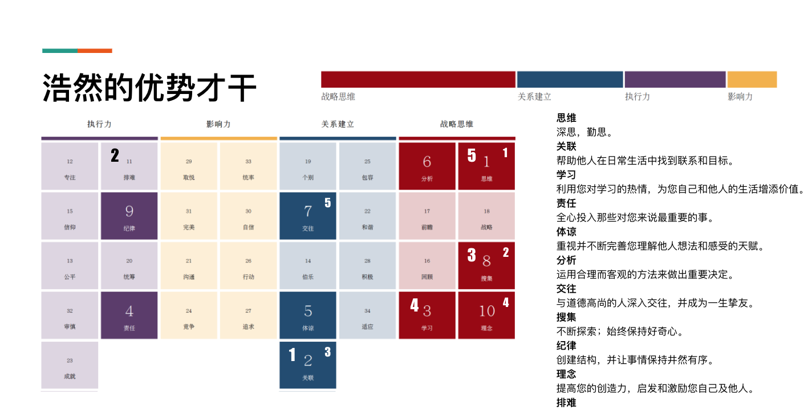

#【生命⋅修行】向盖洛普优势教练咨询

最近一面复盘、一面想要再斟酌一下关于未来的计划，决定找一个盖洛普优势认证教练为我做一下咨询。于是，想起[火哥](https://www.zhihu.com/people/liu-zhi-bin)来。

认识他快超过10年了，因为[豆瓣上那篇7000多字的书评](https://book.douban.com/review/6692850/)。最近一次见面，竟然也已经是8年前。翻看了一下QQ群里他写的记录，关于我他当时是这么说的：

> 搜集、学习、思维、排难、关联，INTJ。后来测出交往应该是有的。
> 典型的思维类人才，也是个老帅哥。03年在深圳置业，从IBM跳到华为做IT业的MARKETING。幸福安宁的深圳人。聚会后向我介绍了比特币的相关信息，让我大开眼界！

「置业」、「幸福」、「比特币」，这些关键字让我不剩唏嘘。想起他在[知乎上的那篇《盖洛普优势识别器测试结果准确吗？》](https://www.zhihu.com/question/22707507/answer/26435540)里说他在2019年去考过了认证教练，也接收费咨询的案子，便赶紧联系了他，于是就有了一次长达一个半小时的深入聊天，受益匪浅。

我的盖洛普优势一览表是这样的：

我最困惑与担心的，便是自己最近几年鲜有成绩的原因，是否因为自己「执行力」方面的短板。可是火哥却告诉我说，其实从天赋与优势来看，我的执行力根本不会是短板。我排在第4的「责任」才干，会让我一旦在内心接纳一件事情后，会不顾一切地去完成它，虽然我也会因此在真正接纳一个任务前，给自己设置一个比较高的准入门槛；我排在第9的「纪律」才干，决定了自己在有准备、有秩序的情况下，也会有着不错的工作效率，而那些准备工作、前置工作究竟是怎样的，其实是我自己可以根据实际效果去调整的东西。

而我思维类的才干，在我排名前十的才干里，占据了一半之多。本来是一个配合很好的组合，有「分析」这个才干作为自己的内审把关，可以把其他各种思维、搜集、学习的产生的结果，变成真正有现实意义的决策。然而，我很大程度上，是把这些才干的原始状态「负向」发挥出来了，反而影响了效率。把这些才干从面向「自我」，转向「利他」的结果导向，就是解决之道。

或者说，我内心里对于「算无遗策」这种完美思维状态的贪婪，导致了一定程度上工作效率与绩效的不尽人意。他的建议是，在我所有的思维过程中，坚持上纸、上工具（模型）、走流程。调动我的纪律、分析与理念来结构化我的思维过程，提高效率。要允许自己有多轮思考，按时间点、按结构完成每一轮思考。他给我介绍了好几样结构性思维的工具，比如《六顶思考帽》、私董会的模式、得到推荐的「君主与幕僚」模式（君主介绍项目议题，幕僚只有1分钟提问，或只结构化介绍曾经的经验）等等。

他还提到，我的特点，自己独自创业会有明显的短板，需要比如SJ型，有坚决执行力的人，或者企图心很强的（大销售）作为搭档。我反思自己最近几年的经历，深以为然。

我们还聊到抑郁症，没想到他也曾深深陷入抑郁症的痛苦，最后靠着自己的读书与研究走了出来。关于这个，他说他彻底想明白了，就这么两点：

> 1. 抑郁症就是一个精神上的感冒，不必否认，也不必恐惧。
>
> 2. 归根结底，是由于我们这个适用于百万年前自然环境的身体，对现代社会不适应造成的。
>
>    a. 晒太阳少了、运动少了——多晒太阳、多运动
>
>    b. Ω-3摄入太少——吃深海鱼油
>
>    c. 现代社会有太多的风险假相。大量与生死无关的事情，我们当作生死悠关去担忧。而实际、真实的风险太少。尤其对于那些有思维过度倾向的人，容易沉浸在一个点上，反复咀嚼假想的痛苦——把想的写纸上

为了让我深入、系统的了解他的建议，他给我推荐了好几本书——《麦肯锡结构化战略思维》、《2的力量》、《赢在决策力》，以及《像哲学家一样生活》，甚至还有于晓非在喜马拉雅上的佛学课程。

他还建议我记住一个比喻：我自己想过的所有东西，以及我思维过程中、工作过程中自己使用的脑图等等，都是属于「源码」级别的东西，不要随便当作「客户界面」拿出来给别人看。

他最后总结说，其实我当下最想解决的问题。就是一个「主现金流」的问题。把情绪扔一边，理性地去解决它就好。待这个问题解决后，其他顾虑和问题都好说。**诚然如是！**