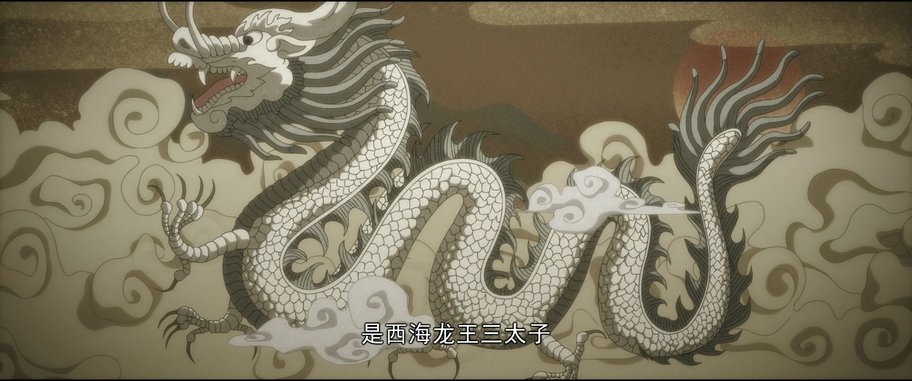
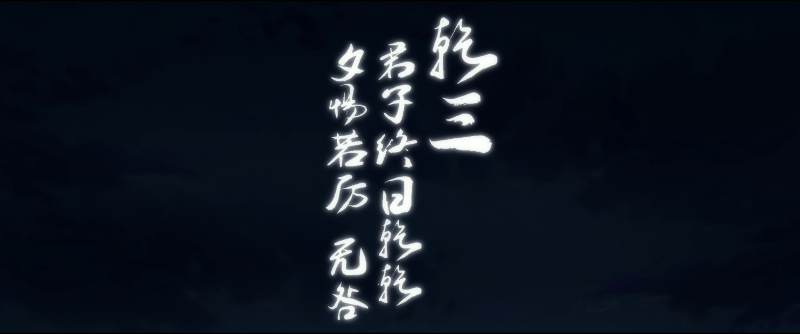

#【生命⋅修行】君子终日乾乾

那天在腾讯视频又追看了一集国漫《一人之下》，居然惊喜地发现，这集借诸葛青之口，又一次在解读《西游记》降妖除魔故事背后的「修行之道」，想当初我就是被主角的爷爷给他讲西游记这个片段带入坑的。

在这集里，特别提到了「心猿意马」里的「意马」，也就是白龙马的另一个身份——西海龙王三太子！

而这个角色，尤其是三太子他爹敖闰在《西游记》里一会儿西海龙王，一会儿北海龙王的，正是西北方——乾卦——第三爻

> ### ䷀ 乾为天，君子以自强不息
>
> 乾，元亨利貞。
> 初九，潛龍勿用。
> 九二，見龍在田，利見大人。
> **九三，君子終日乾乾，夕惕若厲，无咎。**
> 九四，或躍在淵，无咎。
> 九五，飛龍在天，利見大人。
> 上九，亢龍有悔。
>
> 用九，見群龍无首，吉。

> 九三曰：“**君子终日乾乾，夕惕若厉，无咎。**”
>
> 何谓也？
>
> 子曰：“君子进德脩业。忠信，所以进德也；脩辞立其诚，所以居业也。知至至之，可与言几也。知终终之，可与存义也。是故居上位而不骄，在下位而不忧，故乾乾因其时而惕，虽危无咎矣。”

所以，驮着唐三藏，兢兢业业一路到西天修成正果的，正是这「终日乾乾，夕惕若厉」。

所以，我平日里由着这脑子漫天飞转，那可不太行，终究需要让心做主，让猴哥牵好它的缰绳。从早到晚，时时刻刻都要记得，把这脑子里的意识，带回到那正确的修行方向上去。当谋划时则专心谋划；该行动时，则停下胡思乱想，聚焦于推动当下该做的事情；该歇息时就让它歇息。

在让自己的意识歇下来时，更要小心戒惧，如秣马厉兵随时备战一般，做好时刻用它的准备。千万不可刀枪入库、马放南山。

不止日常作息、工作家庭、与人交往，既然事事皆修行，那么事事也都离不开这「终日乾乾，夕惕若厉」的态度。