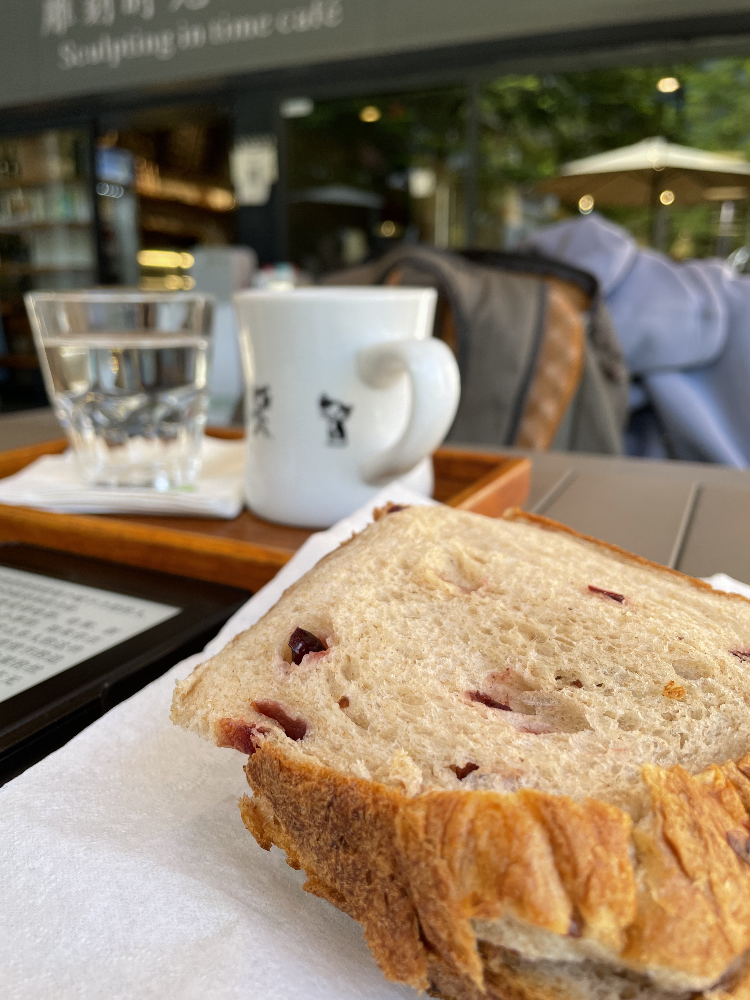

#【随笔】上所施下所效，养子使作善

吃完大宝做的蔓越莓面包，把那杯苦咖啡剩下的最后一口倒进肚子里，伸了伸懒腰，感觉有些凉，原来阳光已经转了过去。

穿上外套，便听见有人跟我打招呼。抬头发现是小R刚刚落座，便换了一张桌坐过去，我问他：

> 最近如何？

他长叹一声：

> 唉，前两天，法院第一次开庭。

我一懵：

> 啥？

他点起一只烟，悠悠地聊起来：

> 我们那机构不是倒闭了么？我们员工要讨薪，家长想要回学费，还有银行贷款、房租水电都欠着呢……

就这么瞎聊着，他谈起他的理想和困惑。他说，经历这么多波折，他依然还是怀揣着做教育的梦想。你说，你知道我给学生上课时那状态吗？他说，**你知道，什么是真正的教育吗**？我反问他，你觉得呢？

小R端起咖啡喝了一口，放下了他刚刚闲聊时一直没离手的游戏，转过头来对我正色说：

> **教**，上所施，下所效也
>
> **育**，养子使作善也

我搜了一下，原来这是许慎在《说文解字》里的说法。心里不禁暗暗竖起大拇指，「上施下效」讲的是方法和原则；「养子使作善」讲的是教育的对象以及目的。我便问他：

> 什么是善呢？

他说：

> 好问题！

却叹了口气，又抽起烟来……

----

只因为格局宽广与否，眼光长远与否，这一个「善」字，就有许多不同的定义。所以，也衍生出许许多多不同的「教育理念」，所以，对于**社会**，对于**家长**，对于**孩子自己**而言，**教育**根本就不是同一个东西。

我倒是觉得，论语里孔老夫子提出的教育或者说学习的次第，颇值得参考，子曾经曰过：

> 弟子入则孝，出则弟，谨而信，泛爱众，而亲仁，行有余力，则以学文。

怎么才能「孝」呢？在子思先生在《中庸》里进一步阐明了原则与方法：

> 顺乎亲有道，反诸身不诚，不顺乎亲矣。诚身有道，不明乎善，不诚乎身矣。

终究还是回到了什么是「善」这个问题。我依然相信，每个人内心，都有「善」的标准。所谓「教育」问题，永远绕不开的还是怎么「自我教育」的问题。

想必，心中依然有理想的小R，目前的困惑对他来说，也终究不是什么大不了的事吧。