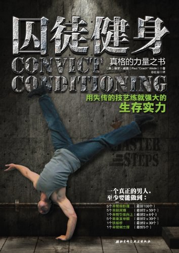

#【教程】怎么样开始囚徒健身并坚持下去

**【写作课作业D.007】**

## 什么是囚徒健身

首先，《囚徒健身》是一本书，2013年由北京科學技術出版社出版，作者是美國的保羅·威德，譯者是谷紅巖。封面长下面这样。

但同时，大家提到《囚徒健身》时，更多指的是保罗在书中介绍那一整套**使用你的身体来训练你的身体的健身方法**。

没错，不需要健身房，不需要请昂贵的教练，不需要大量整块的时间，不需要吃那各种可以让肌肉变得漂亮、但有着各种奇怪副作用的药物与蛋白粉。就好像书中那句话：

> 灯熄了。你独处在你的囚室中，一无所有，只有自己的身体与心灵相伴。 开始练吧。

囚徒健身，这是一套你只需要投入身体与心灵，就可以学会并从中受益的健身方法。

## 为什么我（你）要进行囚徒健身

大约高中时候，被发小拉着一块儿，在一个健身房参加了散打的课程，因此也在那里学会了用杠铃、哑铃等等看起来颇为专业的器械练习力量。以至于我一度以为健身，就是要在健身房里进行的活动。

后来工作了，办过若干次健身卡，什么一年、五年各种值充起，却没有真正地坚持下去。直到大约6、7年前，我发现了这本《囚徒健身》。看了序言，我就知道，这正是我需要的健身方法：

1. 能够增强力量、改善身形——「强健体魄、野蛮精神」。
2. 符合人体科学原理——都是常见身体动作，训练更加均衡，不至于练出肌肉但实际上身体关节却脆弱无比。
3. 简单易行，可以随时随地锻练。

另外，可能作者在中文序里所说的话，也给了我很大的激励吧：

> 我和许多西方人一样，都对中国文化（尤其是中国人在人体运动方面发展出的那些精妙系统）怀有敬畏之心。确切地说，中国人深谙“体操运动”的真正价值已有数千年之久。中国人对体育训练（包括武术与现代运动）的诸多贡献，便是最好的证明。“身体智慧”深深地植根于中国文化中，因此，运用我的方法来锻炼，中国读者有先天优势。
>
> ……
>
> 其实有一种方法，让训练者无需忍受关节疼痛或身体不适，便可以练就极致的肌肉力量、惊人的块头以及超强的爆发力。该方法很自然地运用人的自身体重，而不是那些奇形怪状的器械。

其实，女孩子也一样可以练。大宝看了这书，就也爱上了这方法。除了太极，这应该是她想要坚持下去的第二项健康运动了。她的目的是——「减肥」！而且，一个多月就开始能看到效果了。

所以，如果你也和大宝与我一样，想要学会一个简单、自然可以增强力量、改善身形（无论是增肌还是减脂）的健身方法。欢迎加入一起囚徒健身的行列。

##进行囚徒健身需要什么条件

由于这是一套使用自身体重锻炼的方法，需要的条件非常少，必需品只有以下三样：

1. 开始锻炼的决心

2. 能躺下、能扶墙站立的身体

3. 一小块地：

   有些动作只要够站就行，

   有些动作需要你躺下，

   有些动作需要一堵墙，

   有些动作需要一个凳子或桌子，

   有些动作需要一个能把自己悬空的单杠，栏杆，屋梁或树枝

当然，最好，你可以去买一本《囚徒健身》的书，不管是作为随时翻翻的参考，还是只是为了感谢保羅·威德把这个美妙方法带给我们，表示一点尊敬与谢意，都是非常值得的。

##怎么开始囚徒健身

囚徒健身一共介绍了六种锻炼方法，每种锻炼方法分为10个阶段，俗称六艺十式。**只要你学会了其中任何一个动作的第一式，就可以开始了！**当然，最好你还需要制定一个锻炼计划。

六艺十式究竟是怎么样的呢？我在这里简单列一下表格与升级标准（涉及偏重或单侧的动作都是指每侧的练习次数），每一式首先都要能标准地完成初级所规定的次数，循序渐进慢慢增加，到能轻松完成升级标准后可以试着开始学习下一式。大部分时候，光看名字就知道是怎么回事了。当然，你也可以加我微信，找我要一份本人私藏的图片，作为日常锻炼时的参考。

|            | 一、俯卧撑       | 二、深蹲         | 三、引体向上         | 四、举腿       | 五、桥     | 六、倒立撑       |
| ---------- | ---------------- | ---------------- | -------------------- | -------------- | ---------- | ---------------- |
| **第一式** | **墙壁俯卧撑**   | **肩倒立深蹲**   | **垂直引体**         | **坐姿屈膝**   | **短桥**   | **顶墙倒立**     |
| 初级       | 1x10             | 1x10             | 1x10                 | 1x10           | 1x10       | 30秒             |
| 中级       | 2x25             | 2x25             | 2x20                 | 2x25           | 2x25       | 1分钟            |
| 升级       | 3x50             | 3x50             | 3x40                 | 3x40           | 3x50       | 2分钟            |
| **第二式** | **上斜俯卧撑**   | **折刀深蹲**     | **水平引体向上**     | **平卧抬膝**   | **直桥**   | **乌鸦式**       |
| 初级       | 1x10             | 1x10             | 1x10                 | 1x10           | 1x10       | 10秒             |
| 中级       | 2x20             | 2x20             | 2x20                 | 2x20           | 2x20       | 30秒             |
| 升级       | 3x40             | 3x40             | 3x30                 | 3x35           | 3x40       | 1分钟            |
| **第三式** | **膝盖俯卧撑**   | **支撑深蹲**     | **折刀引体向上**     | **平卧屈举腿** | **高低桥** | **靠墙倒立**     |
| 初级       | 1x10             | 1x10             | 1x10                 | 1x10           | 1x8        | 30秒             |
| 中级       | 2x15             | 2x15             | 2x15                 | 2x15           | 2x15       | 1分钟            |
| 升级       | 3x30             | 3x30             | 3x20                 | 3x30           | 3x30       | 2分钟            |
| **第四式** | **半俯卧撑**     | **半深蹲**       | **半引体向上**       | **平卧蛙举腿** | **顶桥**   | **半倒立撑**     |
| 初级       | 1x8              | 1x8              | 1x8                  | 1x8            | 1x8        | 1x5              |
| 中级       | 2x12             | 2x35             | 2x11                 | 2x15           | 2x15       | 2x10             |
| 升级       | 2x25             | 3x50             | 3x15                 | 3x25           | 3x25       | 3x20             |
| **第五式** | **俯卧撑**       | **深蹲**         | **引体向上**         | **平卧直举腿** | **半桥**   | **倒立撑**       |
| 初级       | 1x5              | 1x5              | 1x5                  | 1x5            | 1x8        | 1x5              |
| 中级       | 2x10             | 2x10             | 2x8                  | 2x10           | 2x15       | 2x10             |
| 升级       | 2x20             | 3x30             | 3x30                 | 3x30           | 3x30       | 3x30             |
| **第六式** | **窄距俯卧撑**   | **窄距深蹲**     | **窄距引体向上**     | **悬垂屈膝**   | **桥**     | **窄距倒立撑**   |
| 初级       | 1x5              | 1x5              | 1x5                  | 1x5            | 1x5        | 1x5              |
| 中级       | 2x10             | 2x10             | 2x8                  | 2x10           | 2x10       | 2x9              |
| 升级       | 2x20             | 3x20             | 3x10                 | 2x15           | 2x15       | 2x12             |
| **第七式** | **偏重俯卧撑**   | **偏重深蹲**     | **偏重引体向上**     | **悬垂屈举腿** | **下行桥** | **偏重倒立撑**   |
| 初级       | 1x5              | 1x5              | 1x5                  | 1x5            | 1x3        | 1x5              |
| 中级       | 2x10             | 2x10             | 2x7                  | 2x10           | 2x6        | 2x8              |
| 升级       | 2x20             | 3x20             | 3x8                  | 2x15           | 2x10       | 2x10             |
| **第八式** | **单肩半俯卧撑** | **单腿半深蹲**   | **单臂半引体向上**   | **悬垂蛙举腿** | **上行桥** | **单臂半倒立撑** |
| 初级       | 1x5              | 1x5              | 1x4                  | 1x5            | 1x2        | 1x4              |
| 中级       | 2x10             | 2x10             | 2x11                 | 2x10           | 2x4        | 2x6              |
| 升级       | 2x20             | 3x20             | 2x8                  | 2x15           | 2x8        | 2x8              |
| **第九式** | **杠杠俯卧撑**   | **单腿辅助深蹲** | **单臂辅助引体向上** | **悬垂半举腿** | **合桥**   | **杠杠倒立撑**   |
| 初级       | 1x5              | 1x5              | 1x3                  | 1x5            | 1x1        | 1x3              |
| 中级       | 2x10             | 2x10             | 2x5                  | 2x10           | 2x3        | 2x4              |
| 升级       | 2x20             | 3x20             | 2x7                  | 2x15           | 2x6        | 2x6              |
| **第十式** | **单臂俯卧撑**   | **单腿深蹲**     | **单臂引体向上**     | **悬垂直举腿** | **铁板桥** | **单臂倒立撑**   |
| 初级       | 1x5              | 1x5              | 1x1                  | 1x5            | 1x1        | 1x1              |
| 中级       | 6x10             | 2x10             | 2x3                  | 2x10           | 2x3        | 2x2              |
| 升级       | 1x100            | 2x50             | 2x6                  | 2x30           | 2x30       | 1x5              |

在书中，保罗给了五种不同难度的锻炼计划，一周两次的“初试身手”计划，一周三次的“渐入佳境”计划，每周六次的“炉火纯青”计划，供恢复能力特别好的“闭关修炼”计划，以及专供耐力的“登峰造极”计划。

我个人推荐可以优先考虑每周六次的“炉火纯青”计划，因为每周只休息一天，每天专注练一个动作也很简单。有助于养成稳定的锻炼习惯。

##怎么坚持下去

《道德经》说得好，「**图难于其易，为大于其细**」，简单的事情才能长久坚持。所以，

### 首先，要在每天任务尽可能简单的情况下，养成每天练习的好习惯

从第一式初级标准开始，每天只需要5分钟就能开始。

而我这次是每周学一个新动作，但是保证每天坚持练。这样，虽然需要六周后，才能开始完整的“炉火纯青”计划、或者混合一下“闭关修炼”计划。但是，到那时，每天健身的习惯已经养成，继续坚持下去也就不难了。

### 其次，一定不能冒进

保罗在书中强调，一定不能冒进。还举了一个愚者、智者的例子做对比。可惜我之前虽然看了这段，依然不以为意。最终总是进展太快，而卡壳、夭折在标准俯卧撑这种第五式的难度上。

无论自己基础有多好，能做几个俯卧撑，也要稳扎稳打从第一式慢慢开始练起。**每一式至少需要一个月**的稳定时间。在这里，**慢就是快**！因为开始时太快了，会让你将来更容易停下和放弃。不怕慢，只怕断，不是吗？

书中**「愚者之道」**与**「智者之道」**这两段，一定要反复看两次。开始锻炼前，最好先翻到后面，反复读一下这一段以及最后两章。我就是刚刚又读一遍，发现自己这次还是练快了！必需慢下来！

## 关键要点

### 热身与拉伸

运动前需要热身已经是老生常谈的事了。我的热身方法通常是几组简单的拉伸，或者练一趟《金刚功》。然后，按照作者介绍的方法，来两组（第一组20次，第二组15次）只需要使一半力气的训练热身。

比如，正在练习标准俯卧撑，那么热身第一组就是20次墙壁俯卧撑（如果我能做40次），热身第二组就是15次上斜俯卧撑（如果我能做30次）。当然，如果本来就在做最开始的第一式或者第二式，那么热身也做第一式就好。

囚徒健身属于力量训练，训练完成后，最好进行相关肌肉的拉伸与按摩，会大大有助于恢复。但简单做一下拉伸与按摩就好，千万不要花费太多时间，否则又会变成坚持锻炼的障碍。

### 组间休息

可以数呼吸，到自己能恢复大部分力气为止。如果不用五分钟就能恢复，可以立即开始下一组。如果要超过五分钟才能恢复大部分力气，那么休息时最好来回走动、拉伸一下。免得肌肉、血管冷却了，还得重新热身后再锻炼。

### 节奏要慢

在一至五组，建议都采用2-1-2的节奏练习。以俯卧撑为例，俯卧两秒，停一秒，撑两秒。这样可以在过程中仔细感受身体状态与姿势，会有最好的锻炼效果。

### 稳扎稳打

再一次说明，一定要从第一式开始，慢慢适应，慢慢掌握正确姿势。

想要最稳定的锻炼效果，并且不受伤，你可以保持致力于十式中你能做到的难度最高的动作，只要你保证做到一下几点：

1. 遵循“慢功出细活”的建议，从第一式开始、慢慢增加难度。
2. 永远保留余力，每次练习至少保留一到两次还能标准完成动作的力量。
3. **动作姿势要完美**。
4. 没有大病、小病。
5. 没有受伤或觉察到受伤的预兆。
6. **已经满足初级标准所要求的反复次数。**

如果生病了，或者只是觉得太累了恢复不过来。你可以根据身体实际情况，需要时就安插一、两天休息（当然不要中断太久破坏习惯）。

### 如何攻克难关

即便如此，有时候，你可能还是发现遇到拦路虎，怎么也不能进步。以下几招或许能够帮助你渡过难关：

1. 降低体重。集中几个月，增加运动次数，配合合理饮食作息，力争先甩掉些赘肉。
2. 多休息。尝试在不破坏运动习惯的前提下，增加休息天数。
3. 有耐心。很可能是自己着急了，检查自己动作是否完美，不行就退回到前几式重新开始。
4. 干净的生活。睡足觉，别让酒精和毒品侵蚀你的身体。尊重它，别透支它。

### 训练日记与寻找同伴

你可以通过记录训练日记来帮助你更有效的进步。也可以找一些伙伴，互相激励、互相帮助。我在微信视频号上发起了一个活动「跟我一起囚徒健身」，欢迎参加，一起锻炼打卡。

## 参考及其他

1. [豆瓣《囚徒健身》](https://book.douban.com/subject/25717097/)
2. [简书《什么是囚徒健身》](https://www.jianshu.com/p/39d14552e7b1)
3. [知乎《《囚徒健身》里面的健身理论是否全都合理？》](https://www.zhihu.com/question/21970093)

