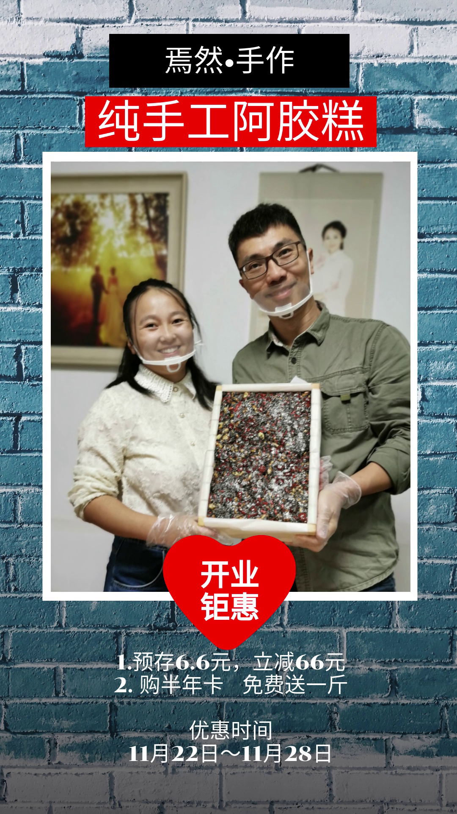

#【生命⋅修行】为什么卖阿胶

和阿宝6个月大时类似，在这次大鱼宝宝满了6个月之后，焉知同学再一次感受到了低落与焦虑。估计是因为生孩子本身就是巨大的气血消耗，然后因为母乳喂养，不能好好睡觉，还有那许许多多细碎的家务活，持续地消耗已经让她的身体到了一个明显的低谷；与此同时，那些朋友、邻居的各种出自好意的关心，或者只是无心的八卦，无法避免地、持续地把社会上弥漫的焦虑传递到了她身上：

> 你出去工作吗？
> 你老公怎么赚钱？
> 你房是买的还是租的？
> 你不让父母来帮忙带孩子吗？
> 小孩子这样教不行啊！
> 小孩子那样带不行啊！
> 你们这样不行的……
> 你们那样不行的……
>
> ……

与生阿宝时不同的是，此时除了一个嗷嗷待哺的大鱼宝宝要操心，上了幼儿园的阿宝也远远没到可以撒手不管的年纪；而且这次，以前对她颇为有效的，来自我的开解、宽慰与支持，这次似乎不是那么管用了。

于是，我们想啊，商量啊，终于做了一个决定。**咱们卖手工阿胶糕吧！**反正焉知同学自己也需要好好补补身体。而且，她又爱太极、又爱美食，这手工阿胶糕恰好既养生、又好吃，而且还很考手工。更重要的是，我相信在把这件事情开展起来的过程中，她能收获更多的价值感，能够更加快乐、更加开心。

而这些，也将成为我这个**「屁大点事儿分享者」**的重要分享内容。日后将要持续分享的那些学习、思考、工作、日常的碎片里，少不了她（通常还有我随侍左右的）这些手工日常。

相信做手工阿胶糕，和太极一样都是她热爱并且可以一直做下去，越来越有收获的事情。我自己也会努力地坚持把我喜欢、热爱的那些事情持续下去：读书、锻炼、研究学习区块链、人工智能这些新技术的应用、陪家人、帮朋友！分享我热爱的这一切！！！

