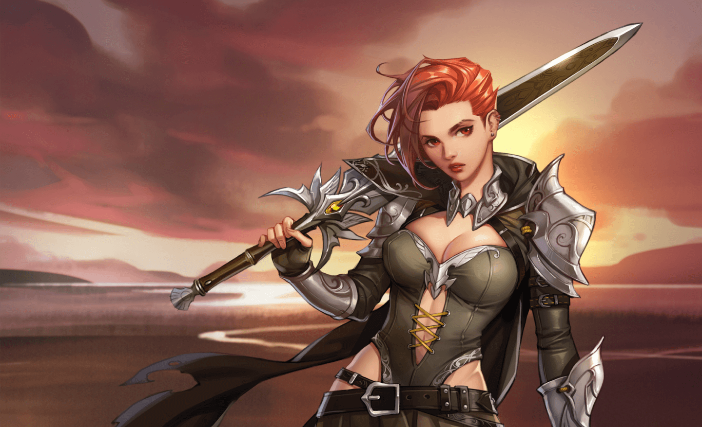
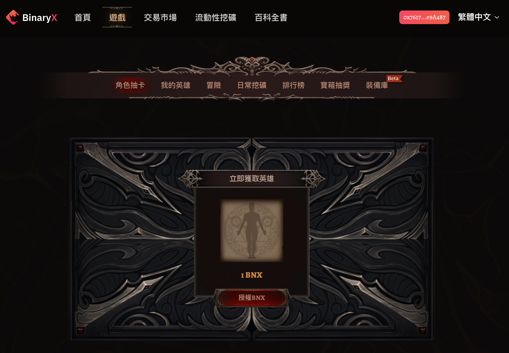
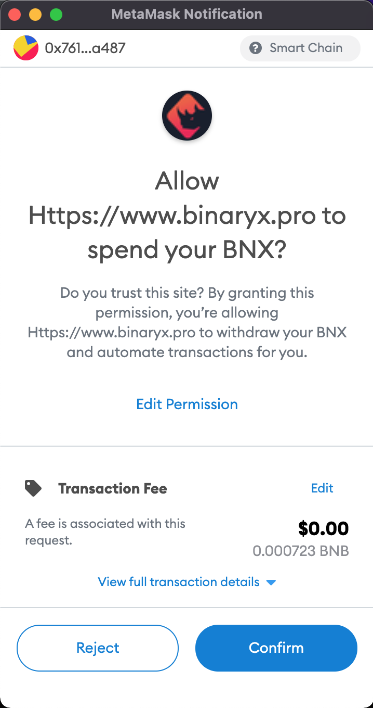
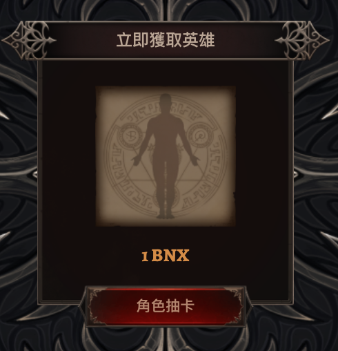
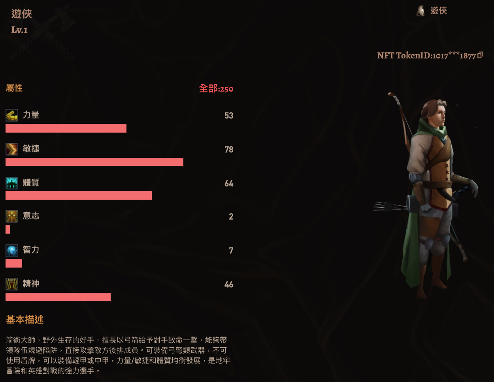
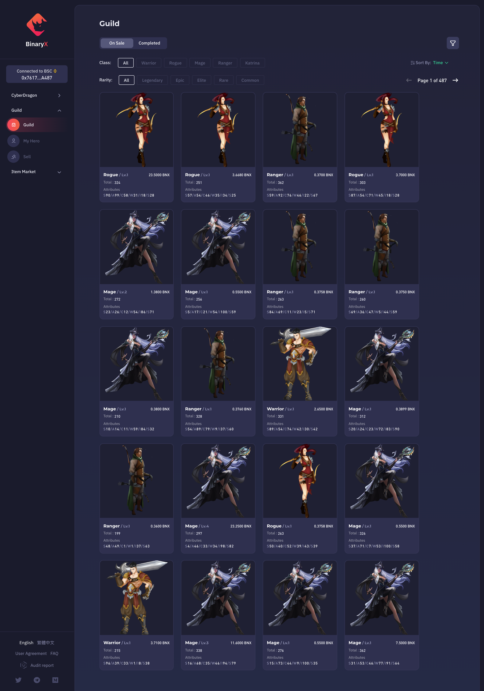
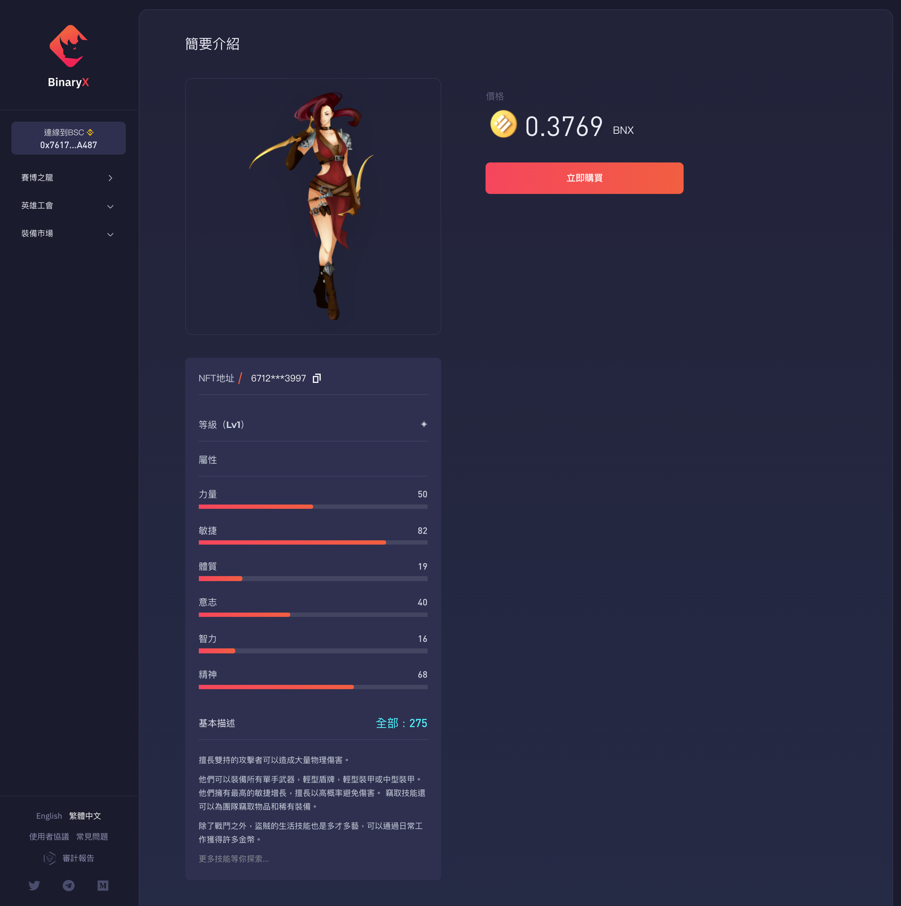
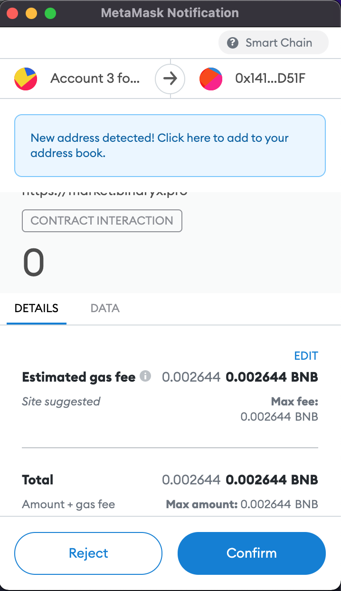
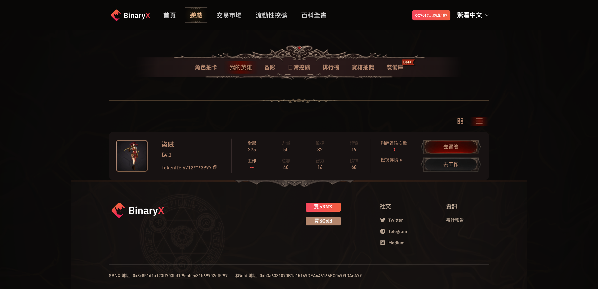

#新手怎么玩区块链游戏BinaryX（一）

没错，就是这款前几天我打算稍微深入体验一下的区块链游戏。人家主页上是这么写的：「CyberDragon / Metaverse 元宇宙遊戲 / Gaming+NFT+Defi+Marketplace+Auction,BSC鏈上玩法大成作品」，好家伙，几乎所有时髦名词都占全了！

## 风险提示

**目前区块链领域里充斥着大量的资金盘、空气币，区块链元宇宙游戏也差不多就这么回事儿。**本人无法保证这里介绍的BinaryX不会沦为（或本来就是）资金盘工具。而且，**玩区块链游戏也需要真金白银的投入**。请各位朋友们擦亮眼睛，**风险自担**。

> “比特币交易作为一种互联网上的商品买卖行为，普通民众在**自担风险**的前提下拥有参与的自由。”
>
> “代币发行融资与交易存在多重风险，包括虚假资产风险、经营失败风险、投资炒作风险等，**投资者须自行承担投资风险，希望广大投资者谨防上当受骗。**”
>
> ——*摘自人民银行等五部委发布的《关于防范比特币风险的通知》*

## 准备工作

首先，你需要一个支持BSC（币安智能链）的网页钱包，比如大名鼎鼎的[Metamask](https://metamask.io/)。毕竟是区块链游戏，登陆需要的是区块链世界目前通行的基于公私钥体系的钱包账户。

再说一遍，这是基础。对于只习惯于用户名/密码登陆各种网站的普通玩家，这是一个巨大的拦路虎。但很多玩家为了玩游戏，最终都把区块链的工具玩得遛遛的。别人能行，你也一定行！

然后，你需要做一些设置，把Metamask连上BSC（币安智能链），并在上面创建好帐号。具体方法，可以照着[币安的官方说明](https://academy.binance.com/zh/articles/connecting-metamask-to-binance-smart-chain)做，很简单的。关键参数就以下这些：

> **网络名称（ Network Name）：**Smart Chain
>
> **新的RPC URL（ New RPC URL）：**https://bsc-dataseed.binance.org/
>
> **智能链ID（ChainID）：**56
>
> **符号（Symbol）：**BNB
>
> **区块浏览器URL（Block Explorer URL）：**https://bscscan.com

最好，请自行备好一定量的BNB（至于如何获得这玩意儿请自行Google），转到刚刚创建的账户里。因为：

1. 区块链游戏的每一个关键交互都要上链，本质上是一笔「交易」，交易就需要手续费。在BSC（币安智能链）上支付手续费用的是BNB。
2. 玩游戏需要BNX和Gold，这些是这款游戏里的两种代币，都可以用BNB换。

如果你只想在游戏中做个佛系兼职打工仔，你需要大约0.5～1个BNX，按现在的价格，大约0.33个BNB，或者大约200美金。如果你还想尝试一下基本的打怪流程，那就需要4个左右的BNX，约莫800美金吧。

接下来，打开浏览器（装好Metamask钱包插件的那个），进入BinaryX的官网，开始历险吧！（什么？不知道官网地址？为了避免广告嫌疑，我就不加链接了，动动脑筋，总会有办法的：）

## 一、获取英雄

有两种办法获取玩游戏的英雄，最常规的就是：

### 1. 角色抽卡

点击首页的「游戏」，再选择「角色抽卡」，点击「授权BNX」……

这时，小狐狸会跳出来，让你确认授权。注意哦，要开始花钱了！

确认之后，等几秒待交易完成，「授权」按钮就变成了「角色抽卡」。

这时，再点击「角色抽卡」，在小狐狸弹出的确认窗口确认交易，你就会花掉1个BNX，得到一个英雄（听说，当年BNX一美金一个，可是现在……）。那天教我玩这游戏的小伙子为了给我演示这操作，鼠标咔咔一点，200美金就没了，然后得到这么一个英雄：

总属性不多不少，刚好250。属于标准只能打兼职工作的废柴游侠（一名合格的游侠，力量需要86，敏捷需要61，每个职业各有入门要求）。不过没关系，如果你抽到的也是这样的废柴（概率非常大，听说有人连抽2、30张，张张是废柴），你也可以像那个小伙子一样，把抽到的废柴英雄送给我。**请注意，你此时抽到的这个英雄角色，就是所谓的NFT！可以转让，可以交易！**

既然抽卡这么划不来，我们还是看看另一种方法：

### 2. 交易

点击首页的「交易市场」，你会进入另一个页面，像下面这样，各种英雄大甩卖呢。注意到价格没？最便宜的废柴英雄，只需要0.36个BNX！！！

不过，这个价格太实惠了，没等我点进去，它就消失了。只好换一个，因为之前已经「授权」过了，现在可以在详情页面直接点击购买。

然后在小狐狸钱包里确认交易。

然后，耐心等待几十秒钟，交易完成后。回到游戏页面，点击「我的英雄」，你就会看到刚刚买回来的英雄角色了！像下面这样……

英雄就位，接下来就可以玩咯！（待续……）