#【区块链】新手怎么玩区块链游戏BinaryX（二）

## 二、做一个快乐的兼职打工崽

### 1. 打工

从「首页」选择「游戏」，再选择「日常挖矿」，然后在第一个「兼职工作」那里点击「准备」

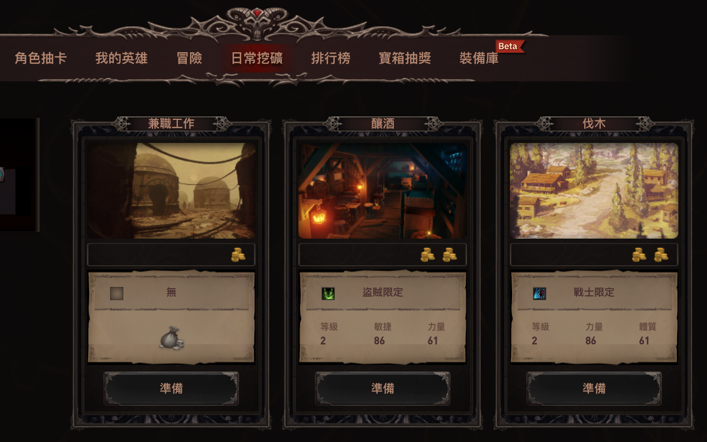

然后呢，在这个下拉菜单里，选中你刚刚买来，还闲置一旁的那个英雄：

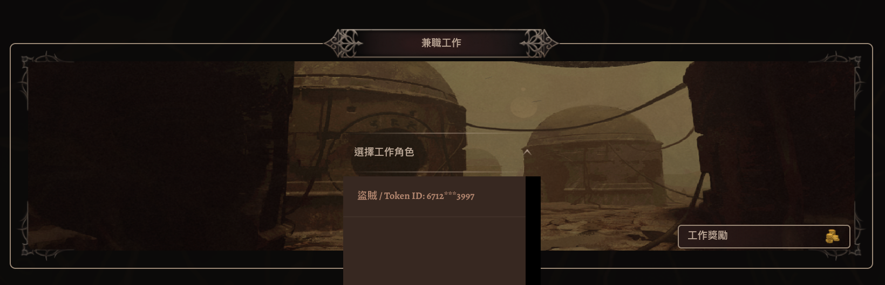

或者，在之前那个「我的英雄」页面，在你的英雄旁边，点击「去工作」那个按钮：

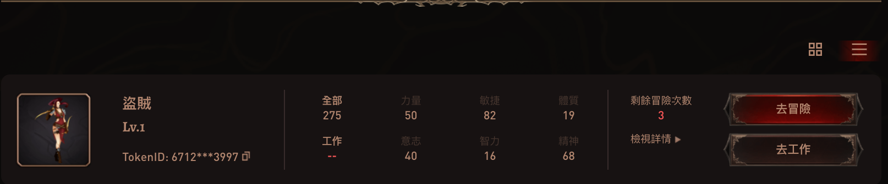

然后，你需要先「授权」，允许你钱包里的这个英雄（这个NFT）在游戏里打工挣钱。

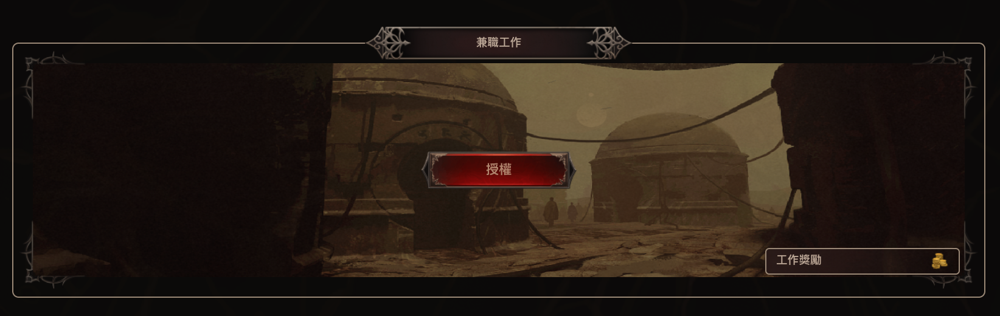

小狐狸钱包会弹出来，确认这笔交易。玩这游戏，动辄需要付交易费（Gas费用），我忍不住去查了一下BNB的价格，0.00072433个BNB大约值0.424098个USD，大概人民币2.68元。啧啧啧！！！

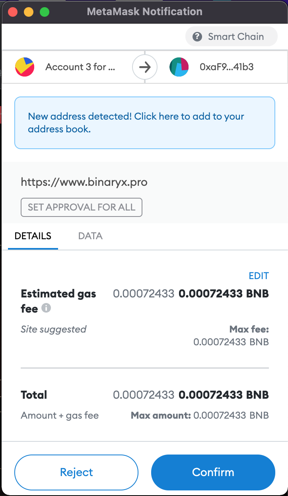

OK，不管了。让英雄赶紧去打工挣钱要紧！交易确认后，就可以「开始工作」了！

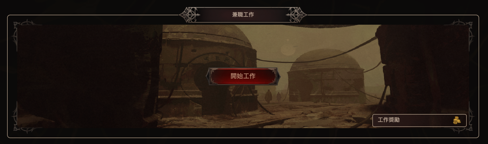

继续在小狐狸跳出来的对话框里点击确认，花掉这大约1.2个USD（约莫人民币7.56元）。

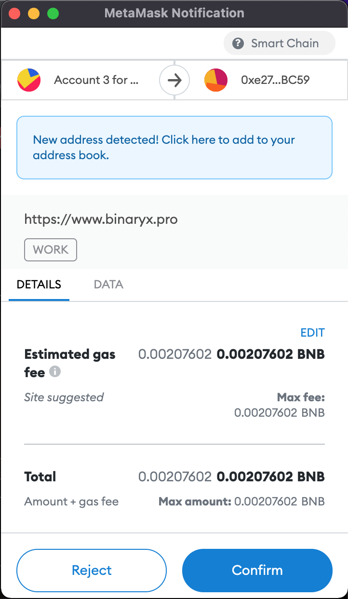

把屏幕往下拉，你会看到一个列表，如果你有多个英雄正在打工的话，这个列表会像下面这个样子。

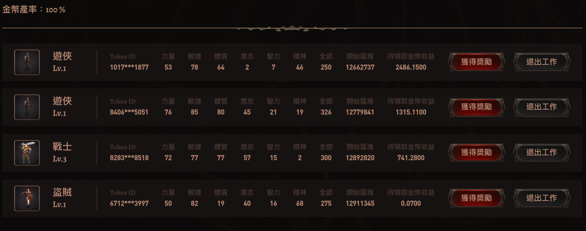

注意，左上角有一个金币产率：100%。根据官方文档：

> 在到达432000个区块（大概15日）后，英雄的收入将下降到原有的80%。 在到达864000个区块（大概30日）后，收入将下降到40%。 在1728000个区块（大概60日）后，收入将下降到10%。点击获取奖励或退出工作即可将英雄的收入恢复正常。

所以，最好在受益率下降之前，「获取奖励」或者「退出工作」。

### 2. 收工

不管是点获得奖励，还是退出工作，都要结算工资。区别在于，「退出工作」之后，英雄就没有在打工了，当然，他也就可以再去做其他事情了，比如「冒险」！

#### 2.1 获得奖励

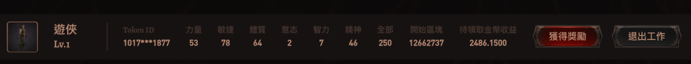

点击对应英雄角色右侧的「获取奖励」，立即会弹出小狐狸钱包的确认框，点击确认支付Gas费用。这次是约莫0.72USD。

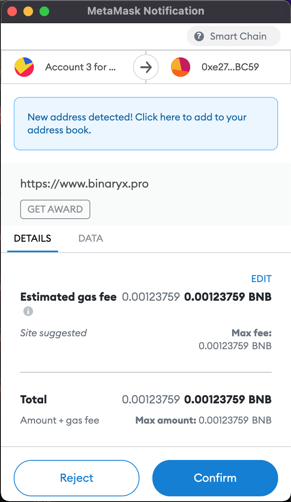

等到交易成功，你会看到待领取金币数量，变成了接近0。

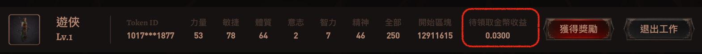

这种废柴英雄，每打一天兼职临时工，会赚大约288个金币。按照今天的价格，大约是1.9USD。所以不能太频繁地领工资，不然赚的钱全都用来付手续费了。每天打零工能赚多少钱，其实还和金币价格相关，官方文档的说法很绕圈：

> 除此之外，英雄每日收入的金币数量还将会收到经济环境的影响，不同的金币对BUSD价格将会影响到英雄实际能够收获的金币数量。金币收获的比例在每日UTC时间中午12：00确定，在确定后的24小时内点击领取收益都将按照该比例领取。所有未领取都将按照点击领取收益时的收入比例进行计算。金币价格和金币收获比例请见下表：

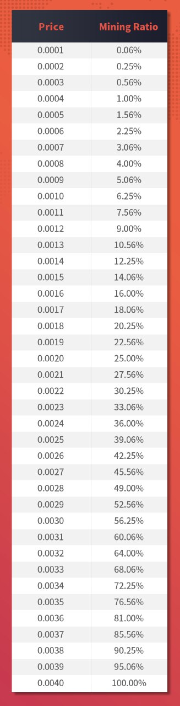

目前的金币价格在0.0067 USD左右，所以，刚才我都是足额100%领取的。按照我们之前购买废柴英雄的价格，你可以算出来，大约是40天回本。**前提是40天后，BNX和Gold还维持在目前的价格水平。**

稍等，可能你回问，这些钱领出来之后去哪儿了？真的给我了吗？答案是：

> 都在你的Metabox小狐狸钱包里，就在你之前创建的那个账户上待着呢。

点开小狐狸钱包，在Asset下面，你可以看到你所有的资产Assets（什么叫资产Assets？这个另外找时间科普吧）。

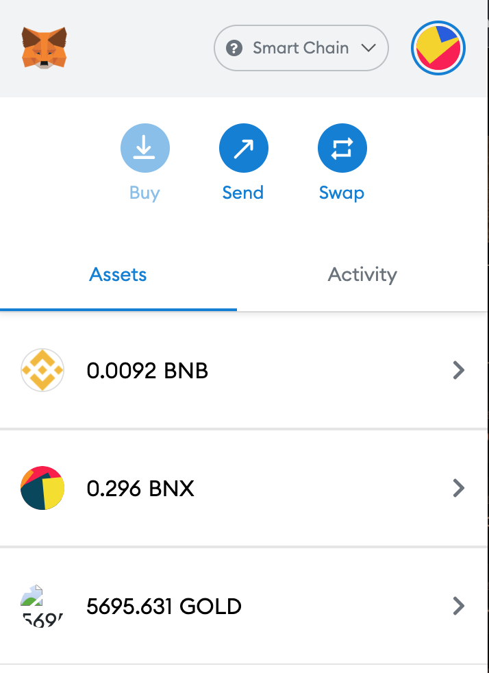

不过我在点受益之前没记录自己有多少Gold，怎么确认游戏确实把「Gold」给我了呢？还有一个办法，去https://bscscan.com/ 查一下区块链记录。这就是区块链的优势：这笔“钱”给你了，而且在分布式账本上记录了、确认过，就再也没法抵赖了。而且谁都能查到（前提是，他有你的账户地址）！

在BSCscan输入我的钱包地址，可以看到以下交易记录：

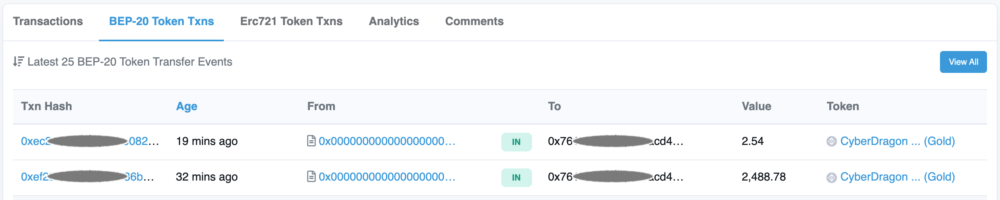

不看不知道，一看吓一跳，刚刚为了写文章，不小心收了两次工资，我是说自己觉得好像在小狐狸里确认了两次来着。第二次相当于花了0.72USD手续费，领了0.017USD的工资回来😭😭😭。

#### 2.2 退出工作

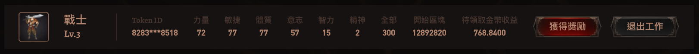

点击退出工作，在小狐狸钱包的弹出框点击确认交易。

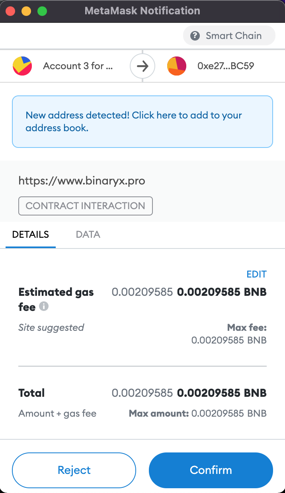

等交易确认后，网页会自动刷新，你会发现，你的英雄不见了！！！废话，那是因为他辞工了嘛😊

你可以返回到我的英雄找到他，不过，我们先不管这个，看看工资结了没有。打开小狐狸钱包，查看一下资产。

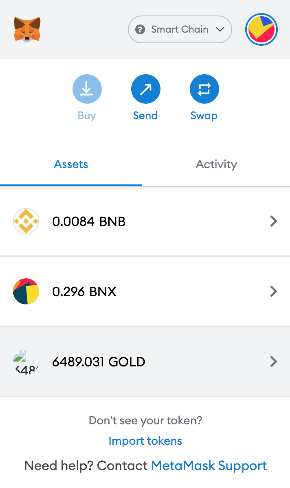

Good！700多两黄金到账。在BSCscan里看一眼交易记录，也是一样。通常来说，只要系统各部分没出问题，不必每笔交易都到处查账，稍等一会儿就确认了。

这是最基本的玩法，想要了解更多花样，那就得去冒险了！（待续……）