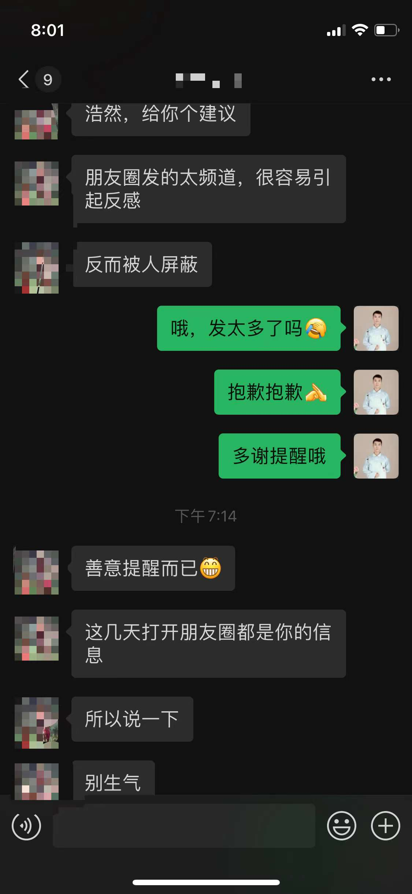

#【生命⋅修行】屁事分享官的第一次挫折

下午时，焉知同学正催着我赶紧发朋友圈，开业优惠今天最后一天了，此时不发更待何时。我赶紧编辑了几条，呼啦啦发了出去。正想着数量够不够，要不要再多晒一下单呢，忽然看到一个朋友发来这么几条消息。

关键是，我觉得他说得很有道理……把这事儿告诉大宝，她立即也有点被打击到了。于是，在所谓的8点档黄金时段里，我们俩竟然都停了下来，不约而同地没有发朋友圈。过了一会儿，大宝让我咨询一下师傅。我说：

> 不需要，我自己给自己做心理按摩就好了。

可是过了一会儿，我发现自己心情并没有变好。我决定，还是在微信里问问师傅吧。师傅开解了我们几句，大宝好多了，然而我却没有。因为，我在想，不算阿胶相关的信息，其他内容我发得也不少呢。毕竟，自己正打算做转型一名勤劳的「屁事分享官」，真的是有点被打击到了……得想个办法，既能继续进行我的转型尝试，又不会太扰到圈里的亲朋好友，也不会错过万一对双方都有价值的分享与讨论，纵然无法十全十美，也得想个办法！

可惜的是，微信发朋友圈，不能像Facebook做付费广告那样，可以控制每一条图文曝光次数，可以根据Pixel记录的用户访问数据进行分组等等。它就没这功能！估计将来也不会有。

不然，还是先用标签吧。

先广而告之，各位亲朋好友，因本人最近打算转型做一名**勤劳的「屁事分享官」**，会在朋友圈分享比较多的各项内容，包括并不限于：「每日打卡」（早起、学法语、锻炼等等）、「囚徒健身」视频、「太极」、「金刚功」或其他传统养生锻炼视频、「区块链」相关的技术与研究、其他技术相关的学习与思考、关于「生命•修行」的反思随想、一些真实发生过的「生命•故事」、和大宝一起做手工阿胶的内容、日常生活分享、随笔、过去几年创业教训总结分享、「投资」相关的学习与思考、书评、有趣有用的东西分享，等等……

如果总体来说嫌我的朋友圈太叨叨吵闹，又不想错过其中某些内容的亲朋好友，可以私信告诉我哪些内容是你可能感兴趣的，我会为你屏蔽掉其他内容。嫌我朋友圈太安静的，也可以私信问问我，是不是不小心误屏蔽了哪些标签。

就先这么试一段时间吧！