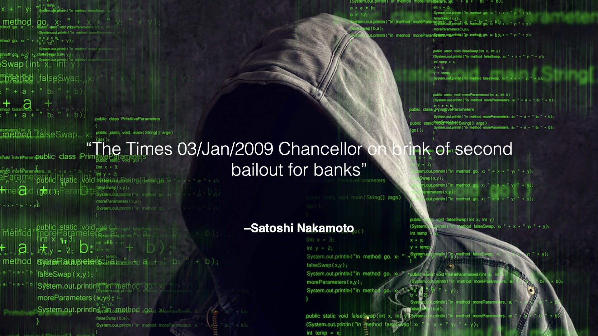
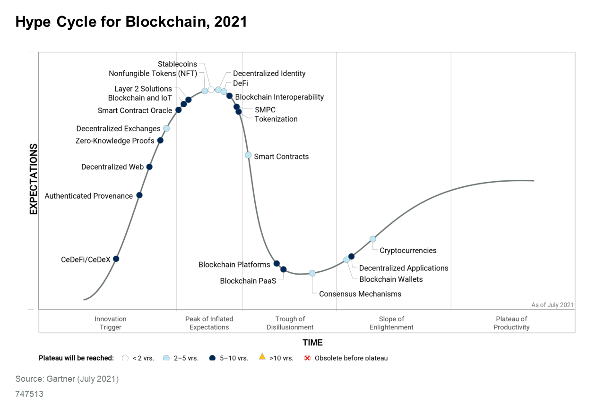

#【区块链】什么是区块链（一）

## 风险提示

**由于目前区块链领域里充斥着大量的资金盘、空气币。**而且，说起区块链，不可避免地涉及到金融、投资或者投机等话题。**投资有风险、决策需谨慎**，请各位朋友们擦亮眼睛，**风险自担**。

> “比特币交易作为一种互联网上的商品买卖行为，普通民众在**自担风险**的前提下拥有参与的自由。”
>
> “代币发行融资与交易存在多重风险，包括虚假资产风险、经营失败风险、投资炒作风险等，**投资者须自行承担投资风险，希望广大投资者谨防上当受骗。**”
>
> ——*摘自人民银行等五部委发布的《关于防范比特币风险的通知》*准备工作

## 区块链不只是比特币，但比特币是区块链

——的第一个应用😛

其实，不加后面那半句话也是一样正确的。就好像天鹅不只是白天鹅，但白天鹅是天鹅一样的道理。当然了，在2008年底，比特币就是区块链，区块链就是比特币。这一切要从中本聪（Satoshi Nakamoto）的那篇著名的论文《[比特币：一种点对点电子货币系统](https://bitcoin.org/files/bitcoin-paper/bitcoin_zh_cn.pdf) [Bitcoin: A Peer-to-Peer Electronic Cash System](https://bitcoin.org/bitcoin.pdf)》开始。

强烈建议，每一个想要真正了解区块链的同学，去看一遍这篇论文的原文（链接已经放在上面了，万一没法下载也可以微信找我要PDF文件），总共只不过8、9页纸而已。就算是你看完发现有大量不懂的概念与知识，起码也能更清晰的知道，关于区块链自己不懂的几个关键点究竟在哪里。知道自己不知道，是迈向真正知道的第一步，不是吗？我把论文的摘要拷贝在这里，大家感觉一下：

> **摘要**. 一种完全的**点对点电子货币**应当允许在线支付从一方直接发送到另一方 而**不需要通过一个金融机构**。**数字签名**提供了部分解决方案，但如果仍需一个 可信任第三方来防止双重支付，那就失去了电子货币的主要优点。我们提出一 种使用**点对点网络**解决**双重支付问题**的方案。该网络通过将交易**哈希**进一条**持续增长**的**基于哈希的工作量证明链**来给交易打上时间戳，形成一条除非重做工 作量证明否则不能更改的记录。最长的链不仅是被见证事件序列的证据，而且 也是它本身是由最大 CPU 算力池产生的证据。只要多数的 CPU 算力被不打算联合攻击网络的节点控制，这些节点就将生成最长的链而超过攻击者。**这种网络本身只需极简的架构**。信息将被尽力广播，节点可以随时离开和重新加入网络，只需接受最长的工作量证明链作为它们离开时发生事件的证据。

摘要中所说的那条「**持续增长**的**基于哈希的工作量证明链**」就是「**区块链**」，这本来是一个非常直白的关于计算机数据结构名词的翻译，Block（区块） Chain（链）——**区块链**，谁能想到经过不到10年的时间，这个词已经变得意义如此丰富。想想看，除了互联网，哪个计算机词汇享有过如此殊荣？数组（Array）、字符串（String）、堆栈（Stack）、数据库（Database）等等这些概念与词汇若是有思想，怕会是各种羡慕嫉妒恨吧😄

中本聪（Satoshi Nakamoto）成为传说中的大神，第一个原因就在于，他不仅仅写了这篇论文，论述了应该怎样**不需要通过一个金融机构**，实现一个完全的点对点电子货币系统。他还直接在2008年底，全球金融危机最为动荡不安的那段时间里，写好了程序，实现了这个系统。UTC时间 2009-01-03 18:15:05，比特币系统上线，产生了第一个区块，也就是所谓[创世区块 Genesis Block](https://btc.com/btc/block/000000000019d6689c085ae165831e934ff763ae46a2a6c172b3f1b60a8ce26f)。通过任何一个比特币的区块浏览器访问 [000000000019d6689c085ae165831e934ff763ae46a2a6c172b3f1b60a8ce26f](https://btc.com/btc/block/000000000019d6689c085ae165831e934ff763ae46a2a6c172b3f1b60a8ce26f)这个区块地址，我们都可以去近距离去参观一下这历史的见证。

在这个创世区块里，除了奖励给矿工（也就是中本聪本人）的50个比特币，没有任何其他交易。但是，有这么一句话，被永远的记录在其中：

> The Times 03/Jan/2009 Chancellor on brink of second bailout for banks.（财政大臣处于第二次援助银行的边缘）。

这句话，本是英国《泰晤士报》当天的头版文章标题。如今再回过头看起来，更觉得意味深长。

时间到了2021年，我们再看看Gartner关于区块链的技术成熟度曲线图，上面已经有密密麻麻无数个小点点。有些，你或许已经在新闻里见过，比如NFT，DeFi。有些，你或许根本不知道那是个什么新名词儿。接下来，我会挑重要的，有代表性的挨个掰开来研究研究，也好把区块链这头大象，尽我可能地从各个角度摸一遍。

当然，正如中本聪在论文里开篇挑明的，这不仅是一个技术范畴的概念，同样关乎金融与投资，因此也不可避免地会关系到社会经济学乃至哲学。

<待续>