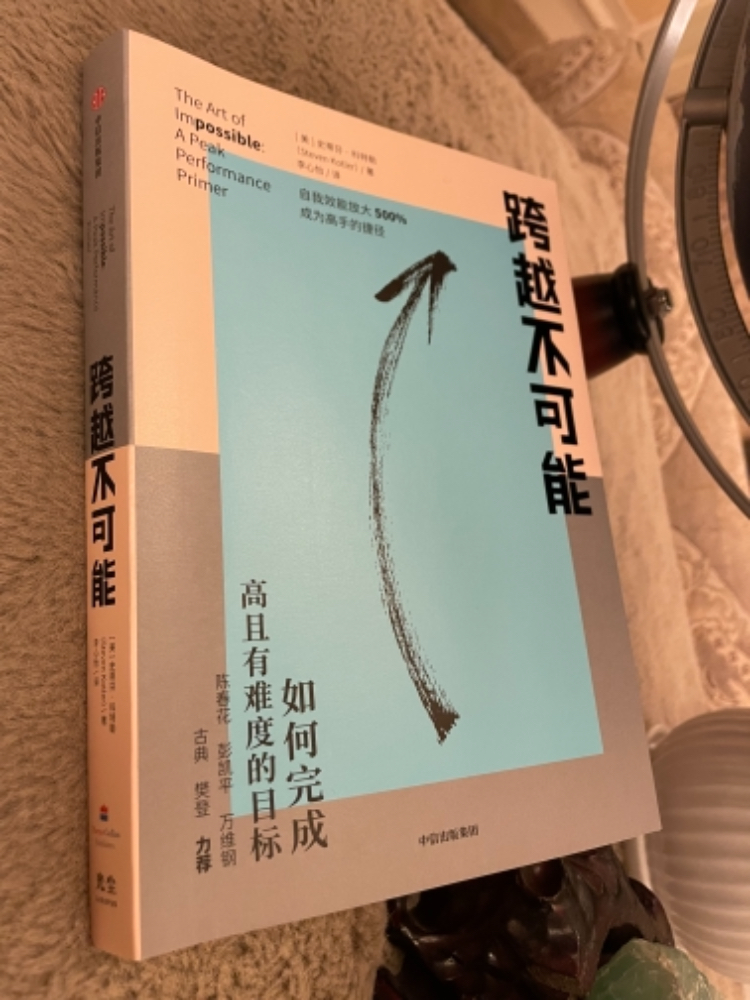
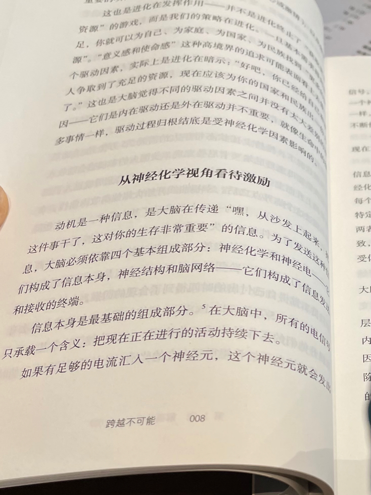

#【随笔】进入心流的套路

前几天，老Q在朋友圈推荐这本书。他说，如果不翻开看，很容易被这本书烂俗的畅销书名给骗了。

今天拆开了塑封，在等朋友的间隙里翻了个开头，果然如老Q所说，这其实是一本严肃认真、科学系统的好书。只读了前言与第一章，我就被折服了。我来截个图，给你们感觉一下：

可以说，科学界关于心流的最前沿研究结果，都在这本书里了。我甚至感觉，这本书比《心流》更值得一读，他告诉我们「心流」是持续突破自己非常关键的一环，但并非是唯一的一环。而完整的挑战「不可能」公式中包含了动机，学习力，创造力，心流这4个部分。

科特勒厉害就厉害在，他不仅给出了一个完整而科学的架构，一步一步可以实践和操作的方法。他的文字还非常引人入胜，读起来竟然有不忍释卷的感觉。

我才刚刚读完第1章，发现作者就已经把激励的内在生物机制给讲透了。所谓七情六欲，正是对应到了人类这哺乳动物内在的7种神经化学网络。恐惧，愤怒，悲伤/分离焦虑，性欲，关怀/养育，社交/游戏，探索/欲望。

我更惊奇的发现，前两天看《宇宙跃迁者》时，自己还在思索人类所两种固有的价值观与生存策略冲突：一种是基于资源有限的竞争掠夺，一种是基于资源无限的探索与创造。在这里，它们竟然完美而漂亮的统一在人类这种哺乳动物固有的生理机制和架构之中。

真是一本还没读完就忍不住要推荐的好书。

