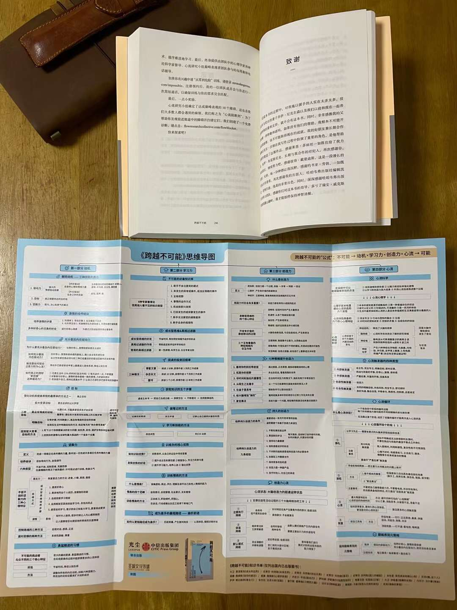

#【随笔】一本人类高效使用手册

夜里两点睡不着，拿起书来看到早上6点钟，睡了一会儿又继续K，终于把这本书读完了！

对于我这种类型的人而言，这本书简直太好了，信息量巨大，过去4、5年摸索中所遇到的各种困惑，几乎全都在这里找到了让人信服的蓝图，强烈感谢为我推荐此书的老Q，以及这本书的作者科特勒，译者李心怡。

可以初步判定这是我2021年读过的最有价值的一本书了，就算放到最近5年我所有读过的书中排名，那也绝对是Top3之选。

书中还附了一份思维导图，我又把这导图读了两遍，竟然是这样的感觉：这再次经过「提炼」的内容，已经开始丢失细节了。说实在话，从读完到现在，我的大脑依然还处于一种小小的激动当中。就好像在森林中迷路许久，猛然发现一份详细地图，而且将地图与记忆中迷惑的各个岔路口一对照，发现正合用！

或者这么说吧，如果人体是一部奇妙的机器，那么这本书，就是一本关于人体这部机器的高效使用手册。

在读完《传习录》后，王阳明的「知善知惡是良知，為善去惡是格物」就像是为我指明了北极星的位置；读过《庄子白皮书》之后，抓住「辩论冲动」与「情绪信号」作为偏离事实的告警，就好像被告知了怎样在摸索探路的过程中判断自己走错了方向；而读过这本《跨越不可能》，简直会觉得人生的「地图」和人体的「使用说明书」已经到手了。

这份说明书，为我怎么使用我自己这个人类个体，提供了科学而详细的蓝图。然而，落实下来，对于今天的我而言，无非只是先做好以下这么几条：

1. 确立成长思维——牢记犯错是进步机会
2. 叠加内驱力，制定目标，以及一个可以坚持用下去的日程表
3. 感恩、正念冥想、锻炼、睡眠、合理饮食这几个习惯做为不可随意动摇的基础
4. 养成以「心流」/「幸福感」为核心的每日/定期/不定期回顾习惯