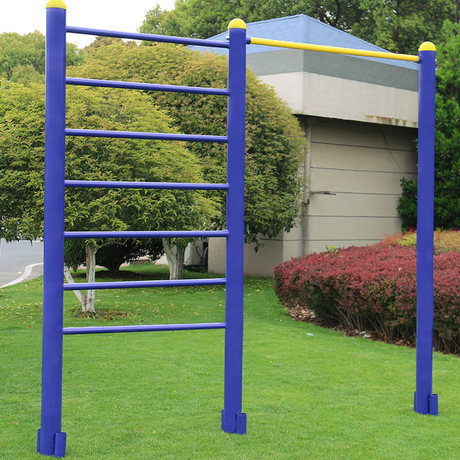

#【生命•故事】（038）差生不差

记得读书时候，还是有一点唯「成绩论」的风气。自从我成绩变好后，也变得有些不由自主「歧视」起「差生」来了。不过很快，我就迎来了一次对他们看法转变的契机。

那天早餐，我应该是吃的油条或者面窝吧，小孩子有个奇怪的特性，对自己手上的各种污垢总是能够毫不在乎。于是，到学校后，我就加入了早锻炼的行列，其中一个项目，是爬健身架——现在有些全民户外健身场所还有这样类似的架子，超过一人高，钢管焊成梯子一样，大概齐像下面这个样子。

我们是排着队爬上去，再从顶部翻过去，从另外一面爬下来。结果，因为自己手上有油，而且自己完全不知道，我在爬到最顶端准备翻过去时，手一滑跌了来。把后脑勺磕破了皮。

那时也没有电话，在学校医务室简单包扎处理后，我依然觉得有些头晕，班主任便派同学Q送我回家。Q同学是那时班上成绩排名倒数1、2的「差生」，不是因为这事儿，我俩几乎没什么交道。但我知道，他的体育倒是非常好，短跑常常是全校第二（第一名是他亲哥哥，在另一个班）。

于是乎，接了护送任务的Q同学，带着我一起踏上了回家之旅。他很开心，说能名正言顺地不上课，真好！不然想出来玩，还得逃课呢。于是，我问他曾经逃课的经历，他说他那时骗家里人去上学了，但是背着书包没有去学校，在外面一直玩到放学，再回家。如此两天之后，觉得一个人在外面晃，实在太无聊，就又回去上学了。一路上，我们聊得非常开心。等到家里，我父母都在上班，他又带着我一起从厂区大门下面的缝隙钻过去，和我一起找到我母亲上班的车间，直到把我交到我母亲手里，这才又悠哉地回学校去向班主任复命了。

从此后，我开始知道，所谓「差生」只是碰巧那时成绩差而已。他们是和我一样的小孩，一样贪玩，一样有梦想，通常还更勇敢，更有担当。

不知Q同学他现在怎么样了。据我所知，当年学校附近所有的那些村民，都早已随着城市化的进程，变成了特别富裕的城里人。他如今，也一定过得很不错吧！