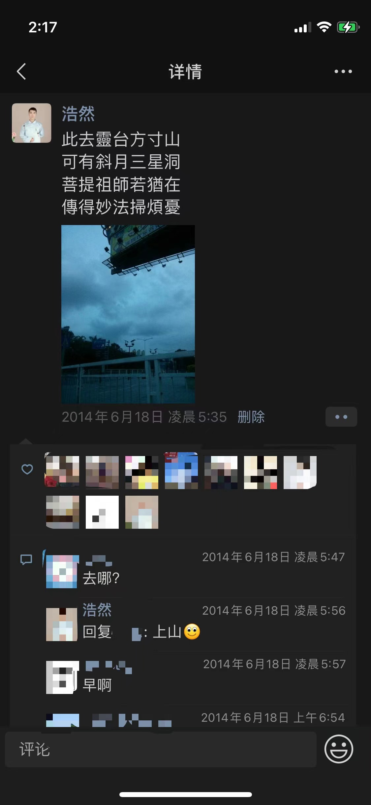

#【生命⋅修行】一切过往皆为序章

不知不觉，又到了一年的最后一天。大部分人每到这个时间节点，都忍不住会去回想一下过去，或者展望一下未来，我也同样无法免俗。

据传说，人类身体的细胞，每7年就会更新一遍，所以有人会说，7年就是「一辈子」。而回头看过去，距离结束自己的第一段婚姻，竟然也已经过去了7年，整整「一辈子」已经过去了。我还依然记得，那年6月，我去丹东参加闭关10日的内观课程，出发那天凌晨，在朋友圈捏了一首歪诗：

> 此去靈台方寸山
> 可有斜月三心洞
> 菩提祖師若猶在
> 傳得妙法掃煩憂

随后，离婚，调整状态（未遂），在亲朋不解的目光中，辞去在菊厂稳定的工作，直接粉碎了另一个看似稳定的生活支柱，继续调整状态。然后同时神奇地开始恋爱、结婚、生娃、再生娃。在半创业、半退休的状态下一直生活到了今天。其中有段时间，在捏碎了自己过往价值观之后，我在朋友圈里发了这样一段文字：

> “大圣，此去欲何？”
> “踏南天，碎凌霄”
> “如若一去不回……？”
> “便一去不回”

再看这段话，心中依然会有些小小激荡。然而，过去的早已过去，我此刻需要面对的，早已不是内心里那需要去踏碎的「南天门凌霄殿」，而是已然破碎的「废墟」，一幅想象中的「桃源蓝图」，以及真实的「一地鸡毛」。此时此刻，才真真切切地感受到，过去所有经历过的一切，原来在我的生命成长中，都有着不可或缺的巨大价值。

在经过了过去几十年，尤其是最近7年这样一个建立价值观，打碎价值观，再重建价值观的循环之后，我找到了一种奇妙的稳定与平静。我变得既相信逻辑、理性与概率，又心甘情愿地相信并臣服于上天的安排与命运；我变得既对未来充满理想主义地憧憬，又满足于抓紧搞钱、争取每天数钱俗趣；我变得越来越相信，人应该长远规划，应该像贝索斯那样，每一天都去做那些，多年后自己七老八十行将就木前，怎么回忆也不会后悔的事情；然而于此同时，我也更加相信生命如此无常，我必须全身心地活在当下，要去做那些，哪怕下一秒就要离开人世也无怨无悔的事情。

我一面学着更加积极地行动、学习、成长；一面学着不再批判自己，学着完全地接受自己，哪怕完全躺平也没有关系。

我一面越来越笃信，想要更好地爱别人，首先要学会爱自己；一面也越来越深刻地认识到，真正的爱需要忘掉自我，全身心地关注他人。

我一面学着去理解和体验全数字化的时代生活方式；一面努力地试图去体验和找回古时候的人类那种最原始、最简单、最纯朴地使用、看待自己身体，乃至与之相处的方式。

所有这些，在此时的我看来，它们就好像太极图里的阴阳两条鱼，两两相对，却又互相生长，互相缠绕，互相成就。

或许生命的力量本就如此——

**一面向着最黑暗处深深扎根，一面向着最光明处拼命生枝长叶**

2021年就此告别，而未来也即将展开，正好借用莎士比亚在《暴风雨》中的那句名言作为此时此刻的注脚：

> **一切过往，皆为序章。**
> **What's past is prologue.**

