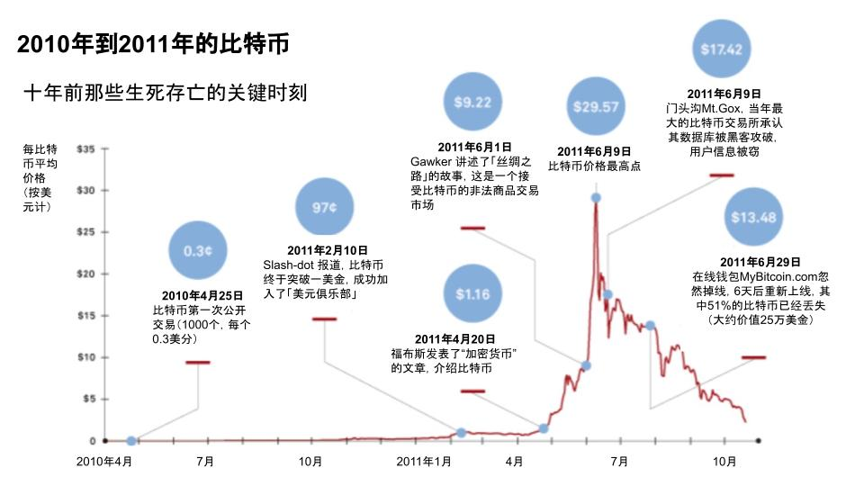

#【区块链】什么是区块链（三）

## 风险提示

**由于目前区块链领域里充斥着大量的资金盘、空气币。**而且，说起区块链，不可避免地涉及到金融、投资或者投机等话题。**投资有风险、决策需谨慎**，请各位朋友们擦亮眼睛，**风险自担**。

> “比特币交易作为一种互联网上的商品买卖行为，普通民众在**自担风险**的前提下拥有参与的自由。”
>
> “代币发行融资与交易存在多重风险，包括虚假资产风险、经营失败风险、投资炒作风险等，**投资者须自行承担投资风险，希望广大投资者谨防上当受骗。**”
>
> ——*摘自人民银行等五部委发布的《关于防范比特币风险的通知》*准备工作

## 比特币到底做了什么

今天来继续捋一捋中本聪的论文，来看看他发明的比特币到底做了什么事情。我将尝试着尽可能用大白话，从以下三个方面把比特币到底做了什么来说清楚：

1. 经济学方面
2. 心理学方面
3. 技术方面

争取能让各位朋友看完我这段「白话」之后，如果再翻回去读最前面那段关于比特币论文的简介，能获得比之前更清晰明了的认识。

### 经济学方面

首先，比特币实现了一个不依赖信任的电子交易系统，或者换句话说，发行了一种**不依赖于任何金融机构**的电子货币。这个电子货币在三个重要的点上参考了人类历史上最最悠久、最最被广泛采用的货币——黄金：

1. **总量有限**——比特币的总数写在了程序里，最多2100万个。
2. **易于分割**——作为电子货币，比特币可是比黄金更容易切割，目前，每一个比特币可以被分成一亿份。0.00000001比特币被称为1聪（Satoshi）。而且，你别忘了，这是写在计算机程序里的，将来有需要，还可以升级程序，再进行修改，让他允许切分得更多。
3. **难以获得**——想要无中生有的获得比特币，只有一种方式——运行比特币网络的程序，付出足够的计算机算力——也正因为如此，这个运行比特币网络程序，获得比特币的过程，被大家称之为「**挖矿**」

这里，最最重要的就是第一点。毕竟，天下苦「王二麻子」久矣。比特币说，咱不要「王二麻子」好了，在我们这里，谁也不能随便写白条当金豆子使。

### 心理学方面

黄金慢慢成为全世界人类公认的货币，那是经过了动辄跨千年的时间跨度。而且，在地球村里，在被「王二麻子」用枪杆子强行篡位之前，黄金——它可是没有竞争对手的。

而比特币就不同了，他出身草根，却瞄着连「黄金」都干不过的「王二麻子」手里的奶酪，凭什么呢？我们来看看中本聪是怎么设计的：

这次，他没有抄黄金的作业。我们知道，在整个人类历史的大部分时间里，黄金的产量大体上是跟着人类社会的生产能力与经济总量同步增长的。黄金的价值，一直是相对稳定的，这也是它成为主流货币的重要原因之一。然而，比特币不是这样。根据比特币的程序设计，在第一个四年里，它会按照大约每十分钟50个的速度从无到有的「生产出来」，这样四年就会产生大约**1050万**个比特币。然后，这个速度会减半，变成大约每十分钟25个。于是，第二个四年只会产生**525万**个比特币。如此这般，总数的上限是**2100万**个。

回过头来看，中本聪显然利用这样一个释放曲线，给比特币规划出了一条完美的「篡权」路线，目前看起来，整个「实验」，还依然大致上在按照他计划的轨迹中进行。

#### 首先，让理想主义技术宅为其护航

2009年初，比特币从加密圈扩散到其它爱好者时，显然走的是技术宅理想主义路线。还记得那时，在我的心目中，比特币网络和SETI寻找外星人项目是类似的东西。笔记本不用开始屏幕保护时，跑一跑这些程序，利用电脑闲散的CPU资源，为各种公益的组织做上一点点微薄的贡献。那时觉得，这比特币，只是一个用来记录贡献值，类似于一个积分一样的玩意儿。

直到2009年10月12日，芬兰的Martti Malmi以5.02美金的总价卖给了NewLibertyStandard一共5050个比特币。

然后就是众人皆知的2010年5月22日，有位程序员老哥Laszlo Hanyecz在论坛上公开叫卖，想要价50美金卖10000个比特币，最后有人拿25美金的披萨优惠券从他那里换到了这1万枚比特币，比特币终于开始和现实世界发生了联系。

####接着，让嗜血的投机者为其推波助澜

自此有了价格，而总数又是固定的。并且，全世界能获得比特币的数量不仅仅固定，还会减少。这给了那些嗜血的投机者一个完美的标的。荷兰的郁金香可以炒，南海公司的股票可以炒，比特币咋就不能炒呢？

眨眼之间，2010年7月16日，比特币一天之间，从0.008美元涨到了8美分，2010年7月17日，当年最大的比特币交易所门头沟（Mt.gox）成立。2010年11月，比特币就涨到了0.5美金的历史高点。

#### 然后，让某些特殊领域的人们开始真正地使用它

2010年12月发生的事情，让我们看到中本聪内心，其实是对比特币的发展节奏有着清晰规划的。当时，维基解密的事件正沸沸扬扬。12月5日，比特币社区呼吁维基解密接受比特币捐款以打破金融封锁。中本聪表示坚决反对，他认为，比特币还在摇篮中，禁不起冲突和争议。七天后的12月12日，他在比特币论坛中发表了最后一篇文章，提及了最新版本软件中的一些小问题，随后不再露面，电子邮件通讯也逐渐终止。

因为他知道，接下来一段时间，比特币的生存，就要依靠这些躲在阴影中、游走于灰色边缘的人与组织们了，高调不得。

上图来自连线杂志很多年前的一个深度报道

[The Rise and Fall of Bitcoin]: https://web.archive.org/web/20131031043919/http://www.wired.com/magazine/2011/11/mf_bitcoin

我们来一起回顾一下十年前的那第一次循环。在连续经历了几次重大黑客事件之后，比特币的价格最终在2011年跌到了1美分，从此消失在公众的耳目之中，耐心等待着，直到下一个循环将它再次唤醒。

就这样一个简单而巧妙的设计，让潜藏在人类内心中的三股力量，轮番为比特币所用。比特币这个草根中诞生的小玩意儿，终于变得越来越强大，越来越难以被任何一个「王二麻子」彻底消灭。

技术部分留待下次再讲，我会试着站在比特币的角度，用白话详细地掰一掰「区块链」这个名词，在技术上究竟是个什么玩意儿。

<待续>

