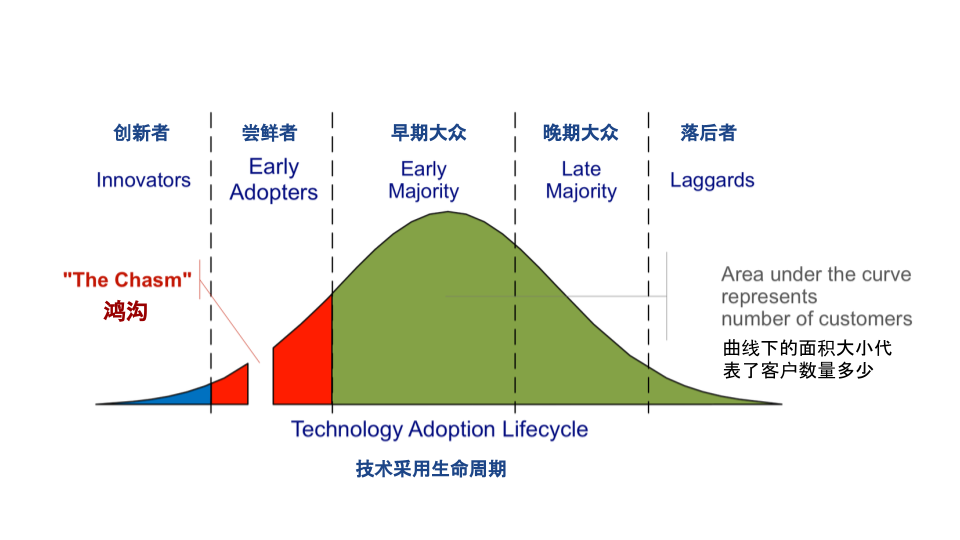
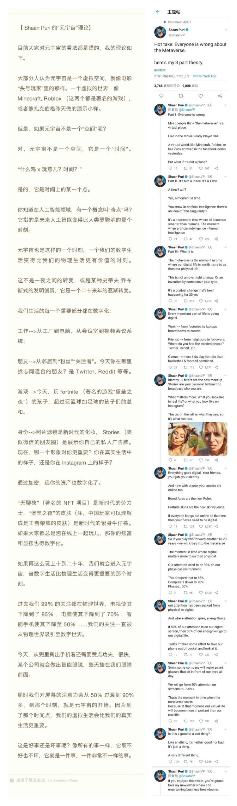

#【区块链】普通人如何把握元宇宙带来的机遇

之前在知乎上简单回答过一个类似的问题，那时我是这么说的：

> 作为一个普通人，只能在自己理解的事物里获得可观的收益。定投所有支撑“元宇宙”与“Web3.0”底层基础设施的股票、数字货币组合（你可以自己做一个指数基金），恐怕是「普通人」唯一能够更进一步地获取长期可观收益的办法了。
>
> 唯一的问题是，普通人大多不甘于当一个普通人。

https://www.zhihu.com/question/503908689/answer/2261443133

类似的话题，我还曾经在朋友圈就一则广告吐槽，那广告是这样的——「**巨头All in元宇宙，普通人应该如何抓住机会**」，我则说：

> 巨头还曾经All in 外卖呢，普通人应该如何抓住机会？
>
> 你我这样的普通人应该如何抓住机会，这不是一直明摆着的嘛😊

后来我又补充了两句，内心对自己的小机智充满了自豪：

> 我觉得吧，不是当外卖小哥，就是去买外卖呀：）
>
> 当然了，如果发现外卖体验不错，再定投下外卖大佬的股票就更好啦：）

----

昨晚上又想起这个问题，觉得可以稍微展开、系统化地思考一下，那就先从破题开始吧：

1. 什么是普通人
2. 什么是元宇宙
3. 元宇宙带来了些什么机遇
4. 普通人如何把握他们

### 什么是普通人

之前在试图白话讲解区块链时，重新翻译了一下来自《技术采用生命周期》里的这张图：

那么，面对像「元宇宙」这样一个新技术、新概念来说，所谓的普通人，指的就是「大众 Majority」，即所谓早期大众与晚期大众的合集。

先清晰地认知，自己是这「大众」中的一员，这是非常重要的事情。

### 什么是元宇宙

关于什么是元宇宙，有许多不同的看法，我比较认可的是罗永浩以[Shaan Puri](https://twitter.com/ShaanVP/status/1454151237650112512)说的那个广义的「元宇宙」概念，而不只是小扎、以及其它打着「元宇宙」旗号的各家「公司」所宣扬的，那些各种被狭义化的「元宇宙」概念。

> 简单来说，那是一个奇点。一个时代来临的时空转折点。从那一刻开始，全世界所有人在数字世界里所投入的时间与注意力，开始超过所有人在物理世界的投入；并且呈加速度趋势把两者之间的差距越拉越大。

而这个词本身，就好像90年代的「信息高速公路」一样，很快会随着「元宇宙」时代的真正到来，而被大众忘到九霄云外。	

### 元宇宙带来了些什么机遇

任何一个概念，都会带来两种机遇，一种是短期的，一种是长期的。我个人一直认为，短期机遇就好像股市上时常会出现的各种炒作概念一样，对于普通人而言，没有任何价值。「元宇宙」的短期价值，只对手握「镰刀」的少数收割者有用。

当然，如果你不认可这一点，此刻打住，出门左转。那边有许多人在讨论，「为什么我觉得元宇宙是个骗局？」你可以和他们好好探讨探讨。

这里我想聊的，是那些相对长期、巨大的机遇。当「**所有人在数字世界里所投入的时间与注意力，开始超过在物理世界的投入**」时，意味着什么机遇呢？

不知道大家有没有看过一本2005年的畅销书「奇点临近The Singularity Is Near」。这本书最开篇，描绘了人类文明的发展历程及其关键里程碑的对数曲线：

* 2000年前，全世界主流的经济围绕着农耕文明
* 200年前，全世界主流的经济圈变成了以工业为主，首先是围绕着铁路与煤炭
* 几十年后，大约60、70年前，变成围绕着汽车与石油
* 紧接着，信息产业变成了世界经济的主流
* 然后是互联网
* 接着是移动互联网

变革的周期呈指数缩短，但同样的是，每一次都会改变经济格局，制造出一个从前不存在，之后成为主流的经济体。「元宇宙」更不会例外。所以，对我们而言，那意味着「数字世界」本身，会迅速演变成为一个自循环的巨大经济体。大家都在这个经济体里面花钱、赚钱、投资。

所以，机遇同样的也有三类：

1. 在这个经济体里花钱，享受其便利，并且借此，帮助自己在原有的物理世界过得更好、赚更多的钱。
2. 在这个经济体里赚钱。
3. 投资这个经济体，享受他整体的成长红利。

### 普通人如何把握他们

我们作为普通人，能做的事情不多，说到最后，发现还是回到了之前我在朋友圈里抖机灵式的结论：

1. **买外卖**——投入其中，感受他——玩游戏、刷抖音、看直播、适度买点NFT收藏品，都可以，但需要定期退后一步看看，有没有办法用这些消费和体验，帮自己在目前的物理世界里过得更好，赚更多钱。
2. **卖外卖**——进入数字经济体，在里面赚钱——加入相关的公司，或者加入相关的生态，比如当主播，比如制作内容，比如学会发行自己的NFT
3. **定投外卖公司的股票**——作为普通人，还是以定投相关的指数基金为最简单有效的投资策略——成年人嘛，做什么选择，全都要😄

当然，还有一点。我们作为普通大众，想要更好的把握新的机会，最好做一个「早期大众」而不是「晚期大众」。策略也很简单，那就是多多关注这个领域的「创新者」，并同时与这个领域的「尝鲜者」们保持相对高频的沟通与交流。

**One more thing!**

人类在物理世界消耗时间与注意力的塌缩，也并非意味着这个领域无事可做，只能逃离。因为再怎么样，人还是要吃喝拉撒睡的。我们回顾过去那些已经塌缩的领域，就会看到规律——最终剩下的，只有最高端和最低端。

因此，你还可以致力于以下两类事情：

1. 要么，提供最高端，最原生态的物理世界的享受与体验。
2. 要么，以最低的成本，为人类提供最基本的物理世界的支持。

----

### 参考

以下是穆逸扬大大制作的，Shaan的推文，以及老罗翻译的中英文对照。我觉得很有价值，特地把它搬过来，供大家参考。

