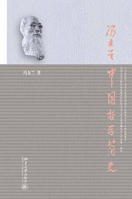

#【随笔】构筑中国哲学的知识框架

花了几天功夫把冯友兰先生的《中国哲学简史》读完了，二十余万字，很好读的一本小书，既于我心有戚戚焉，也有颇多收获。读这本书，更加深切体会到了，花上几天时间吸收一位大家花几十年心血的研究成果，那是多么愉悦和超值的一件事情。

回到评分，依然从两个角度入手：

### 好看 🌟🌟🌟🌟4星

冯先生原本是用英文写给外国友人看的，这个北大版听说是冯先生自己亲自审阅过译文的版本。可怜像我这样的中国人，对于中国哲学的理解，还远不如国外的爱好者们深入。好在还有这本书在，娓娓道来，如同讲故事一般，一个故事接一个故事的听下来，竟然觉得自己也把中国哲学的脉络梳理明白了。

唯一遗憾的是，译者可能没想到还有我这样古文功底如此不堪的中国人。冯先生所引用的原文，译者都直接拿了原作中的古文来，我原以为自己读古文的能力还凑合了，却也搞不定这大段大段的引用，50%甚至以上的文字，都直接滑过了。

——不过呢，对于那些文字，依然会留下一个印象：嗯，某某的这个很赞、某某的那个很了不起，有机会值得细细研究！或者，将来再结合冯先生当年原作中的英文翻译一起读读更好。

### 启发 🌟🌟🌟🌟🌟5星

**首先**，正如我前面说过。这本书，把中国历朝历代的哲学思想发展脉络梳理明白了。可以帮助自己非常明晰地构筑一个整体框架。

**其次**，对于那些自己过去几乎不了解的那些理论体系，比如墨家、荀子，有了一个粗略的认识。完成了从0到1的了解。可以想象，如果是那些头一次接触中国哲学领域的人，这本书得有多大的价值啊！

**对于我自己而言**，我最最欣赏的，还是冯先生的「中国哲学观」，于我心有戚戚焉：

> “不离日用常行内，直到先天未画前”，这正是中国哲学努力要做到的。有了这种精神，它就是最理想主义的，同时又是最现实主义的；它是很实用的，但是并不肤浅。

自己捧起这些哲学书来，无非也是在探寻自己的那份生活指南

——**如何应对日常生活的柴米油盐酱醋茶，如何追寻那超越一切的生命意义！**

### 总之 🌟🌟🌟🌟🌟5星 强烈推荐！！！

所有对中国哲学感兴趣，但了解又不够深入的人，建议都读读这本书，查漏补缺，在自己大脑里，把这个关于中国哲学的整体知识框架构筑起来。