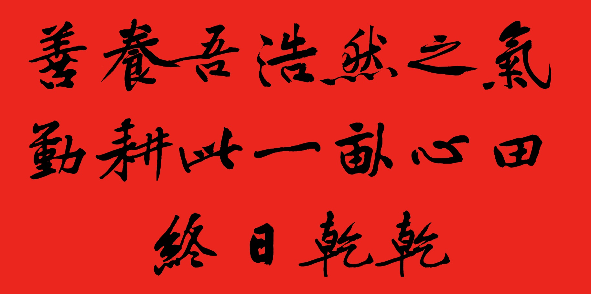
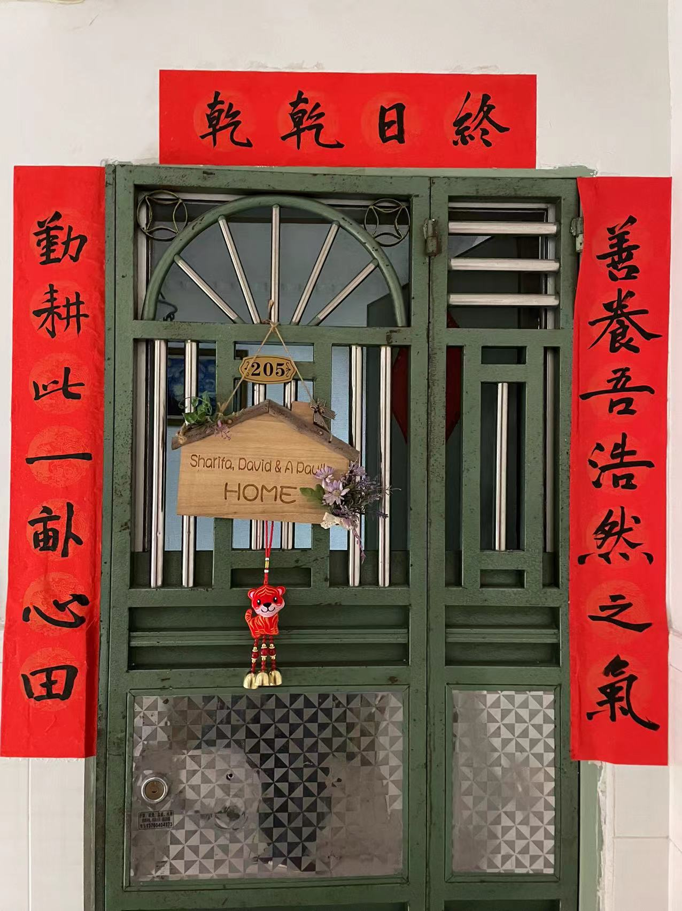

#【生命⋅修行】情绪的转折与波动

惦记了很多天想要自己写春联，等到吃年饭前，终于铺开了笔墨纸砚（其实没有砚台，用的现成的墨汁）。

我把羊毛毡铺在了桌子上，注意到上面有好几块巨大的墨迹。想起上次用它们，还是去年写春联的时候，或者是今年和大宝一起写那个挂在家里的「爱」字的时候，几乎一年写一次呢。

我打开电脑，把之前想好的那几个字输入那个文档，是的，就像下面这样，我喜欢黄庭坚的字：

然后，我就开始练啊，练啊，练了三遍觉得差不多了，便在红纸上开始了奋笔疾书……终于，一顿操作猛如虎之后，我把它们贴到了大门外：

然后，一看照片，把自己丑哭了～

本来很开心准备吃年饭的心情，忽然就被破坏掉了。我郁闷地滴溜溜在屋子里转了好几圈，想要撕掉重新来，可恰巧这时大宝给我发来了视频。等视频结束，我也终于决定接受这「差不多就行了」（其实我内心里觉得差好多）的对联贴在门口。

说白了，我就是还不能接受这样的事实——我的字写得并不好，贴在门口别人也会知道我的字写得不好，我依然看重别人的看法，而不是真的只求自己乐呵。

所以，我的情绪就冒了出来，没法简单的乐呵了！

吃过年饭，睡了一小会儿。起来陪父母去欢乐谷、世界之窗转了转。等回家时，忽然意识到：今天的300字还没有写，明天出门的行李还没有收，还有每日的回顾，洗澡，洗衣服，给妈妈看春晚的平板充电，等等……一系列想做而还没有做的事情嗡地上脑，我发现自己明显地开始暴躁起来！

在屋子里又转了一圈，本来想写写自己这暴躁的情绪，可是又改了主意。我决定先去洗澡……热水滚汤地冲在自己的后背和身体上，我感受到那些略略酸痛的肌肉开始松弛下来，内心也开始从另一个角度去思考：

所有那些我想要每天坚持的事情，目的是让自己过得更开心、更快乐、更自在。可是，这些事情在此时此刻却变成了压力之源，暴躁情绪的触发点，那又是何必呢？

我索性打开手机，自己一边洗澡，一边听起春晚来。忽然想起，其实小时候几乎每一个春节，都是和爸爸妈妈一起看春晚，直到12点出门放鞭炮然后才睡觉的。可是今天却不认真抓紧时间，继续好好陪伴父母呢？哪怕要早点睡觉，也可以再多陪他们几分钟，而没有必要浪费时间为自己可能做不完的事情抓狂啊！

说白了，我其实没认清的事实是——以我目前的能力，想把这些事情都做完，只能晚一点睡觉。想要早一点睡觉，要么直接扔掉一些事情不做，要么等待将来，自己能力提升，效率变高。

所以，我硬要把这些清单完成，让自己开心，又硬要早点睡觉，白白让自己不开心了。甚至连父母都不能好好多陪伴几分钟。

收起电脑，去看看父母的春晚看得怎样了吧。