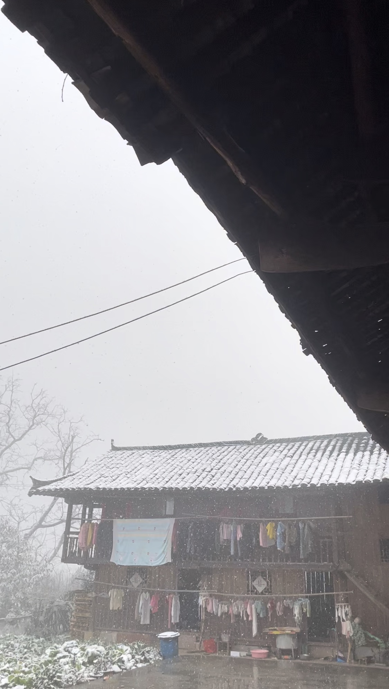

#【随笔】雪来雪去山里山外

大年初一的夜里下了一场大雪，早上起来已经是积了不少。屋顶、树枝、院子里青菜都盖上了厚厚一层雪，白茫茫一片。雪一直没停，大朵大朵的雪花，漫天飞舞着，无声地撒落在各处。

大宝问我：

> 你一来就下雪了，开心吗？

我说：

> 开心啊，只要一下雪，天地间就自带着欢乐的气氛呢！我最喜欢下雪了！！！

虽然在下雪，温度却并不太低。落在院子里水泥地板上的雪花，默默地全都化成了水。本来这天计划着要去给外甥到县城里去买个生日蛋糕的，见雪一直不停也不敢出门了。外甥有些失望，嘟嘟囔囔了好几次：

> 你们都不记得今天是什么日子了吗？

我很喜欢在这样寒冷的日子里，坐在火坑边烧柴。眯着眼睛躲过缭绕的烟火，听着木柴劈劈啪啪地燃成一团熊熊的火焰，让身体在火光中暖暖地、放松地缩成一团。天气太冷，电脑和手机在早上全都自动关了机，根本无法开机。我索性把它们全扔在了房间里充电，不再理会屏幕后面那喧嚣的世界。

可是今年，怎么样也无法回到第一次来到山里过年的心境了。那年大宝家里手机信号都没有，除了烤火，读书，什么也不用想，也懒得想。那时心境倒也自在，完全没想到，只不过5年之后，自己和大宝都要开始操心甚至焦虑，怎么养育这两个娃娃，怎么在那喧嚣的大城市里买个房，安个家。

今天早上雪一停，大家就带着外甥下了山，去县城里给他买蛋糕，逛街。朋友圈里，许多人开始晒山景、海景，一副又一副世外桃源。

整个世界，好像就是一个大围城。城里的想上山，山里的想进城。有人辞官归故里，有人漏夜赶科场。