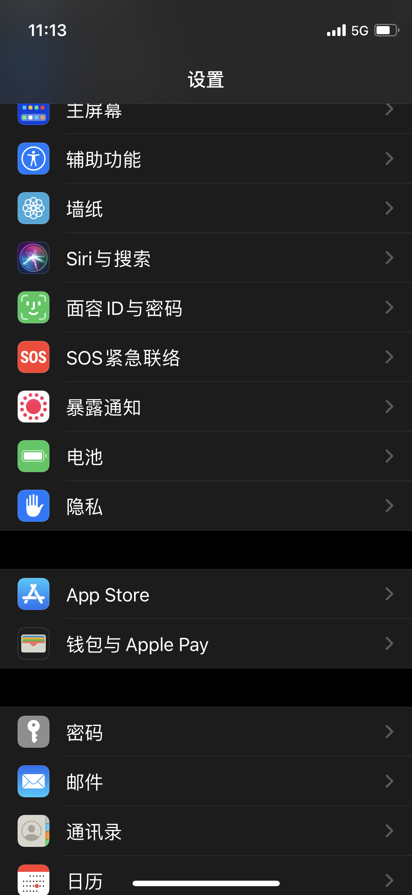
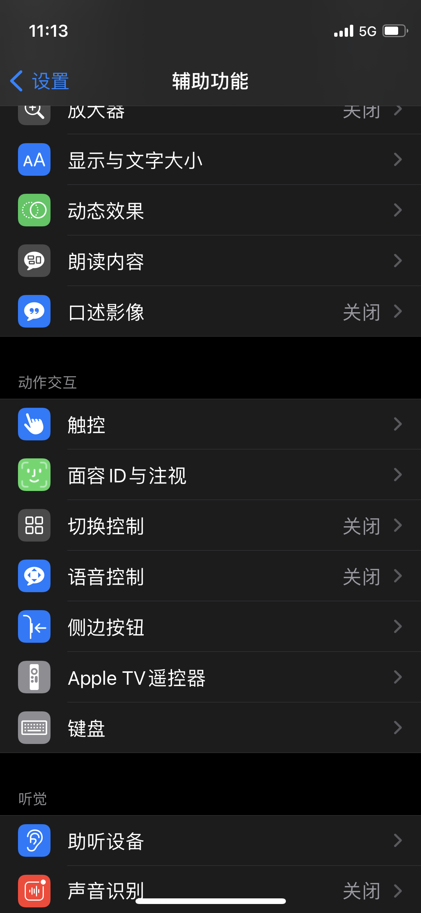
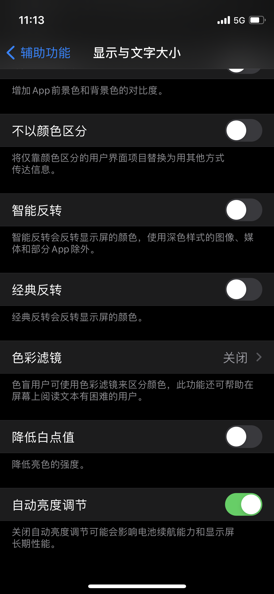
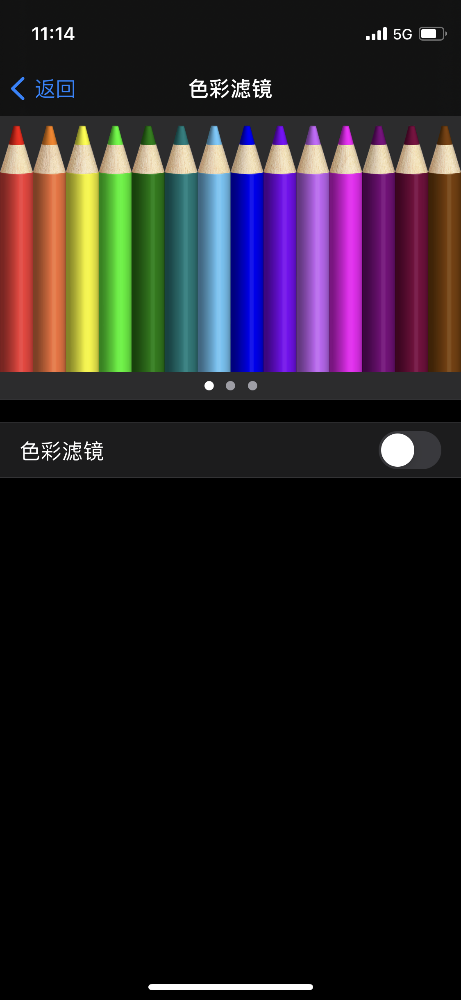
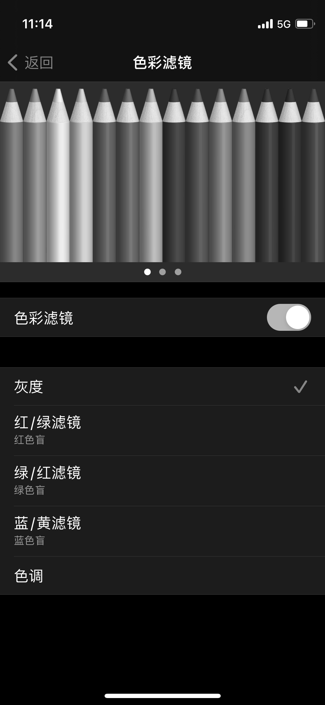
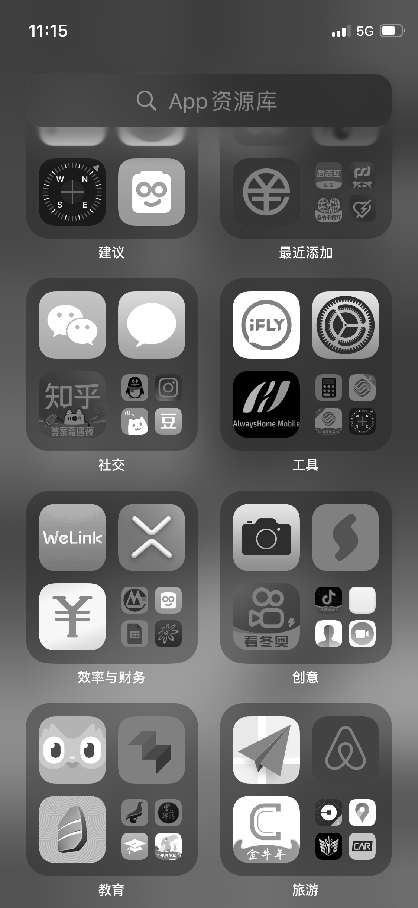
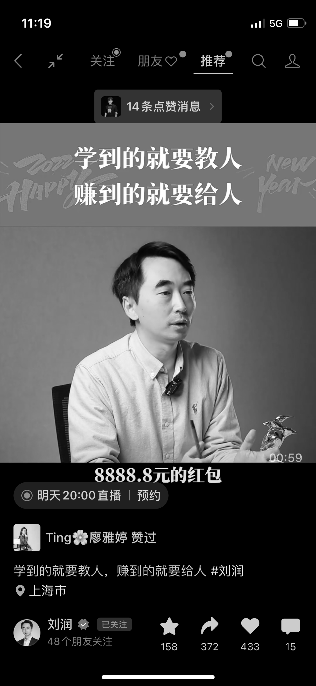

#【教程】如何减少手机的诱惑与影响

**【写作课作业D.009】**

### 手机惹你了？

因为需要用手机——不管是工作，还是与人联系，还是我想要表达、分享或者美其名曰「创造」——都需要用到手机。

因为「需要」这个理直气壮的理由，手机就像一个黑洞，把越来越多的时间都吸了进去。仔细想想，也觉得颇为可怕。在App Annie发布的报告里，2021年全球前十的区域平均每天用手机4.8小时，而排名第17的中国是3.3小时；而在Quest Mobile发布的报告里，2019年中国人的平均使用时间就逼近了6小时；北大的一篇白皮书里更是说中国95后的平均使用时间是8.33小时。

我记得，曾经自己的使用时间是在3小时多。可最近自从打开了屏幕使用时间进行跟踪后，才发现其实6小时、8小时都是常有的事情。

### 想要更多的时间？

一天毕竟只有24小时，不是扔在这里，就是扔在那里。每当我觉得时间不够用时，就会想起这个消耗时间的大头来。从用手机的时间里随便抠出个20%来，那可就是1、2小时呢。每天1、2小时可是个不得了的数字。

可是，全球最顶尖的脑袋们，都在想着怎么把咱们的注意力和时间「吸」进手机里，想要对着干，可不是那么容易的事情。

我试过以下几招，你也可以试试：

### 物理隔离

利用人的懒惰惯性，以及担心手机没电的焦虑，把手机放得远远的。

1. 曾经在内观中心闭关时，上交手机，统一锁起来，10天不拿手机，也没有什么大不了的感觉。

2. 每天晚上睡前，把手机放到客厅或书房充电，也能减少睡前刷手机到半夜的情况出现。
3. 开重要的会议或进行重要的交流时，把手机留在办公桌上充电。
4. 要专注工作时，把手机放到另一张够不着的桌子上去充电。

### 记录屏幕使用时间

据说，管理学大师德鲁克曾经曰过：「如果你不能度量它，你就无法改进它」；更有一种说法，只要你去「度量」它，它就会被改进。

所以，用手机的屏幕使用时间功能。至少你就可以开始「度量」这件事情。

当然，很遗憾的是——在「使用手机」这件事情上，「度量」无法带来自动的改善——这已经被（我）证伪了。

### 最新杀招——启用黑白模式

这招我刚刚学来，这里先教一下大家怎么开启。至于是否有用，待我试用一段时间之后，再来汇报结果。

以苹果手机为例，进入**设置**，选择**辅助功能**

再选择**显示与文字大小**

选择**色彩滤镜**这一设置项

把**色彩滤镜**那个开关点开，你会发现屏幕立刻变成了下面这幅模样：

好了，这就👌了，看看屏幕的效果，就像这样：

请注意，其实在这种模式下，只是你自己的屏幕显示成了黑白，但无论是你截屏，还是拍照或者视频，图片和照片本身都依然是彩色的。给别人看，或者你把这个滤镜关掉，彩色的世界就会回来。

试试看吧，感觉咋样，效果如何，欢迎和我交流。