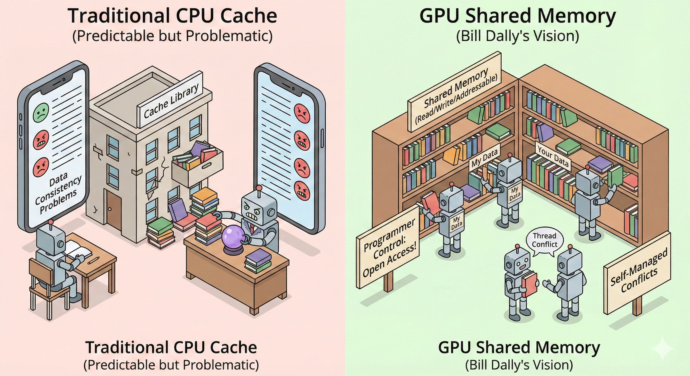

# 【AI】小白话系列——人工智能简史（五十一）

用这种激进的 SIMT 策略省下的空间，John Nickolls 可舍不得用传统的 Cache 机制来为 GPU 设计共享内存。

根据 Bill Dally 在 Imagine 处理器上验证过的理论，硬件管理的 Cache 在大规模并行计算场景上是不可预测的（Unpredictable），换句话说就是「没用」。

传统的 Cache 核心能力就在于「预测」CPU 可能会用到哪些数据，然后提前把这些搬运到离 CPU 更近的地方。

而我们之前说过，现在 GPU 一个 SM 里可以同时运行 768 个线程，并且还需要支持他们随机读、随机写任意地址的内存。这种复杂情况，没有任何办法做预测，导致 Cache 忙活半天，提前把数据搬运来搬运去，却全都是无用功。

并且，使用传统的 Cache 机制，还有一个麻烦就是需要保证数据一致性。

传统的多核 CPU ，在其中一个核心 A 修改了 Cache 里的数据后，需要通知其他核心：

> 这个数据我改过了，你们内部缓存的数据作废咯！

如果是 4 核 CPU，那就得「打三通电话」来通知，如果是 8 核，那可就是 7 通电话。对于 CPU 来说，这个额外的工作量还算勉强说得过去。可是，在 G80 的一个 SM 内部最多可以支持 768 个并行线程，任何一个修改，就是 767 通电话……

于是乎，在寸土寸金的 CBD 里塞进去的 16 KB SRAM，使用了全新的共享内存设计理念：

1. 可读
2. 可写
3. 可寻址

可寻址是什么意思？要知道，传统的 Cache 是不可寻址的。

你可以理解为传统 Cache 是设置在教室附近的特殊图书室，你每次都可以先跑去图书室门口问问，看那里有没有你需要的参考画册，如果没有，你就下楼去另一栋楼的图书馆里取。但图书室里到底放什么东西，是图书室管理员通过它独特的「猜测方法」来决定的，你无权干涉。

**搞不定就不搞了！**—— 这是 Bill Dally 式哲学的再一次贯彻。现在，图书室管理员既然管不好这图书室，干脆全干掉，把门打开。

图书室变成了教室里的开放式公共大书架，什么地方放什么东西，到底怎么用，全部交给大家（也就是程序员）自己决定。

对了，那么线程冲突怎么解决呢？

同一本参考画册，有人正要参考着画图，有人正要修改，这是常有的事。

Bill Dally 式的解决逻辑依然是，管不了，所以不管了。

这种冲突问题，还是交由你们线程（软件代码）自己协商着办吧。比如：

```c
__syncthreads()
```



<待续>