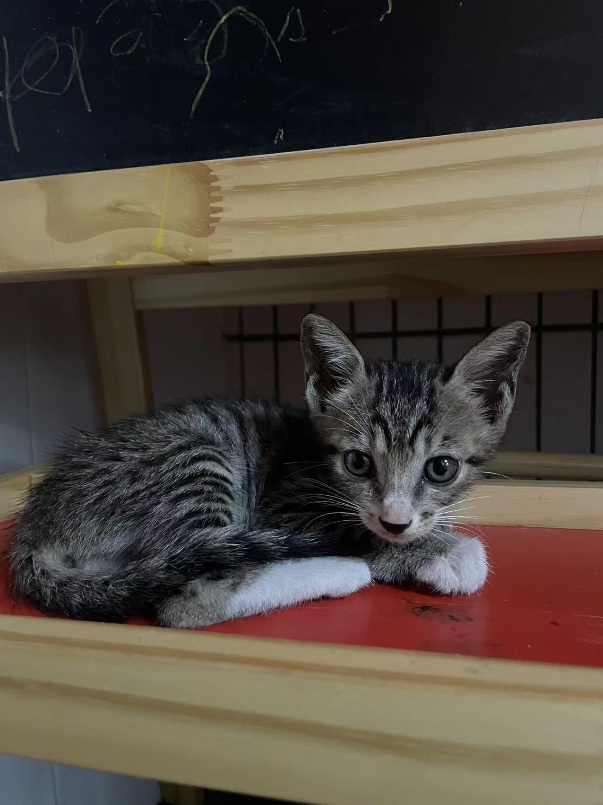

#【随笔】新的家庭成员

今天家里来了一位新的家庭成员。 

这是怎么回事儿呢？早上大宝带着大鱼和阿宝出门的时候，经过小区栅栏边的草地，听见了一只小猫躲在草丛里，发出凄厉的叫声。 大宝说，一听就知道，那是小猫咪找妈妈找了很久也找不到之后，才会那么凄厉的惨叫。他们到草地里找了一会儿，果然发现了一只已经瘦弱不堪，充满恐惧的小猫咪。小猫一开始还凶他们，可是估计实在是太饿了，太需要人照顾。很快就接受了大宝的善意，由着大宝抓住了它，带回了家。

等我下班回家的时候，大宝已经给它洗过了澡，还带去宠物医院给他检查了身体。说是其他都还好，就是体内有猫瘟病毒，关系也不是很大，需要过一个星期，看它能不能扛过去。

大宝说它刚回来时都饿得发抖了，吃了些东西，喝了些水。反倒有精神和小朋友们玩了起来，阿宝给他起名小椰子。

小椰子胆子很大，很快就熟悉了我们家和我们。除了傍晚时分，可能又想妈妈了，在那里喵喵喵的叫了很多声。我轻声安慰了它一会儿，它就安静了。也是神奇，这小家伙也没和我打几个照面，只凶了我一次，就能由着我摸它了。

Cup猫警惕地看着这个小东西，可是小猫咪对它一哈气，它就被吓得屁滚尿流。竖着耳朵夹着尾巴，继续远远的观察。

小椰子玩的很开心，很快就进入了拆家模式。阿宝也喜欢它，坐在阳台和它玩了一个晚上。

希望它现在有吃有喝有地方住，能很快恢复健康。