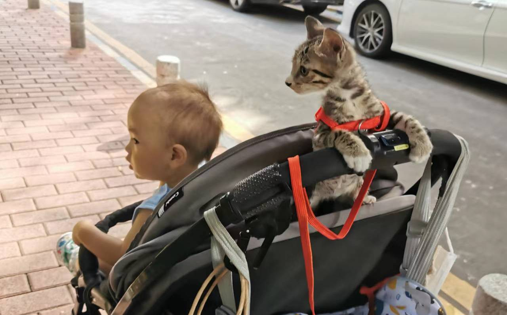

#【随笔】胆大的小椰子

早上起来，不见了小椰子。大宝满屋子到处呼唤，终于还是在洗衣机那里听到了它的喵喵声。但是，它并不是简单地待在洗衣机下面，而是钻到了洗衣机里面，怎么叫它，它也不肯出来。幸好它在里面时，洗衣机没有开动。我们只好把洗衣机放倒，终于在缝隙里看见了它的身影。

小椰子还不大理会我，于是换了大宝来呼唤招呼，它终于爬了出来，到了大宝伸手够得着的地方，大宝轻轻把它掏了出来。当年躲在马桶后面的Cup是大宝救的，这次小椰子又是大宝救的，善良的人总能积德修福。

小家伙出来后吃了点东西，立即又开始到处跑起来，我怕它再次钻到洗衣机下面太危险。找出那两个大泡沫地垫挡在洗衣机前面，没想到，小椰子直接亮出了爪子，顺着泡沫板爬了上去。Cup猫当年可是拿这个大泡沫板一点办法都没有呢，没想到这个障碍物对两个月大的小椰子竟然完全无用。大宝只好先找来些小泡沫块，把洗衣机旁边那些明显的缝隙先堵了一下。

阿宝起床后，一门心思地陪着小椰子，我上班时她还和小椰子一起在阳台玩耍。后来，大宝告诉我，阿宝只想陪小猫，根本不想出门！然后过了不久，给我发来几张照片。他们居然带着小椰子出门了！

小椰子真是一只胆大的小猫，据说出门也不害怕，只不过总想去找妈妈。

想想它也是个可怜的家伙，还没到离开妈妈的年纪，却找不到妈妈了，也许都差点活不下去了。可是，它妈妈去哪里了呢？我记得以前常见一只和它花色差不多的小猫，很喜欢跟着一只狗，也有一阵子没见过了，会是它的妈妈么？

到底它还有机会找到它的妈妈么？

不过，它这么胆大，应该生存能力很强吧。也不知道它，到底能在我们家安分地待多久呢……

反正，现在，阿宝是很喜欢很喜欢它的！

