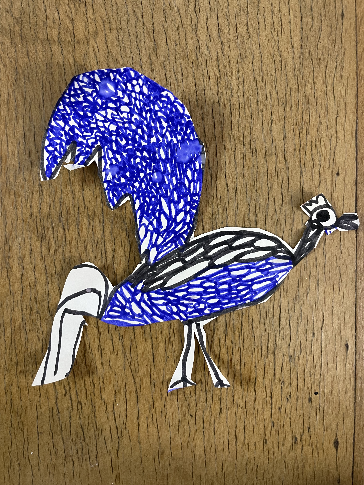

#【随笔】用心创作——阿宝趣事

昨晚回到家，大宝给我介绍了一天照顾发烧的大鱼宝宝是如何疲惫，懂事的阿宝是怎样贴心地帮她忙。最后忽然想起来，把阿宝叫过来说：

> 阿宝，你不是有画要给你爸分享吗？

阿宝连忙兴冲冲拿着一张纸片跑了过来，原来是她画好之后，然后又用剪刀剪下来的一只鸟儿。大大的翅膀，细细的脚。翅膀和肚子上的羽毛，被她细心地画上了蓝紫色的花纹。我说：

> 哇！这是珍珠鸡吗？好美丽的羽毛，像蓝紫色的珍珠一样！

阿宝说：

> 这不是鸡，是鸟啊！她翅膀上，是像波浪一样的羽毛！

我觉得真的很美，不知道是不是每个孩子都会有引发父母感慨的高光时刻。这一瞬间，我是真的觉得阿宝有艺术家的天赋，线条笔画虽然稚嫩拙朴，但那种炫目的美感，却冲击力十足。大宝告诉我说，她和阿宝一起画的，眼见阿宝一片羽毛一片羽毛特别用心地在画，而她自己则是有些着急地涂完颜色。最后，画好了一对比，果然用心和急躁赶工的效果是天壤之别。

目前只能继续鼓励她随心所欲地创作，只是好担心我们俩都是美术的外行，会不小心破坏了她内心里萌发的这艺术家小苗苗。只能再一次感慨自己挣钱不够利索，不然报名去蔡志忠最近开的私教班，在大师身边耳濡目染几天，总不必担心把孩子教坏了！