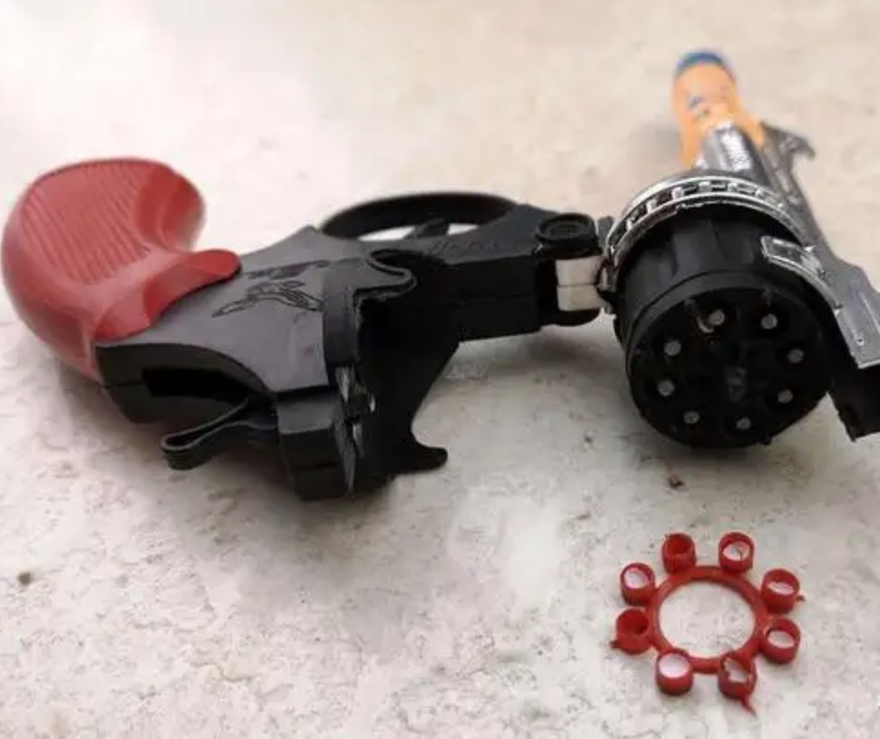
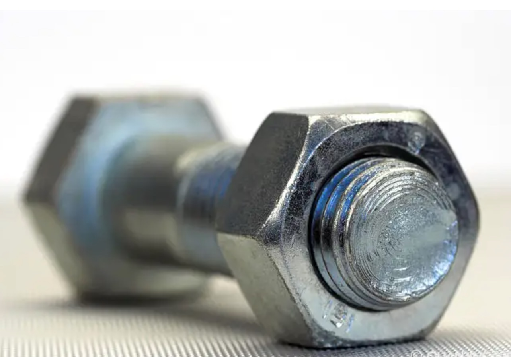

#【生命•故事】（082）几个记忆深刻的小玩意儿（续）

说起哪些小玩具，不由得又想起小时候玩过的一些东西来。首先，就是纸炮枪——那是一种左轮手枪，子弹是一圈带着「火药」的红塑料，一开枪，撞针就会狠狠地砸在纸泡上，发出「砰」的巨响，接着左轮会转动一圈，等待下一次击发。网上找到这个蛮精致的，我记得当初我那把枪是塑料的，镀了一层银色。不是太经用。

我们常常舍不得买子弹，如果打完之后这个塑料圈没被炸烂，就可以被用来再次填充弹药。取下几颗火柴头，碾碎。再掰开一枚鞭炮，把里面的火药倒出来，和碎火柴头混合在一起。填充进去之后，表面再盖一张薄薄的纸片免得火药漏出来。不过，自己做的，哑炮概率总是比较高。

我们还会制作另外一种简易，但是更危险的砸炮。由一枚螺母，两颗螺钉组成。将螺钉拧入螺母，只拧进去一半，然后在螺母里导入火药和火柴头，再拧入另外一颗螺钉将火药封闭在螺母中间。然后把这个家伙往地上一砸，就会引发里面的火药爆炸。大部分时候，伴随着一声巨响，两枚螺钉中总有一颗会被炸飞，需要到处找一阵子，偶尔就会再也找不到了，只能重新寻觅材料制作。有时候，还在拧螺钉呢，因为拧太紧，螺钉就直接在手中爆炸了。现在回想起来，这么危险的玩法，小时候竟然没有因此受伤，实在命大呢，真是承蒙老天爷眷顾啊！

