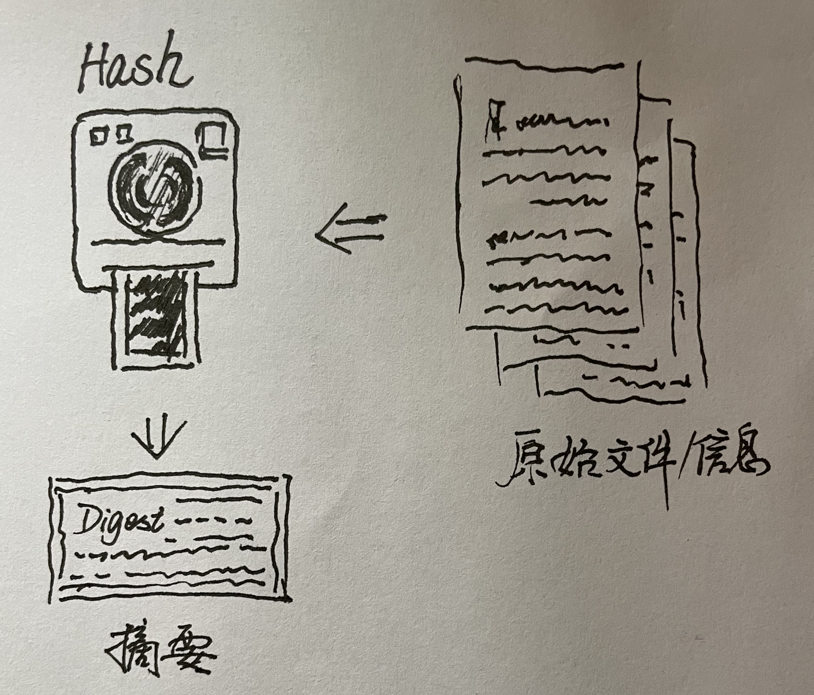
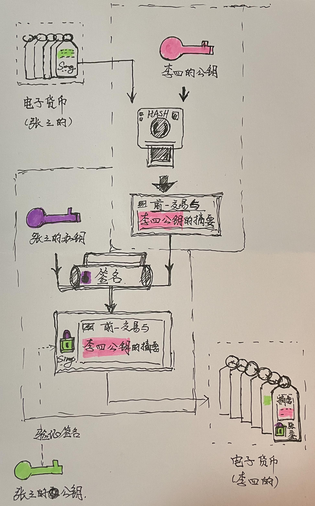

#【区块链】什么是区块链（六）

## 风险提示

**由于目前区块链领域里充斥着大量的资金盘、空气币。**而且，说起区块链，不可避免地涉及到金融、投资或者投机等话题。**投资有风险、决策需谨慎**，请各位朋友们擦亮眼睛，**风险自担**。

> “比特币交易作为一种互联网上的商品买卖行为，普通民众在**自担风险**的前提下拥有参与的自由。”
>
> “代币发行融资与交易存在多重风险，包括虚假资产风险、经营失败风险、投资炒作风险等，**投资者须自行承担投资风险，希望广大投资者谨防上当受骗。**”
>
> ——*摘自人民银行等五部委发布的《关于防范比特币风险的通知》*准备工作

## 比特币到底做了什么

### 技术方面

上次，顺着比特币白皮书的内容，还在讲它在技术领域所做的第二件重要的事情：

#### 比特币用密码学原理重新定义了电子货币

**数字签名**和**链**的概念讲过了，接下来本应该谈谈这**电子货币**和**交易**的关系，但是刚刚发现，还有一个之前以为理所当然的技术，其实也算是中本聪继承来的一个关键技术。那就是——

##### Hash哈希——摘要算法

是的，这是一个计算机算法中的概念，哈希是音译，有时又被叫做摘要算法，或散列算法。这个算法在数据管理时一般用来做索引什么的。而在密码学中，它一般用来做密钥和摘要。

我们可以把它理解成一个特殊的拍立得照相机。不管多么复杂的内容，被它咔嚓一下，就能生成固定大小的一串字符串。

一个好的Hash拍立得照相机有以下几个特点：

1. 拍照快：给出原始数据，能迅速算出固定长度的摘要来。
2. 难还原：拿着摘要，在正常的时间内，几乎不可能还原出原始数据。
3. 摘要散：这是被称为「散列」的原因，哪怕是在数万字的原始数据中修改一个字母，摘要也会看起来完全不同，基本上均匀分布。
4. 无冲突：简单来说，两样不同的东西，不能拍出一摸一样的照片来。

那么，有了Hash和数字签名之后，比特币是怎么搞定交易的呢？

##### 交易与「电子货币」

还记得白皮书中这句话吧「We define an electronic coin as a chain of digital signatures. 我们定义一枚电子货币就是一条数字签名链。」

所以，这枚电子货币是被串起来的一摞签名。按照之前的比喻，一串签名信箱，或者说一串签名信封吧。让我们假设，张三已经有了这样「一枚」电子货币，也就是一串「签名信封」。让我们看看，当张三打算要把这枚「电子货币」给李四时，会发生什么吧：

1. 首先，张三先生用Hash拍立得相机，把李四的公钥和这「电子货币」上前一次的交易记录，也就是串在最后那个签名信封放在一起，拍了一张摘要照片。
2. 接着，张三先生拿出自己的私钥，将这张摘要照片，用签名机制作了一个带特殊锁扣的信封——也就是签了个名。
3. 李四（其实可以是任何人），拿出张三的公钥，试了试这个锁扣，发现可以打开。证明这信封确实是张三封上的，签名就是张三的。当然，他还可以进一步确认，这些摘要里的信息也都是正确的，包括上一次的交易（其实也就是张三到底有多少「电子货币」），李四的公钥（以便确认，现在这些「电子货币」，都是给李四了）。
4. 一切无误之后，把这个签名，和之前的签名信封串到一起。
5. 现在，这枚电子货币已经是李四的了！

我们注意到，在这个过程中，并没有什么「电子货币」从张三给到了李四，实体的，虚拟的都没有。这可不像是有一条什么特殊的微信消息，从张三发给了李四。而是，直接在「某处」——也就是「这个电子货币」上，由张三增加了一条记录，说明此货币现在归李四了，而已。

同时，用一系列密码学手段保证，只有张三本人（或者说拥有张三私钥的这个人），才能增加这条转账记录。

注意，重要的事情再说一次。并没有什么实际存在的，到处转移的「电子货币」。每一枚电子货币，都只是一串签名卡片，最后一张签名卡片证明了此「电子货币」的最终所有者。

现在剩下一个问题，所谓的**双花问题**：

如果张三在增加一条把电子货币转给李四的记录同时，又增加了一条把电子货币转给王五的记录怎么办呢？那么此时，这枚电子货币，到底是李四的，还是王五的呢？一块钱花了一次又一次，这样下去，岂不是乱套了吗？那怎么能行！

<待续> 