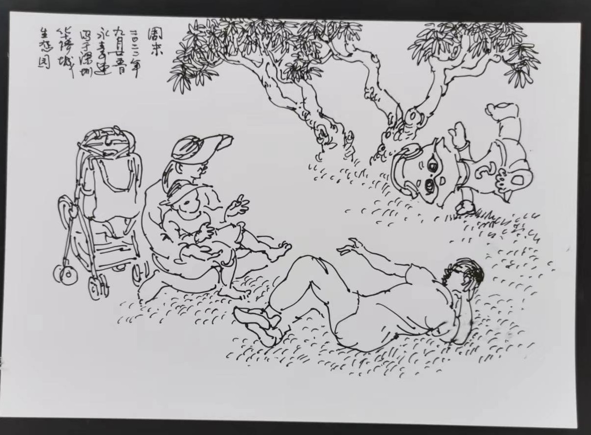

#【随笔】周末速写

周末在拳场锻炼时，又一个中年人（或者是老年人）在离我不远处坐了下来。我能感觉到，他是在画画，而我们，应该就是他的模特了。他画了好一会儿，可是大鱼跑到硬邦邦有摔伤危险的水泥沟玩去了。我赶紧起身，也不管他是不是还在画画，就去追大鱼了。

不久，瞥见他跑到木板上，对着那个巨大雕像画了起来。我还暗自琢磨，是不是自作多情了，他其实在画别的东西呢。

等到打算离开时，他又坐到了我们跟前画起来。我推着大鱼来得他身后，想看看他到底画的是什么。原来果然是我们。这幅速写，倒是有那么点丰子恺画作的味道。他见我们在看，也热情地给我们说他的创作：

> 今天周末，你们一家在这里的感觉颇为休闲，我把木板也改成了草地，更有「周末」的感觉。你是凭记忆画的，还没画完，你和你大女儿就都跑掉了。还没来得及画她。
>
> 你看这个雕像，从这里看只能看到屁股。我把他拧过来，画面就有趣多了。
>
> 这个婴儿车特别好，你看，放在这里，不论意境还是整个构图，是不是都要好得多呢？

好吧，我在木板上吭哧吭哧地练短桥呢，在他画里竟然如此休闲轻松，哈哈……

这个周末，不止看到这位画家。早先还另有一位吹尺八的老师，在旁边练拳的场地里，给小孩子们表演了好几首曲子。尤其是那一首「长亭外，古道边」，听得我心里痒痒，忍不住跟着在心里哼唱几遍，后来甚至跳起来在内心重播的悠扬「音乐声」中练了两趟太极拳。

艺术与美学，真是有意思的东西。啥时候，我能开始怡然自得地好好练字，然后学画、学尺八，自得其乐呢？想想就很美妙啊！