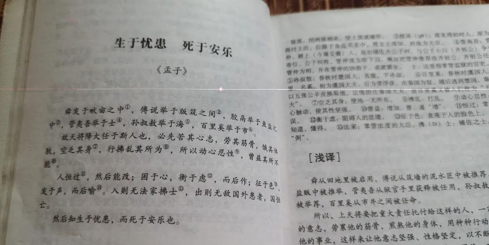

#【随笔】关于时间线被改动的事儿

一开始，是在郝景芳的书友群里和别人吵吵另外一件事儿时，见有人插入了一条知乎的文章。文章中，谈到「天将降大任于斯人也」还是「天将降大任于是人也」这件事儿。

说实话，我也是「斯人」派，但看完那篇文章，不由得对作者的脑洞拍案惊奇。「时间线扰动」这个说法，实在是太有意思了。本来是一个有趣的争议现象，相对正常的解释，可能也就是「真理部」干活失误而已。我还一度很好奇地在网上进行了一番搜索研究，再找到了一张有「斯人」证据的图片后。好奇心就得到了满足。我认为，这无非是一个在印刷上存量很少的版本，由于一些传播上的机缘巧合，刻入了几代大多数人的脑海记忆而已。

但，事实证明，我的思维还是太刻板和常态化了。

一整天，越来越多的人在微信群里，朋友圈里询问究竟是「天将降大任于斯人也」还是「天将降大任于是人也」，事情莫名其妙地就再次发酵了，比甜豆腐脑和咸豆腐脑的争议来得还要凶猛。直到傍晚，和菜头扔出一篇王炸——《关于时间线扰乱事件的个人说明》！

菜头抛出了一个更为完整的假设，这一切都是1999战记的后续，不仅仅是时间线被扰动，根本就是发生了大规模平行宇宙跃迁事件。

1999战记？我以前从来没有注意过它，这是一个多么有趣的科幻题材啊！可是为什么？当我看到那句：

> 战友，你还好吗？

的时候，竟然会差点忍不住，热泪盈眶呢？