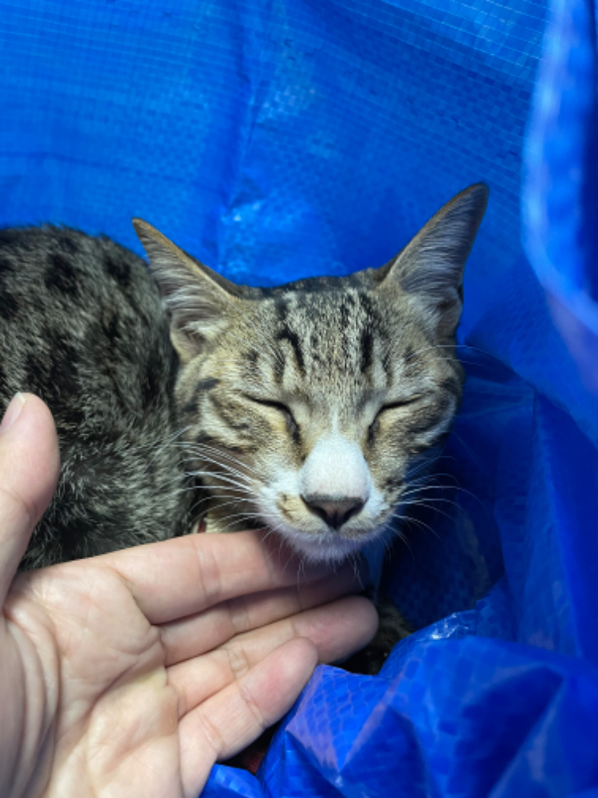
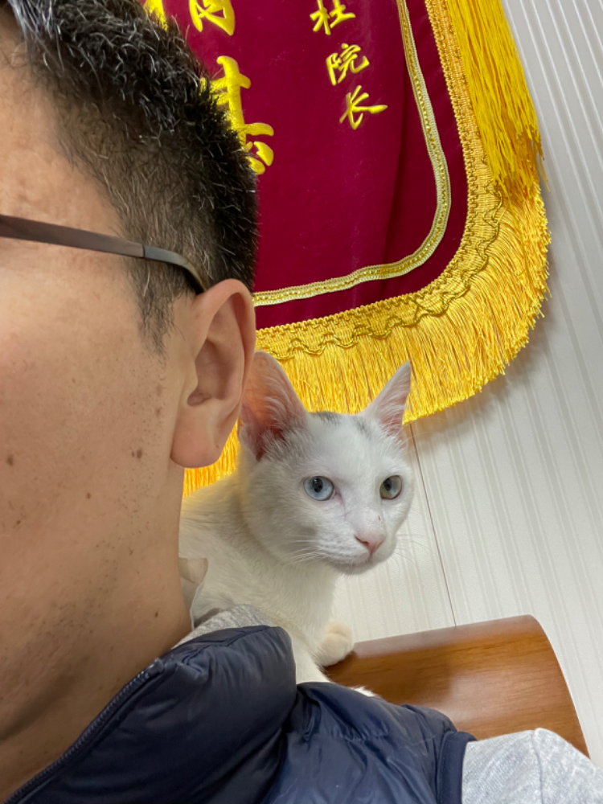

#【随笔】给两只小猫打针

在大宝带着大鱼睡觉的时候，我和阿宝坐在客厅里，悠哉地撸着三只猫。等大宝出来，反正我们居然不干活，还在那儿撸猫，尤其是，到了该给猫洗澡的日子了，却不给他们洗澡。

正准备收拾给三只猫洗澡呢，忽然想起来，该给他们打针了。可是之前的背包已经被大宝扔掉了，用什么带他们出门呢？想了想，我决定用那个铁垃圾桶，然后又找了一个宜家的袋子。小白倒是容易抓，小椰子一听说要打针，立刻吓得满屋子乱跑。担心它在外面乱跑出抓不住，赶紧去找了栓猫的绳子来。它继续在屋子里窜来窜去的躲着我，大宝过来一把拽住尾巴，给它套上绳子，装进了袋子。

拎着他们下楼时，我在想这两个家伙已经变得这么沉了，想当初阿宝刚把小椰子救回来时，他瘦得皮包骨头比一只老鼠大不了多少。小白来时虽然不瘦，但也是个小小家伙。现在两个家伙加起来怕是快有十斤了吧。

到了医院，反倒是小椰子老老实实待在袋子里，吓得瑟瑟发抖也不乱跑。小白则一如既往的是个好奇宝宝，不停的想要到处巡视，摁都摁不住。打针很快，但是需要观察半个小时。我只好把小椰子放在腿上，把小白搂在怀里，一直安抚着他们。

然而很快，小白就跑到了我的脖子上待着，哎呀，真是会找地方。是因为我在大椎穴上贴了个暖宝宝吗？